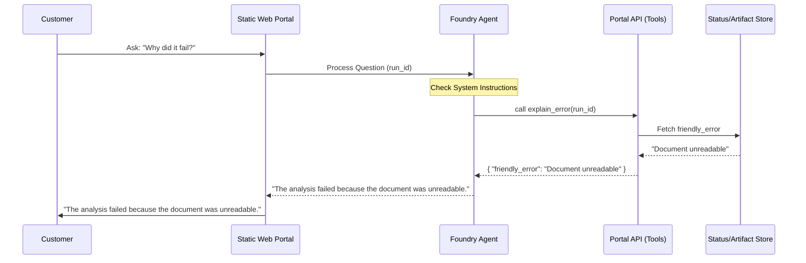

# Pipeline Assistant Foundry

Azure AI Foundry agent reference for customer questions about a pipeline execution.

## Purpose

The Pipeline Assistant allows customers to interact with their document processing pipeline results using natural language. It provides a grounded, safe interface for answering questions without exposing the technical complexity or sensitive internals of the Azure environment.

Key customer questions addressed:
- "What is the current status of my document?"
- "Why did the analysis fail?"
- "Where can I find the extracted JSON?"
- "How much did this specific run cost?"
- "Can a human check this result?"

## Customer-Safe Behavior

The agent is designed with a strict **customer-safe boundary**. It is explicitly instructed never to reveal:
- Raw Azure Function logs or technical stack traces.
- System prompts or internal grounding logic.
- Internal identifiers (Subscription IDs, Tenant IDs, Resource IDs).
- Infrastructure secrets (SAS tokens, storage keys, connection strings).
- Raw JSON payloads from Document Intelligence or OpenAI.

## Design Decision: Prompt Agent

This module implements a **Prompt Agent** pattern.
- **Visibility**: System instructions are explicitly defined in `src/agent_definition.py`.
- **Control**: Tool calling is restricted to a curated set of business-level functions.
- **Simplicity**: No custom hosted runtime is required; the agent runs within the standard Azure AI Foundry Agent Service.

## Tool Boundary

The agent interacts with the environment through six controlled tools:

| Tool Name | Purpose | Data Source |
|-----------|---------|-------------|
| `get_pipeline_status` | High-level business status (e.g., Completed, Failed). | `PipelineRun` contract |
| `get_pipeline_steps` | Detailed step-by-step progress and timing. | `PipelineStep` contract |
| `get_artifacts` | List of customer-visible output files and data. | `Artifact` contract |
| `explain_error` | Friendly, non-technical failure explanation. | `PipelineRun.friendly_error` |
| `estimate_cost` | Aggregated cost estimate for the run. | `CostLedger` contract |
| `request_human_review` | Escalation path for manual intervention. | External Review System |

## Architecture



## Environment & Configuration

The agent expects the following configuration when deployed via the Azure AI Projects SDK:
- **Model**: `gpt-4o` or `gpt-4o-mini`.
- **Tools**: Function tools as defined in `src/agent_definition.py`.
- **Environment Variables**:
    - `AZURE_AI_PROJECT_ENDPOINT`: The endpoint for the AI Foundry project.

## Known Limits

- **Read-Only**: The current agent is primarily read-only; it cannot re-trigger or modify pipeline runs.
- **Scoped to Run**: The agent requires a `run_id` context to provide grounded answers.
- **Latency**: Answers depend on the underlying Portal API response times.

## Local Validation

Run the contract validation tests to ensure the safety boundary and tool definitions are correct:

```bash
python --version
ruff check .
ruff format --check .
PYTHONPATH=. pytest tests/
```
