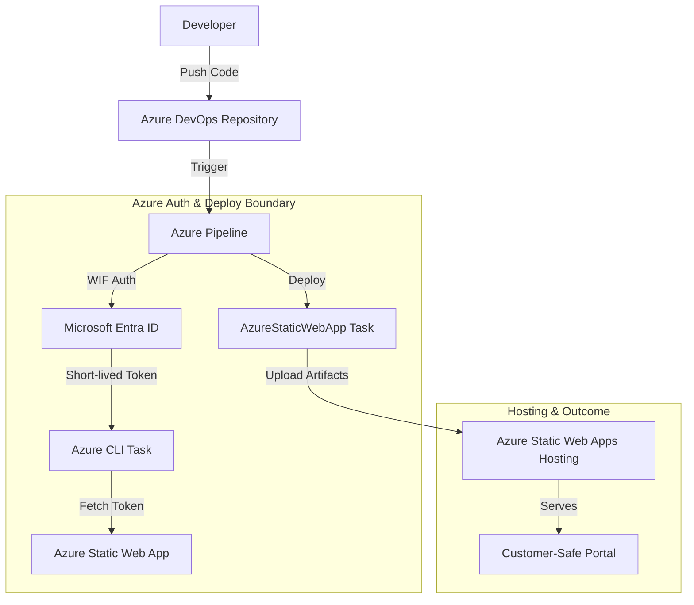
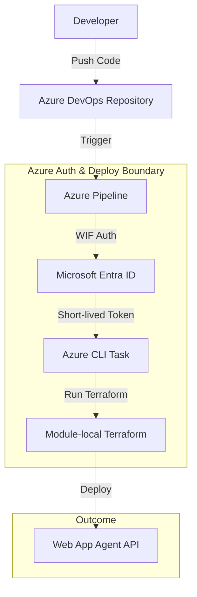

# Azure Pipelines Azure Deployment Reference

Secure Azure Pipelines deployment patterns for publishing the [Static Status Portal](../../portals/static-status-portal/) and the [Web App Agent API](../../hosting/webapp-agent-api/) to Azure.

## Purpose

This building block defines secure reference patterns for deploying to Azure using Azure Pipelines. It prioritizes Workload Identity Federation (WIF) to eliminate the use of long-lived secrets like Service Principal keys or Static Web Apps deployment tokens in the pipeline configuration.

## When to Use Azure Pipelines instead of GitHub Actions

- **Use Azure Pipelines when**:
  - Your source code and project management already reside in Azure DevOps.
  - You require complex deployment strategies (e.g., multi-stage gates, custom approval flows) native to Azure DevOps Environments.
  - You need to integrate with on-premises resources via self-hosted agents within a corporate VNet.
  - Your organization has standardized on Azure DevOps for compliance and governance.
- **Use GitHub Actions when**:
  - Your repository is hosted on GitHub.
  - You prefer a more modern, YAML-first experience with a vast ecosystem of community actions.
  - You want a simpler, more lightweight CI/CD setup for open-source or smaller projects.

## Deployment Architecture

### Static Web App Deployment
The following diagram illustrates the secure deployment boundary for Static Web Apps:



### Web App Agent API Deployment
The following diagram illustrates the secure deployment boundary for the Web App Agent API using Terraform:



## Configuration and Service Connection

To implement this pattern securely, configure an **Azure Resource Manager service connection** using **Workload identity federation (automatic)**.

### OIDC Configuration Prerequisites
1. In Azure DevOps, go to **Project settings** > **Service connections**.
2. Select **New service connection**, then **Azure Resource Manager**.
3. Select **Workload identity federation (automatic)**.
4. Scope the connection to the specific **Subscription** and **Resource Group** containing your resources.
5. **Security**: Do not select "Grant access permission to all pipelines". Instead, [authorize the pipeline individually](https://learn.microsoft.com/en-us/azure/devops/pipelines/library/service-endpoints?view=azure-devops#authorize-pipelines).

## Configuration and Secrets

To implement these patterns securely, configure the following Azure DevOps Variables or Variable Groups. **Never commit these values to the repository.**

### Variables

| Name | Type | Description |
|------|------|-------------|
| `AZURE_SERVICE_CONNECTION_NAME` | Variable | Name of the ARM service connection with WIF. |
| `ENVIRONMENT_NAME` | Variable | Name of the Azure DevOps Environment for gating (e.g., `webapp-agent-api-deploy`). |
| `LOCATION` | Variable | Azure region for deployment. |
| `RESOURCE_PREFIX` | Variable | Prefix for resources (Web App Agent API). |
| `CONTAINER_IMAGE` | Variable | The container image to deploy (Web App Agent API). |
| `CONTAINER_REGISTRY_SERVER` | Variable | The FQDN of the container registry (Web App Agent API). |
| `CONTAINER_REGISTRY_ID` | Variable | The ID of the Azure Container Registry (Web App Agent API). |
| `AUTH_CLIENT_ID` | Variable | The Client ID for Entra ID authentication (Web App Agent API). |

### Secure Variables (Mark as Secret)

| Name | Type | Description |
|------|------|-------------|
| `AZURE_TENANT_ID` | Secret | The Directory (tenant) ID of your Azure tenant. |
| `BACKEND_RESOURCE_GROUP_NAME` | Secret | The resource group name for the Terraform remote backend. |
| `BACKEND_STORAGE_ACCOUNT_NAME` | Secret | The storage account name for the Terraform remote backend. |
| `BACKEND_CONTAINER_NAME` | Secret | The container name for the Terraform remote backend. |
| `BACKEND_KEY` | Secret | The state file key for the Terraform remote backend. |

## Reference Pipeline: Deploy Static Status Portal

The following YAML snippet from `azure-pipelines.yml` demonstrates how to securely build and deploy the portal.

```yaml
# ... build steps ...
- stage: Deploy
  jobs:
    - deployment: DeployPortal
      environment: 'production'
      strategy:
        runOnce:
          deploy:
            steps:
              # Fetch the SWA deployment token dynamically using the WIF service connection
              - task: AzureCLI@2
                inputs:
                  azureSubscription: 'MyWIFServiceConnection'
                  scriptType: 'bash'
                  scriptLocation: 'inlineScript'
                  inlineScript: |
                    TOKEN=$(az staticwebapp secrets list \
                      --name my-status-portal \
                      --resource-group my-resource-group \
                      --query "properties.apiKey" -o tsv)
                    echo "##vso[task.setvariable variable=SWA_DEPLOYMENT_TOKEN;isSecret=true]$TOKEN"

              - task: AzureStaticWebApp@0
                inputs:
                  app_location: '/'
                  output_location: ''
                  skip_app_build: true
                  cwd: '$(System.ArtifactsDirectory)/drop'
                  azure_static_web_apps_api_token: $(SWA_DEPLOYMENT_TOKEN)
```

## Reference Pipeline: Deploy Web App Agent API

The following YAML snippet from `webapp-agent-api-deploy.yml` demonstrates a secure Terraform deployment with validation, planning, and gated deployment.

```yaml
stages:
- stage: Static_Validation
  jobs:
  - job: Validate
    steps:
    - script: |
        terraform init -backend=false
        terraform validate
      workingDirectory: $(TF_WORKING_DIR)

- stage: Plan
  jobs:
  - job: Plan
    steps:
    - task: AzureCLI@2
      inputs:
        azureSubscription: '$(AZURE_SERVICE_CONNECTION_NAME)'
        scriptType: 'bash'
        inlineScript: |
          terraform plan -input=false -out=tfplan > /dev/null
      workingDirectory: $(TF_WORKING_DIR)

- stage: Deploy
  condition: and(succeeded(), eq(variables['Build.SourceBranch'], 'refs/heads/main'))
  jobs:
  - deployment: Apply
    environment: '$(ENVIRONMENT_NAME)'
    strategy:
      runOnce:
        deploy:
          steps:
          - task: AzureCLI@2
            inputs:
              azureSubscription: '$(AZURE_SERVICE_CONNECTION_NAME)'
              scriptType: 'bash'
              inlineScript: |
                terraform apply -auto-approve -input=false > /dev/null
            workingDirectory: $(TF_WORKING_DIR)
```

## Cost Impact & Operations

### Cost Impact
- **Billable Resources**: Provisioning resources via these pipelines will incur costs for **Azure App Service**, **Container Registry**, and associated storage.
- **Pipeline Minutes**: Using Microsoft-hosted agents consumes pipeline minutes. Self-hosted agents may be required for complex or long-running builds.

### Rollback and Destroy
- **Rollback**: To roll back, revert the commit in the repository. This triggers a new pipeline run that applies the previous known-good configuration.
- **Destroy**: Resource deletion is an intentional act. Use `terraform destroy` locally or via a dedicated manual pipeline to decommission resources.

### Known Limits
- **WIF Availability**: Workload Identity Federation (automatic) requires specific Azure DevOps and Entra ID permissions.
- **Terraform Versioning**: This reference assumes a compatible Terraform version is available on the pipeline agent.

## Security & Customer-Safe Boundary

- **Identity First**: Use Workload Identity Federation to avoid storing long-lived secrets in Azure DevOps.
- **Least Privilege**: Scope the service connection only to the Resource Group or Subscription needed.
- **Secret Masking**: Azure Pipelines automatically masks variables marked as "Secret" or `isSecret=true`.
- **Output Suppression**: Terraform plan and apply outputs are redirected to `/dev/null` to prevent leaking technical internals or sensitive data in logs.

## Deployment/IaC Decision

- **Pattern-Only**: This building block defines the *pipeline* orchestration pattern.
- **Reuse Existing IaC**: It reuses the infrastructure defined in [`building-blocks/hosting/webapp-agent-api/infra/terraform/`](../../hosting/webapp-agent-api/infra/terraform/). No new Terraform is owned by this block.
- **Boundary**: This block owns the pipeline YAML; it does not own the application code or the infrastructure definitions.

## References
- [Azure Static Web Apps build configuration](https://learn.microsoft.com/en-us/azure/static-web-apps/build-configuration?tabs=azure-devops)
- [Connect to Azure with an ARM service connection](https://learn.microsoft.com/en-us/azure/devops/pipelines/library/connect-to-azure)
- [Azure Pipelines YAML schema](https://learn.microsoft.com/en-us/azure/devops/pipelines/yaml-schema/)
