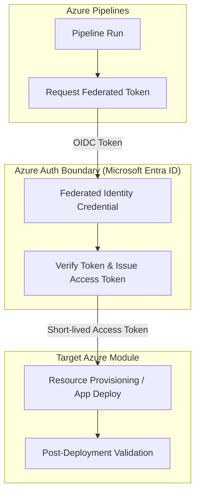

# Azure Pipelines Azure Deployment Reference

This building block defines the secure reference pattern for deploying Azure resources and applications using Azure Pipelines. It prioritizes identity-based authentication through Workload Identity Federation.

## Purpose

The purpose of this reference is to provide a standardized, secure, and repeatable pattern for CI/CD workflows in Azure DevOps targeting Azure. By following this pattern, development teams can ensure that their deployment pipelines are:

- **Secure:** Using Workload Identity Federation (OIDC) to eliminate the need for long-lived Azure Service Principal secrets or certificates in Azure DevOps.
- **Auditable:** Leveraging Microsoft Entra ID for identity management and access control.
- **Consistent:** Providing a common structure for pipelines across different modules and solutions.

## Workload Identity Federation (OIDC)

Traditional CI/CD patterns in Azure DevOps often rely on storing a Service Principal's `client-secret` or a certificate within a Service Connection. This creates a security risk if the secret is leaked and requires manual rotation.

This reference recommends **Workload Identity Federation**. With this approach, Azure Pipelines requests a short-lived access token from Azure by presenting a token issued by Azure DevOps. Azure verifies this token against a **Federated Identity Credential** configured on the Microsoft Entra application or User-Assigned Managed Identity.

### Why Workload Identity Federation is preferred:
- **No long-lived secrets:** No Azure password, secret, or certificate is stored in Azure DevOps.
- **Reduced management overhead:** Eliminates the need to rotate secrets.
- **Automatic token expiration:** Access tokens are short-lived and valid only for the specific pipeline run.

## Authentication Flow

The following diagram illustrates the secure authentication boundary using Workload Identity Federation:



## Required Variables and Service Connections

To implement this pattern, an **Azure Resource Manager service connection** must be configured in the Azure DevOps project.

### Service Connection Configuration
- **Authentication Method:** Workload identity federation (automatic or manual).
- **Scope:** Subscription, Management Group, or Machine Learning Workspace.

### Pipeline Variables
The following variable is typically used in the YAML pipeline to reference the service connection:

| Name | Description |
|------|-------------|
| `AZURE_SERVICE_CONNECTION_NAME` | The name given to the service connection in Azure DevOps settings. |

## Implementation Guidance

Concrete Azure Pipelines YAML files (`azure-pipelines.yml` or templates) should be added to the repository only when they are tied to a specific **deployable module** or **reference solution**.

### Example Pipeline Snippet (YAML)

When creating a pipeline, use the `AzureCLI@2` or `AzureResourceManagerTemplateDeployment@3` tasks, referencing the service connection:

```yaml
jobs:
- job: Deploy
  steps:
  - task: AzureCLI@2
    inputs:
      azureSubscription: '$(AZURE_SERVICE_CONNECTION_NAME)'
      scriptType: 'bash'
      scriptLocation: 'inlineScript'
      inlineScript: |
        az account show
```

## Local run

Deployment pipelines are designed to run in Azure Pipelines. For local simulation or testing of deployment scripts:
1. Log in locally using `az login`.
2. Ensure your local identity has the same RBAC permissions as the Service Principal/Managed Identity used in the Service Connection.
3. Run deployment scripts (e.g., Terraform, Azure CLI) manually.

## Deploy

This is a documentation-first reference. Concrete deployment instructions depend on the target module.

## Tests/proof

Validation of this pattern involves:
1. **Static Analysis:** Verifying that YAML pipelines use the correct service connection variable and recommended tasks.
2. **End-to-End Test:** Successfully running a pipeline in an Azure DevOps environment with a configured Workload Identity Federation service connection.

## References
- [Connect to Azure with an Azure Resource Manager service connection](https://learn.microsoft.com/en-us/azure/devops/pipelines/library/connect-to-azure?view=azure-devops)
- [Azure Pipelines YAML schema](https://learn.microsoft.com/en-us/azure/devops/pipelines/yaml-schema/?view=azure-pipelines)
- [Troubleshoot Azure Resource Manager service connections](https://learn.microsoft.com/en-us/azure/devops/pipelines/release/azure-rm-endpoint?view=azure-devops)
