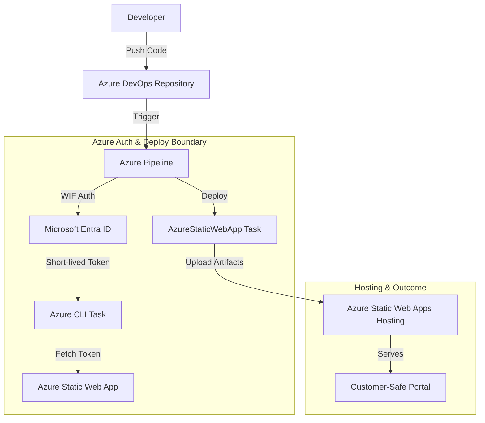

# Azure Pipelines Azure Deployment Reference

Secure Azure Pipelines deployment pattern for publishing the [Static Status Portal](../../portals/static-status-portal/) to Azure Static Web Apps.

## Purpose

This building block defines secure reference patterns for deploying to Azure using Azure Pipelines. It prioritizes Workload Identity Federation (WIF) to eliminate the use of long-lived secrets like Service Principal keys or Static Web Apps deployment tokens in the pipeline configuration.

## When to Use These Patterns

- **Use when**: Deploying frontend applications to Azure Static Web Apps from an Azure DevOps repository.
- **Use when**: You want to eliminate long-lived secrets in Azure DevOps using Workload Identity Federation.
- **Do not use when**: Using legacy credential-based authentication (secrets/certificates) or when a simpler GitHub Actions flow is preferred for non-DevOps projects.

## Deployment Architecture

The following diagram illustrates the secure deployment boundary:



## Configuration and Service Connection

To implement this pattern securely, configure an **Azure Resource Manager service connection** using **Workload identity federation (automatic)**.

### OIDC Configuration Prerequisites
1. In Azure DevOps, go to **Project settings** > **Service connections**.
2. Select **New service connection**, then **Azure Resource Manager**.
3. Select **Workload identity federation (automatic)**.
4. Scope the connection to the specific **Subscription** and **Resource Group** containing your Static Web App.
5. **Security**: Do not select "Grant access permission to all pipelines". Instead, [authorize the pipeline individually](https://learn.microsoft.com/en-us/azure/devops/pipelines/library/service-endpoints?view=azure-devops#authorize-pipelines).

## Reference Pipeline: Deploy Static Status Portal

The following YAML snippet from `azure-pipelines.yml` demonstrates how to securely build and deploy the portal.

```yaml
# ... build steps ...
- stage: Deploy
  jobs:
    - deployment: DeployPortal
      environment: 'production'
      strategy:
        runOnce:
          deploy:
            steps:
              # Fetch the SWA deployment token dynamically using the WIF service connection
              - task: AzureCLI@2
                inputs:
                  azureSubscription: 'MyWIFServiceConnection'
                  scriptType: 'bash'
                  scriptLocation: 'inlineScript'
                  inlineScript: |
                    TOKEN=$(az staticwebapp secrets list \
                      --name my-status-portal \
                      --resource-group my-resource-group \
                      --query "properties.apiKey" -o tsv)
                    echo "##vso[task.setvariable variable=SWA_DEPLOYMENT_TOKEN;isSecret=true]$TOKEN"

              - task: AzureStaticWebApp@0
                inputs:
                  app_location: '/'
                  output_location: ''
                  skip_app_build: true
                  cwd: '$(System.ArtifactsDirectory)/drop'
                  azure_static_web_apps_api_token: $(SWA_DEPLOYMENT_TOKEN)
```

## Security & Customer-Safe Boundary

- **Identity First**: Use Workload Identity Federation to avoid storing secrets in Azure DevOps.
- **Least Privilege**: Scope the service connection only to the Resource Group or resource needed for the deployment.
- **Secret Masking**: Azure Pipelines automatically masks variables marked as `isSecret=true`.
- **Clean Logs**: Ensure technical identifiers like Tenant IDs or internal resource paths are not printed to standard output.

## Deployment/IaC Decision

- **Pattern-Only**: This building block defines the *pipeline* contract.
- **Reuse Existing IaC**: This pipeline reuses the infrastructure defined in [`building-blocks/portals/static-status-portal/infra/terraform/`](../../portals/static-status-portal/infra/terraform/). No new Terraform is required for this deployment pattern.
- **Prerequisites**: The Azure Static Web App must already exist (deployed via the portal's Terraform) before running this pipeline.

## References
- [Azure Static Web Apps build configuration](https://learn.microsoft.com/en-us/azure/static-web-apps/build-configuration?tabs=azure-devops)
- [Connect to Azure with an ARM service connection](https://learn.microsoft.com/en-us/azure/devops/pipelines/library/connect-to-azure)
- [Azure Pipelines YAML schema](https://learn.microsoft.com/en-us/azure/devops/pipelines/yaml-schema/)
