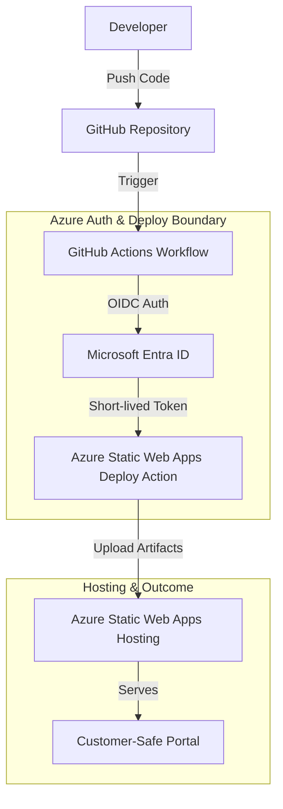
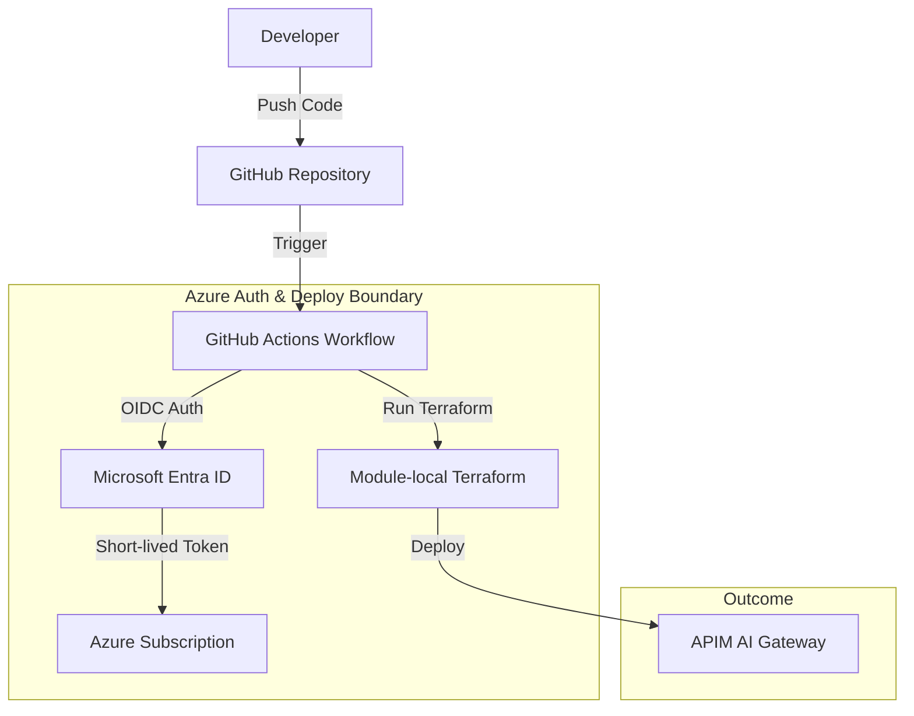

# GitHub Actions Azure Deployment Reference

Secure GitHub Actions deployment patterns for publishing the [Static Status Portal](../../portals/static-status-portal/), the [APIM AI Gateway](../../gateways/apim-ai-gateway/), and the [Web App Agent API](../../hosting/webapp-agent-api/) to Azure.

## Purpose

This building block defines secure reference patterns for deploying to Azure using GitHub Actions. It prioritizes identity-based authentication (OIDC) to minimize the use of long-lived secrets.

## When to Use These Patterns

- **Use when**: Deploying frontend applications to Azure Static Web Apps, containerized APIs to Azure App Service, or infrastructure via Terraform/OpenTofu from a GitHub repository.
- **Use when**: You want to eliminate long-lived Service Principal secrets in GitHub using OpenID Connect (OIDC).
- **Do not use when**: Deploying to non-Azure targets or using legacy credential-based authentication as the primary method.

## Deployment Architecture

### Static Web App Deployment


### APIM AI Gateway Deployment


### Web App Agent API Deployment


## Configuration and Secrets

To implement these patterns securely, configure the following GitHub Repository Secrets and Variables. **Never commit these values to the repository.**

### Secrets

| Name | Type | Description |
|------|------|-------------|
| `AZURE_CLIENT_ID` | Secret | The Application (client) ID of the Entra ID app or Managed Identity configured for OIDC. |
| `AZURE_TENANT_ID` | Secret | The Directory (tenant) ID of your Azure tenant. |
| `AZURE_SUBSCRIPTION_ID` | Secret | The ID of the Azure Subscription. |
| `AZURE_STATIC_WEB_APPS_API_TOKEN` | Secret | (Optional) The SWA deployment token. Required if not using the full OIDC integration for the upload action. |
| `BACKEND_RESOURCE_GROUP_NAME` | Secret | The resource group name for the Terraform remote backend. |
| `BACKEND_STORAGE_ACCOUNT_NAME` | Secret | The storage account name for the Terraform remote backend. |
| `BACKEND_CONTAINER_NAME` | Secret | The container name for the Terraform remote backend. |
| `BACKEND_KEY` | Secret | The state file key for the Terraform remote backend. |

### Variables

| Name | Type | Description |
|------|------|-------------|
| `ENVIRONMENT_NAME` | Variable | The name of the GitHub Environment used for deployment gating (e.g., `durable-pipeline-deploy`, `apim-gateway-deploy`). |
| `RESOURCE_GROUP_NAME` | Variable | The name of the target Azure resource group (APIM). |
| `LOCATION` | Variable | Azure region for deployment. |
| `APIM_NAME` | Variable | Name of the APIM instance. |
| `PUBLISHER_EMAIL` | Variable | Email address for APIM notifications. |
| `PUBLISHER_NAME` | Variable | Organization name for APIM. |
| `MODEL_ENDPOINT` | Variable | The target model endpoint URL. |
| `MODEL_ID` | Variable | Friendly identifier for the model (e.g., 'gpt-4o'). |
| `MODEL_RESOURCE_ID` | Variable | The Azure Resource ID of the model for RBAC assignment. |
| `RESOURCE_PREFIX` | Variable | Prefix for resources (Web App Agent API). |
| `CONTAINER_IMAGE` | Variable | The container image to deploy (Web App Agent API). |
| `CONTAINER_REGISTRY_SERVER` | Variable | The FQDN of the container registry (Web App Agent API). |
| `CONTAINER_REGISTRY_ID` | Variable | The ID of the Azure Container Registry (Web App Agent API). |
| `AUTH_CLIENT_ID` | Variable | The Client ID for Entra ID authentication (Web App Agent API). |

### OIDC Configuration Prerequisites
1. Create a Microsoft Entra application or User-Assigned Managed Identity.
2. Configure **Federated Identity Credentials** in Azure to trust your GitHub repository, branch, or environment.
3. Assign the `Contributor` role (or a custom role with deployment permissions) to the identity at the target resource or resource group scope.

## Reference Workflow: Deploy Static Status Portal

The following YAML demonstrates a secure deployment for the `static-status-portal`.

```yaml
name: Deploy Static Status Portal

on:
  push:
    branches: [ main ]
    paths:
      - 'building-blocks/portals/static-status-portal/**'
  pull_request:
    types: [opened, synchronize, reopened, closed]
    branches: [ main ]
    paths:
      - 'building-blocks/portals/static-status-portal/**'

jobs:
  build_and_deploy:
    if: github.event_name == 'push' || (github.event_name == 'pull_request' && github.event.action != 'closed')
    runs-on: ubuntu-latest
    permissions:
      id-token: write # Mandatory for OIDC
      contents: read  # Mandatory for checkout

    steps:
      - uses: actions/checkout@v4
        with:
          submodules: true

      - name: 'Az CLI Login'
        uses: azure/login@v2
        with:
          client-id: ${{ secrets.AZURE_CLIENT_ID }}
          tenant-id: ${{ secrets.AZURE_TENANT_ID }}
          subscription-id: ${{ secrets.AZURE_SUBSCRIPTION_ID }}

      - name: 'Get ID Token for SWA'
        uses: actions/github-script@v7
        id: idtoken
        with:
          script: |
            const id_token = await core.getIDToken();
            core.setOutput('token', id_token);

      - name: Build And Deploy
        id: builddeploy
        uses: Azure/static-web-apps-deploy@v1
        with:
          # Use github_id_token for OIDC-native deployment to SWA
          github_id_token: ${{ steps.idtoken.outputs.token }}
          action: "upload"
          app_location: "building-blocks/portals/static-status-portal/src"
          api_location: "" # Linked API is handled separately or via portal-api-functions
          output_location: "dist" # Folder where the build output is generated
```

## Reference Workflow: Deploy APIM AI Gateway

The following YAML demonstrates a secure Terraform deployment for the [APIM AI Gateway](../../gateways/apim-ai-gateway/). It includes static validation, planning, and deployment stages with environment-based gating.

```yaml
name: Deploy APIM AI Gateway

on:
  push:
    branches: [ main ]
    paths:
      - 'building-blocks/gateways/apim-ai-gateway/infra/terraform/**'
  pull_request:
    branches: [ main ]
    paths:
      - 'building-blocks/gateways/apim-ai-gateway/infra/terraform/**'

permissions:
  id-token: write
  contents: read

env:
  TF_WORKING_DIR: 'building-blocks/gateways/apim-ai-gateway/infra/terraform'
  # Terraform OIDC environment variables
  ARM_CLIENT_ID: ${{ secrets.AZURE_CLIENT_ID }}
  ARM_TENANT_ID: ${{ secrets.AZURE_TENANT_ID }}
  ARM_SUBSCRIPTION_ID: ${{ secrets.AZURE_SUBSCRIPTION_ID }}
  ARM_USE_OIDC: true
  # Terraform variables mapped from secrets/variables
  TF_VAR_resource_group_name: ${{ vars.RESOURCE_GROUP_NAME }}
  TF_VAR_location: ${{ vars.LOCATION }}
  TF_VAR_apim_name: ${{ vars.APIM_NAME }}
  TF_VAR_publisher_email: ${{ vars.PUBLISHER_EMAIL }}
  TF_VAR_publisher_name: ${{ vars.PUBLISHER_NAME }}
  TF_VAR_model_endpoint: ${{ vars.MODEL_ENDPOINT }}
  TF_VAR_model_id: ${{ vars.MODEL_ID }}
  TF_VAR_model_resource_id: ${{ vars.MODEL_RESOURCE_ID }}
  TF_VAR_tenant_id: ${{ secrets.AZURE_TENANT_ID }}

jobs:
  static_validation:
    name: 'Static Validation'
    runs-on: ubuntu-latest
    steps:
      - uses: actions/checkout@v4
      - name: Setup Terraform
        uses: hashicorp/setup-terraform@v3
      - name: Terraform Format Check
        run: terraform fmt -check -recursive
        working-directory: ${{ env.TF_WORKING_DIR }}
      - name: Terraform Init & Validate
        run: |
          terraform init -backend=false
          terraform validate
        working-directory: ${{ env.TF_WORKING_DIR }}

  plan:
    name: 'Infrastructure Plan'
    needs: static_validation
    runs-on: ubuntu-latest
    environment: apim-gateway-deploy
    steps:
      - uses: actions/checkout@v4
      - name: 'Az CLI Login'
        uses: azure/login@v2
        with:
          client-id: ${{ secrets.AZURE_CLIENT_ID }}
          tenant-id: ${{ secrets.AZURE_TENANT_ID }}
          subscription-id: ${{ secrets.AZURE_SUBSCRIPTION_ID }}
      - name: Setup Terraform
        uses: hashicorp/setup-terraform@v3
      - name: Terraform Plan
        run: |
          terraform init \
            -backend-config="resource_group_name=${{ secrets.BACKEND_RESOURCE_GROUP_NAME }}" \
            -backend-config="storage_account_name=${{ secrets.BACKEND_STORAGE_ACCOUNT_NAME }}" \
            -backend-config="container_name=${{ secrets.BACKEND_CONTAINER_NAME }}" \
            -backend-config="key=${{ secrets.BACKEND_KEY }}"
          terraform plan -input=false
        working-directory: ${{ env.TF_WORKING_DIR }}

  deploy:
    name: 'Infrastructure Deploy'
    needs: plan
    runs-on: ubuntu-latest
    environment: apim-gateway-deploy
    if: github.event_name == 'push' && github.ref == 'refs/heads/main'
    steps:
      - uses: actions/checkout@v4
      - name: 'Az CLI Login'
        uses: azure/login@v2
        with:
          client-id: ${{ secrets.AZURE_CLIENT_ID }}
          tenant-id: ${{ secrets.AZURE_TENANT_ID }}
          subscription-id: ${{ secrets.AZURE_SUBSCRIPTION_ID }}
      - name: Setup Terraform
        uses: hashicorp/setup-terraform@v3
      - name: Terraform Apply
        run: |
          terraform init \
            -backend-config="resource_group_name=${{ secrets.BACKEND_RESOURCE_GROUP_NAME }}" \
            -backend-config="storage_account_name=${{ secrets.BACKEND_STORAGE_ACCOUNT_NAME }}" \
            -backend-config="container_name=${{ secrets.BACKEND_CONTAINER_NAME }}" \
            -backend-config="key=${{ secrets.BACKEND_KEY }}"
          terraform apply -auto-approve -input=false
        working-directory: ${{ env.TF_WORKING_DIR }}
```

## Reference Workflow: Deploy Web App Agent API

The following YAML demonstrates a secure Terraform deployment for the [Web App Agent API](../../hosting/webapp-agent-api/). It includes static validation, planning, and deployment stages with environment-based gating.

```yaml
name: Deploy Web App Agent API

on:
  push:
    branches: [ main ]
    paths:
      - 'building-blocks/hosting/webapp-agent-api/infra/terraform/**'
  pull_request:
    branches: [ main ]
    paths:
      - 'building-blocks/hosting/webapp-agent-api/infra/terraform/**'

permissions:
  id-token: write
  contents: read

env:
  TF_WORKING_DIR: 'building-blocks/hosting/webapp-agent-api/infra/terraform'
  # Terraform OIDC environment variables
  ARM_CLIENT_ID: ${{ secrets.AZURE_CLIENT_ID }}
  ARM_TENANT_ID: ${{ secrets.AZURE_TENANT_ID }}
  ARM_SUBSCRIPTION_ID: ${{ secrets.AZURE_SUBSCRIPTION_ID }}
  ARM_USE_OIDC: true
  # Terraform variables mapped from secrets/variables
  TF_VAR_prefix: ${{ vars.RESOURCE_PREFIX }}
  TF_VAR_location: ${{ vars.LOCATION }}
  TF_VAR_container_image: ${{ vars.CONTAINER_IMAGE }}
  TF_VAR_container_registry_server: ${{ vars.CONTAINER_REGISTRY_SERVER }}
  TF_VAR_container_registry_id: ${{ vars.CONTAINER_REGISTRY_ID }}
  TF_VAR_client_id: ${{ vars.AUTH_CLIENT_ID }}
  TF_VAR_tenant_id: ${{ secrets.AZURE_TENANT_ID }}

jobs:
  static_validation:
    name: 'Static Validation'
    runs-on: ubuntu-latest
    steps:
      - uses: actions/checkout@v4
      - name: Setup Terraform
        uses: hashicorp/setup-terraform@v3
      - name: Terraform Format Check
        run: terraform fmt -check -recursive
        working-directory: ${{ env.TF_WORKING_DIR }}
      - name: Terraform Init & Validate
        run: |
          terraform init -backend=false
          terraform validate
        working-directory: ${{ env.TF_WORKING_DIR }}

  plan:
    name: 'Infrastructure Plan'
    needs: static_validation
    runs-on: ubuntu-latest
    environment: webapp-agent-api-deploy
    steps:
      - uses: actions/checkout@v4
      - name: 'Az CLI Login'
        uses: azure/login@v2
        with:
          client-id: ${{ secrets.AZURE_CLIENT_ID }}
          tenant-id: ${{ secrets.AZURE_TENANT_ID }}
          subscription-id: ${{ secrets.AZURE_SUBSCRIPTION_ID }}
      - name: Setup Terraform
        uses: hashicorp/setup-terraform@v3
      - name: Terraform Plan
        run: |
          terraform init \
            -backend-config="resource_group_name=${{ secrets.BACKEND_RESOURCE_GROUP_NAME }}" \
            -backend-config="storage_account_name=${{ secrets.BACKEND_STORAGE_ACCOUNT_NAME }}" \
            -backend-config="container_name=${{ secrets.BACKEND_CONTAINER_NAME }}" \
            -backend-config="key=${{ secrets.BACKEND_KEY }}"
          terraform plan -input=false
        working-directory: ${{ env.TF_WORKING_DIR }}

  deploy:
    name: 'Infrastructure Deploy'
    needs: plan
    runs-on: ubuntu-latest
    environment: webapp-agent-api-deploy
    if: github.event_name == 'push' && github.ref == 'refs/heads/main'
    steps:
      - uses: actions/checkout@v4
      - name: 'Az CLI Login'
        uses: azure/login@v2
        with:
          client-id: ${{ secrets.AZURE_CLIENT_ID }}
          tenant-id: ${{ secrets.AZURE_TENANT_ID }}
          subscription-id: ${{ secrets.AZURE_SUBSCRIPTION_ID }}
      - name: Setup Terraform
        uses: hashicorp/setup-terraform@v3
      - name: Terraform Apply
        run: |
          terraform init \
            -backend-config="resource_group_name=${{ secrets.BACKEND_RESOURCE_GROUP_NAME }}" \
            -backend-config="storage_account_name=${{ secrets.BACKEND_STORAGE_ACCOUNT_NAME }}" \
            -backend-config="container_name=${{ secrets.BACKEND_CONTAINER_NAME }}" \
            -backend-config="key=${{ secrets.BACKEND_KEY }}"
          terraform apply -auto-approve -input=false
        working-directory: ${{ env.TF_WORKING_DIR }}
```

## Cost Impact & Operations

### Cost Impact
- **Billable Resources**: Applying these workflows will provision billable Azure resources, including **Azure API Management (APIM)**, **Azure App Service**, and **Azure OpenAI/Foundry** model consumption.
- **SKU Caution**: Ensure the configured SKUs (e.g., APIM `StandardV2_1`, App Service `B1`) and model usage align with your budget and quota.

### Rollback and Destroy
- **Rollback**: Terraform does not support automatic "undo" to a previous state. To roll back, you must revert the code changes in the repository and trigger a new deployment workflow to apply the previous configuration.
- **Destroy**: Deleting resources is an explicit operator action. Use `terraform destroy` locally or via a manual workflow to remove resources.
- **State Risks**: Manual deletion of resources in the Azure Portal can cause state divergence, leading to deployment failures in the workflow.

## Security & Customer-Safe Boundary

This pattern enforces strict boundaries to prevent leakage of technical internals:

- **Forbidden in Repository**: Never commit `.env`, `.publishsettings`, `.json` credentials, or hardcoded IDs.
- **Identity First**: Prefer OIDC over long-lived secrets.
- **Least Privilege**: The deployment identity should only have permissions to deploy to the specific Azure resources.
- **Log Masking**: GitHub Actions automatically masks secrets, but avoid printing technical identifiers (Tenant ID, Subscription ID) in non-secret variables if they might appear in customer-facing logs.

## Deployment/IaC Decision

- **Pattern-Only**: This building block defines the *workflow* contract. It does not include Terraform/OpenTofu files because it focuses on the GitHub Actions orchestration.
- **Prerequisites**: It assumes the target Azure resources (e.g., Resource Group) have been provisioned or will be managed via the provided Terraform modules.

## References

- [GitHub Actions for Azure Overview](https://learn.microsoft.com/en-us/azure/developer/github/github-actions)
- [Connect GitHub to Azure with OpenID Connect](https://learn.microsoft.com/en-us/azure/developer/github/connect-from-azure-openid-connect)
- [Terraform on Azure overview](https://learn.microsoft.com/en-us/azure/developer/terraform/overview)
