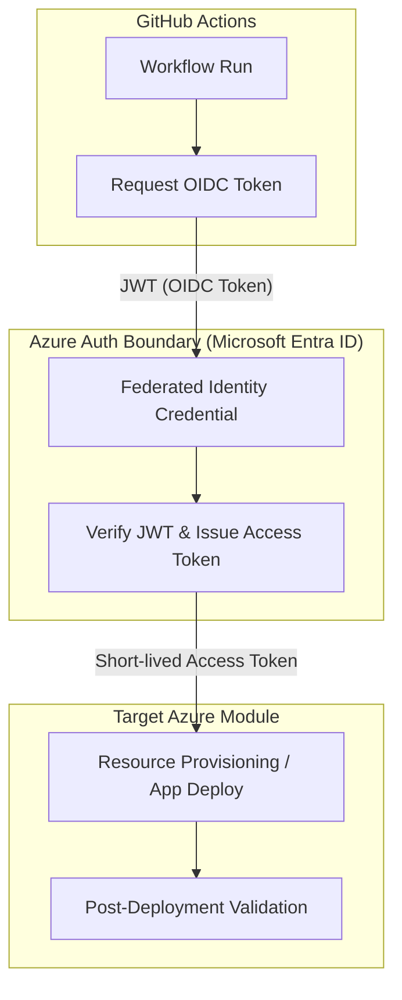

# GitHub Actions Azure Deployment Reference

This building block defines the secure reference pattern for deploying Azure resources and applications using GitHub Actions. It prioritizes identity-based authentication over long-lived secrets.

## Purpose

The purpose of this reference is to provide a standardized, secure, and repeatable pattern for CI/CD workflows targeting Azure. By following this pattern, development teams can ensure that their deployment pipelines are:

- **Secure:** Using OpenID Connect (OIDC) to eliminate the need for long-lived Azure Service Principal secrets in GitHub.
- **Auditable:** Leveraging Microsoft Entra ID (formerly Azure AD) for identity management and access control.
- **Consistent:** Providing a common structure for workflows across different modules and solutions.

## OIDC and Federated Identity

Traditional CI/CD patterns often rely on storing a Service Principal's `client-secret` as a GitHub Secret. This creates a security risk if the secret is leaked and requires manual rotation.

This reference recommends **OpenID Connect (OIDC)**. With OIDC, GitHub Actions requests a short-lived access token from Azure by presenting a GitHub-issued JWT (JSON Web Token). Azure verifies this token against a **Federated Identity Credential** configured on the Microsoft Entra application or User-Assigned Managed Identity.

### Why OIDC is preferred:
- **No long-lived secrets:** No Azure password or secret is stored in GitHub.
- **Automatic token expiration:** Access tokens are short-lived and valid only for the specific workflow run.
- **Granular trust:** Federated credentials can be restricted to specific GitHub repositories, branches, environments, or even specific workflow triggers.

## Authentication Flow

The following diagram illustrates the secure authentication boundary using OIDC:



## Required Secrets and Variables

To implement this pattern, the following GitHub Secrets (or Environment Variables) must be configured:

| Name | Type | Description |
|------|------|-------------|
| `AZURE_CLIENT_ID` | Secret | The Application (client) ID of the Entra ID app or Managed Identity. |
| `AZURE_TENANT_ID` | Secret | The Directory (tenant) ID of your Azure tenant. |
| `AZURE_SUBSCRIPTION_ID` | Secret | The ID of the Azure Subscription for deployment. |

## Implementation Guidance

Concrete GitHub Actions workflows (`.github/workflows/*.yml`) should be added to the repository only when they are tied to a specific **deployable module** or **reference solution**.

### Example Workflow Snippet (OIDC)

When creating a workflow, ensure the `id-token: write` permission is granted to allow the OIDC exchange:

```yaml
jobs:
  deploy:
    runs-on: ubuntu-latest
    permissions:
      id-token: write # Required for OIDC
      contents: read  # Required for checkout
    steps:
      - name: Checkout
        uses: actions/checkout@v4

      - name: Azure Login
        uses: azure/login@v2
        with:
          client-id: ${{ secrets.AZURE_CLIENT_ID }}
          tenant-id: ${{ secrets.AZURE_TENANT_ID }}
          subscription-id: ${{ secrets.AZURE_SUBSCRIPTION_ID }}

      - name: Run Azure CLI
        run: az account show
```

## Local run

Deployment workflows are designed to run in GitHub Actions. For local simulation or testing of deployment scripts:
1. Log in locally using `az login`.
2. Ensure your local identity has the same RBAC permissions as the Service Principal/Managed Identity used in CI.
3. Run deployment scripts (e.g., Terraform, Azure CLI) manually.

## Deploy

This is a documentation-first reference. Concrete deployment instructions depend on the target module.

## Tests/proof

Validation of this pattern involves:
1. **Static Analysis:** Verifying that workflows use `azure/login@v2` with OIDC parameters and have `id-token: write` permissions.
2. **End-to-End Test:** Successfully running a deployment workflow in a GitHub environment with configured Federated Identity.

## References
- [Use Azure Login action with OpenID Connect](https://learn.microsoft.com/en-us/azure/developer/github/connect-from-azure-openid-connect)
- [GitHub Actions for Azure](https://learn.microsoft.com/en-us/azure/developer/github/github-actions)
- [Configuring OpenID Connect in Azure](https://docs.github.com/en/actions/deployment/security-hardening-your-deployments/configuring-openid-connect-in-azure)
