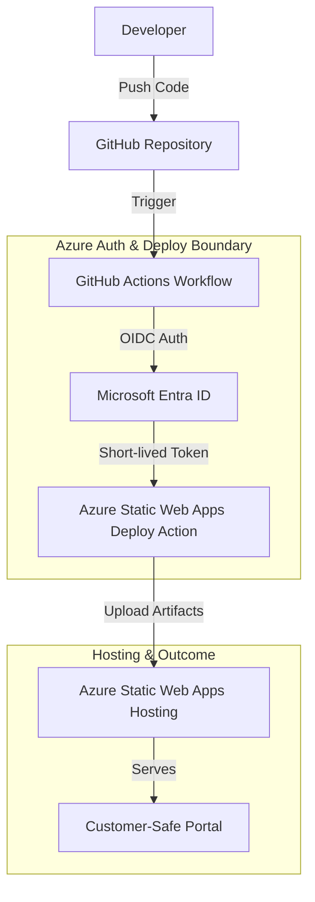

# GitHub Actions Azure Deployment Reference

Secure GitHub Actions deployment pattern for publishing the [Static Status Portal](../../portals/static-status-portal/) to Azure Static Web Apps.

## Purpose

This building block defines the reference pattern for deploying Azure Static Web Apps (SWA) using GitHub Actions. It prioritizes identity-based authentication (OIDC) to minimize the use of long-lived secrets.

## When to Use This Pattern

- **Use when**: Deploying the `static-status-portal` or similar frontend applications to Azure Static Web Apps from a GitHub repository.
- **Use when**: You want to eliminate long-lived Service Principal secrets in GitHub using OpenID Connect (OIDC).
- **Do not use when**: Deploying to non-Azure targets or using legacy credential-based authentication as the primary method.
- **Do not use when**: Deploying infrastructure-only changes (use Terraform/OpenTofu patterns instead).

## Deployment Architecture

The following diagram illustrates the secure deployment boundary:



## Configuration and Secrets

To implement this pattern securely, configure the following GitHub Repository Secrets. **Never commit these values to the repository.**

| Name | Type | Description |
|------|------|-------------|
| `AZURE_CLIENT_ID` | Secret | The Application (client) ID of the Entra ID app or Managed Identity configured for OIDC. |
| `AZURE_TENANT_ID` | Secret | The Directory (tenant) ID of your Azure tenant. |
| `AZURE_SUBSCRIPTION_ID` | Secret | The ID of the Azure Subscription. |
| `AZURE_STATIC_WEB_APPS_API_TOKEN` | Secret | (Optional) The SWA deployment token. Required if not using the full OIDC integration for the upload action. |

### OIDC Configuration Prerequisites
1. Create a Microsoft Entra application or User-Assigned Managed Identity.
2. Configure **Federated Identity Credentials** in Azure to trust your GitHub repository, branch, or environment.
3. Assign the `Contributor` role (or a custom role with SWA deployment permissions) to the identity at the target resource or resource group scope.

## Reference Workflow: Deploy Static Status Portal

The following YAML demonstrates a secure deployment for the `static-status-portal`.

```yaml
name: Deploy Static Status Portal

on:
  push:
    branches: [ main ]
    paths:
      - 'building-blocks/portals/static-status-portal/**'
  pull_request:
    types: [opened, synchronize, reopened, closed]
    branches: [ main ]
    paths:
      - 'building-blocks/portals/static-status-portal/**'

jobs:
  build_and_deploy:
    if: github.event_name == 'push' || (github.event_name == 'pull_request' && github.event.action != 'closed')
    runs-on: ubuntu-latest
    permissions:
      id-token: write # Mandatory for OIDC
      contents: read  # Mandatory for checkout

    steps:
      - uses: actions/checkout@v4
        with:
          submodules: true

      - name: 'Az CLI Login'
        uses: azure/login@v2
        with:
          client-id: ${{ secrets.AZURE_CLIENT_ID }}
          tenant-id: ${{ secrets.AZURE_TENANT_ID }}
          subscription-id: ${{ secrets.AZURE_SUBSCRIPTION_ID }}

      - name: 'Get ID Token for SWA'
        uses: actions/github-script@v7
        id: idtoken
        with:
          script: |
            const id_token = await core.getIDToken();
            core.setOutput('token', id_token);

      - name: Build And Deploy
        id: builddeploy
        uses: Azure/static-web-apps-deploy@v1
        with:
          # Use github_id_token for OIDC-native deployment to SWA
          github_id_token: ${{ steps.idtoken.outputs.token }}
          action: "upload"
          app_location: "building-blocks/portals/static-status-portal/src"
          api_location: "" # Linked API is handled separately or via portal-api-functions
          output_location: "dist" # Folder where the build output is generated
```

## Security & Customer-Safe Boundary

This pattern enforces strict boundaries to prevent leakage of technical internals:

- **Forbidden in Repository**: Never commit `.env`, `.publishsettings`, `.json` credentials, or hardcoded IDs.
- **Identity First**: Prefer OIDC over long-lived secrets.
- **Least Privilege**: The deployment identity should only have permissions to deploy to the specific SWA resource.
- **Log Masking**: GitHub Actions automatically masks secrets, but avoid printing technical identifiers (Tenant ID, Subscription ID) in non-secret variables if they might appear in customer-facing logs.

## Deployment/IaC Decision

- **Pattern-Only**: This building block defines the *workflow* contract. It does not include Terraform/OpenTofu files because it focuses on the GitHub Actions orchestration.
- **Prerequisites**: It assumes the Azure Static Web App resource has been provisioned (e.g., via a separate infra module or manually for initial setup).

## References
- [GitHub Actions for Azure Overview](https://learn.microsoft.com/en-us/azure/developer/github/github-actions)
- [Deploy to Azure Static Web Apps with GitHub Actions](https://learn.microsoft.com/en-us/azure/static-web-apps/build-configuration)
- [Azure Login action / OpenID Connect guidance](https://learn.microsoft.com/en-us/azure/developer/github/connect-from-azure-openid-connect)
