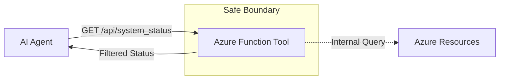

# HTTP Function as Agent Tool

## Purpose

This building block demonstrates a minimal HTTP-triggered Azure Function designed to serve as a **safe read-only tool boundary** for AI agents.

It provides a concrete reference for exposing enterprise data to agents without allowing arbitrary API passthrough or mutation operations.

## Architecture



## Tool Contract

### GET `/api/system_status`

Returns a high-level summary of the system status.

**Request Schema:**
- No parameters required for this reference.

**Response Schema:**
- `business_status` (string): Friendly operational status (e.g., "operational").
- `service_health` (string): technical health indicator.
- `active_regions` (array): List of regions currently serving traffic.
- `last_updated` (string): ISO8601 timestamp of the last status update.
- `environment` (string): Name of the environment.

## Security and Boundaries

- **Read-Only:** This tool does not accept parameters that modify state.
- **Data Redaction:** The implementation explicitly filters internal metadata, raw logs, and stack traces.
- **Authentication:** In Azure, this function should be protected via Function Keys or Microsoft Entra ID.
- **No Passthrough:** This is not a generic proxy to other Azure APIs; it returns a specific, pre-defined contract.

## Local Run

Prerequisites:
- [Azure Functions Core Tools](https://learn.microsoft.com/en-us/azure/azure-functions/functions-run-local)
- Python 3.10+

1. Install dependencies:
   ```bash
   pip install -r requirements.txt
   ```

2. Start the function locally:
   ```bash
   func start
   ```

3. Test the endpoint:
   ```bash
   curl http://localhost:7071/api/system_status
   ```

## Local Validation

Run tests to verify the tool logic and boundary:

```bash
PYTHONPATH=src python3 -m pytest tests
```

## Azure Deployment

This module can be deployed to an Azure Function App.

**Recommended SKU:** Flex Consumption (for scale-to-zero and managed identity support).

**Environment Variables:**
- `AzureWebJobsStorage`: Connection string for the storage account (required by Functions).

## Known Limits

- This reference uses a synchronous HTTP trigger. For long-running tasks (>230 seconds), use the [Queue Function Tool](../agent-tool-queue-function/README.md) pattern.
- This is a reference implementation; real-world status checks should be backed by actual resource monitoring or a status database.
