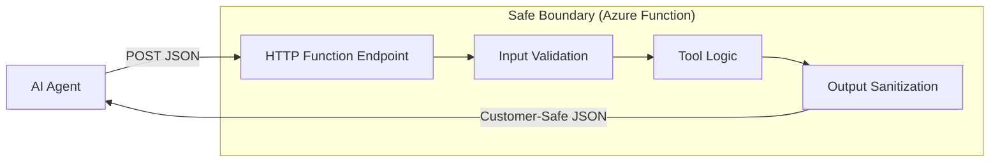

# Agent Tool HTTP Function

## Purpose

This building block demonstrates a **minimal Python Azure Functions HTTP endpoint** that exposes a controlled **read-only agent-tool contract**. It serves as a reference for how to bridge AI agents (like those in Azure AI Foundry) with internal systems or data sources using a safe, validated, and serverless boundary.

## Architecture



## Tool Contract

### Input Parameters (JSON POST)

- `resource_id` (string): The unique identifier for the resource (1-128 chars).
- `resource_type` (string): The type of the resource. Supported: `virtual_machine`, `storage_account`, `database`.

### Output Contract

- `resource_id` (string): The identifier of the resource.
- `resource_type` (string): The confirmed type.
- `status` (string): Current status (`running`, `stopped`, `degraded`, `unknown`).
- `location` (string): The Azure region.
- `tags` (object): Metadata tags.
- `summary` (string): A friendly business-level status summary.

## Security and Safety

- **Read-Only:** The implementation only provides information and does not support any mutation operations.
- **Input Validation:** Strict Pydantic-based validation rejects malformed or oversized requests before processing.
- **Safe Errors:** Internal stack traces and technical details are redacted. The API returns bounded, generic error messages for unhandled exceptions.
- **Authentication:** Configured with `Function` level authorization for Azure deployment. Anonymous access is disabled by default.
- **No Technical Leakage:** Does not log request bodies, tokens, or raw internal payloads.

## Local Development

### Prerequisites

- Python 3.10+
- [Azure Functions Core Tools](https://learn.microsoft.com/en-us/azure/azure-functions/functions-run-local)

### Local Run

```bash
# Navigate to the module directory
cd building-blocks/functions/agent-tool-http-function

# Install dependencies
pip install -r requirements.txt

# Start the function locally
func start
```

### Example Request

```bash
curl -X POST http://localhost:7071/api/get_resource_info \
  -H "Content-Type: application/json" \
  -d '{"resource_id": "vm-prod-01", "resource_type": "virtual_machine"}'
```

## Azure Deployment

This module includes minimal Terraform for deployment.

### Authentication Assumptions

- The deployed function uses **Function Key** authentication.
- For production use cases, it is recommended to place this behind **Azure API Management (APIM)** or use **Microsoft Entra ID** authentication.

## Validation Commands

```bash
# Run tests
pytest tests/

# Linting
ruff check src/
ruff format --check src/
```

## Known Limits

- This is a reference implementation with mocked logic; it does not connect to real Azure resources.
- Designed for small, stateless tool calls. For long-running work, consider the `agent-tool-queue-function` pattern (Track 3.2).

## Microsoft Documentation Consulted

- [Azure Functions HTTP trigger](https://learn.microsoft.com/en-us/azure/azure-functions/functions-bindings-http-webhook-trigger)
- [Azure Functions Python developer guide](https://learn.microsoft.com/en-us/azure/azure-functions/functions-reference-python)
- [Foundry Azure Functions tools](https://learn.microsoft.com/en-us/azure/foundry/agents/how-to/tools/azure-functions) (Consulted for distinction from queue-based tools).
