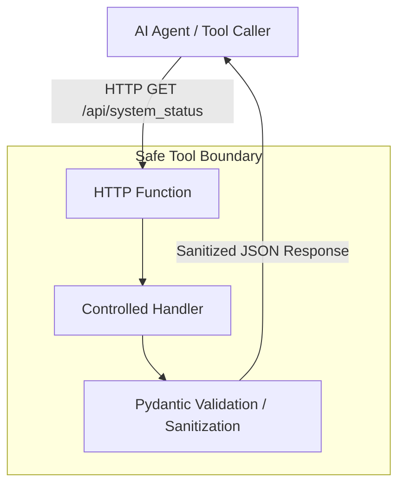

# HTTP Function as Agent Tool

## Purpose

This building block demonstrates a minimal HTTP-triggered Azure Function designed to serve as a **safe read-only tool boundary** for AI agents.

It provides a concrete reference for exposing enterprise data to agents without allowing arbitrary API passthrough or mutation operations, following the [Microsoft Foundry tool catalog](https://learn.microsoft.com/en-us/azure/foundry/agents/concepts/tool-catalog) principles.

## Architecture



## Tool Contract

### GET `/api/system_status`

Returns a high-level summary of the system status.

**Inputs:**
- None (GET request with no parameters).

**Outputs:**
- `business_status` (string): Friendly operational status (e.g., "operational").
- `service_health` (string): Technical health indicator.
- `active_regions` (array of strings): List of regions currently serving traffic.
- `last_updated` (string): ISO8601 timestamp of the last status update.
- `environment` (string): Name of the environment.

The response is deterministically validated using Pydantic models defined in `src/models.py`.

## Security Notes

- **Read-Only:** This tool does not accept parameters that modify state.
- **Deterministic Validation:** Uses Pydantic for strict output schema enforcement.
- **Customer-Safe Errors:** Implements friendly error responses to prevent leaking internal technical details.
- **Safe Logging Boundary:** The implementation explicitly forbids logging raw exception strings (`str(e)`), stack traces, or provider payloads to prevent accidental exposure of secrets, tokens, or internal technical detail in telemetry.
- **Data Redaction:** The implementation explicitly filters internal metadata, raw logs, and stack traces from the response.
- **Authentication:** In Azure, this function should be protected via Function Keys or Microsoft Entra ID.
- **No Passthrough:** This is not a generic proxy to other Azure APIs; it returns a specific, pre-defined contract.

## Known Limits

- This reference uses a synchronous HTTP trigger. For long-running tasks (>230 seconds), use the asynchronous pattern described in [Use Azure Functions with Foundry Agent Service](https://learn.microsoft.com/en-us/azure/foundry/agents/how-to/tools/azure-functions).
- This is a reference implementation; real-world status checks should be backed by actual resource monitoring or a status database.

## Local Run

Prerequisites:
- [Azure Functions Core Tools](https://learn.microsoft.com/en-us/azure/azure-functions/functions-run-local)
- Python 3.11+

1. Install dependencies:
   ```bash
   pip install -r requirements.txt
   ```

2. Start the function locally:
   ```bash
   func start
   ```

3. Test the endpoint:
   ```bash
   curl http://localhost:7071/api/system_status
   ```

## Local Validation

Run tests to verify the tool logic and boundary:

```bash
# From the module root
PYTHONPATH=. pytest tests/test_function.py
```

## Dependencies

- `azure-functions`: Python SDK for Azure Functions.
- `pydantic`: For deterministic validation.
- `pytest`: For running unit tests.

## Deployment / IaC Decision

This building block **includes module-local Terraform** to demonstrate the recommended Infrastructure-as-Code (IaC) pattern for Azure Functions Flex Consumption.

The decision to provide IaC is based on:
1. **Azure Native Best Practices:** Showing the correct configuration for Flex Consumption, including scale-to-zero and managed identity.
2. **Security-First Setup:** Explicitly demonstrating an identity-first storage configuration (secret-less) in Terraform.
3. **Repeatability:** Ensuring developers can provision the exact environment required to host this safe agent tool boundary.

## Azure Deployment

This module can be deployed using the provided Terraform in `infra/terraform/`.

**Recommended SKU:** Flex Consumption (for scale-to-zero and managed identity support).

**Identity-First Configuration:**
This reference uses Managed Identity for all storage operations. The following App Settings are handled by the provided Terraform:
- `AzureWebJobsStorage__accountName`: The name of the storage account.
- `AzureWebJobsStorage__credential`: Set to `managedidentity` to use the Function's identity.

## Microsoft Documentation

- [Azure Functions Overview](https://learn.microsoft.com/en-us/azure/azure-functions/functions-overview)
- [Azure Functions Python Developer Guide](https://learn.microsoft.com/en-us/azure/azure-functions/functions-reference-python)
- [Azure AI Foundry Agents Tool Catalog](https://learn.microsoft.com/en-us/azure/foundry/agents/concepts/tool-catalog)
- [Use Azure Functions with Foundry Agent Service](https://learn.microsoft.com/en-us/azure/foundry/agents/how-to/tools/azure-functions)
- [Terraform on Azure](https://learn.microsoft.com/en-us/azure/developer/terraform/overview)
