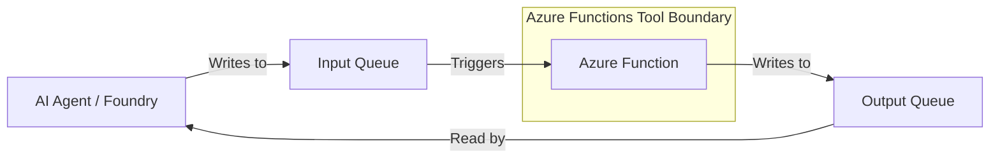

# Queue Function as Agent Tool

## Purpose

This building block demonstrates an asynchronous, queue-triggered Azure Function designed to serve as a **long-running tool boundary** for AI agents.

It provides a concrete reference for executing complex or time-consuming tasks (up to the Function's timeout limit) without blocking the agent's immediate conversation flow.

## Architecture



## Tool Contract

The agent communicates with the function through Azure Storage Queues.

### Input Message Schema (Input Queue)

The message placed in the input queue must follow this structure:

- `function_args` (object): Arguments required by the tool (e.g., `{"location": "Seattle"}`).
- `CorrelationId` (string): A unique identifier provided by the agent to track the request.

### Output Message Schema (Output Queue)

The function must return a message to the output queue with this structure:

- `Value` (string/object): The result of the tool execution.
- `Error` (string, optional): A safe error message if the tool execution fails.
- `CorrelationId` (string): The matching identifier from the input message.

## Security and Boundaries

- **No Raw Logs:** The function must not include raw technical logs, stack traces, or internal metadata in the `Value` field returned to the agent.
- **Secrets Boundary:** No secrets, connection strings, or tokens should ever be included in queue messages.
- **Read-Only vs. Mutation:** While queue-based tools can perform mutations, this reference emphasizes safe, business-level operations.
- **Correlation ID:** The `CorrelationId` is mandatory for the agent to successfully associate the result with the original call.

## Local Run

Prerequisites:
- [Azure Functions Core Tools](https://learn.microsoft.com/en-us/azure/azure-functions/functions-run-local)
- [Azurite](https://github.com/Azure/Azurite) (for local storage emulation)
- Python 3.10+

1. Install dependencies:
   ```bash
   pip install -r requirements.txt
   ```

2. Start Azurite:
   ```bash
   azurite
   ```

3. Start the function locally:
   ```bash
   func start
   ```

## Local Validation

Run tests to verify the tool logic and `CorrelationId` handling:

```bash
PYTHONPATH=. python3 -m pytest tests
```

## Azure Deployment

This module should be deployed to an Azure Function App.

**Recommended SKU:** Flex Consumption.

### Terraform Deployment

A minimal Terraform deployment reference is provided in the [infra/terraform/](infra/terraform/) directory. It provisions the necessary Resource Group, Storage Account, Storage Queues, and the Flex Consumption Function App.

**Required Configuration:**
- `AzureWebJobsStorage`: Connection string for the storage account.
- `STORAGE_CONNECTION`: Connection string (or service URI if using managed identity) for the queues.

## Known Limits

- Queue-based tools are asynchronous; the agent will wait for the message to appear in the output queue.
- Standard Function execution limits apply.
- Ensure the agent's timeout settings match the expected execution time of the function.
