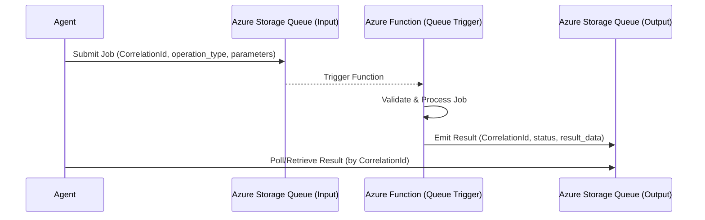

# Agent Tool Queue Function

Async queue-based Azure Function reference for longer-running agent tool execution. This building block demonstrates how to decouple an agent's tool call from its execution using Azure Storage Queues and a correlation-based status pattern.

## Purpose

When an agent needs to perform a task that exceeds the typical timeout of a synchronous HTTP call (e.g., complex analysis, multi-step validation), a queue-based pattern is preferred. This module provides a deterministic, customer-safe reference for such a flow.

## Service-Level Mermaid Diagram



## Schema Examples

### Input Message (Queue)

```json
{
  "correlation_id": "job-12345678",
  "operation_type": "analyze_text",
  "parameters": {
    "text": "The quick brown fox jumps over the lazy dog."
  }
}
```

### Output Message (Queue)

```json
{
  "correlation_id": "job-12345678",
  "status": "succeeded",
  "result_data": {
    "length": 43,
    "word_count": 9,
    "is_upper": false
  },
  "error_message": null,
  "timestamp": "2024-07-03T12:00:00Z"
}
```

## Status Model

- `queued`: Job received and waiting in the input queue.
- `running`: Job picked up by the Function (internal state).
- `succeeded`: Job completed successfully; results in `result_data`.
- `failed`: Job failed; customer-safe error in `error_message`.

## Security Notes

- **Redaction**: Raw exceptions and stack traces are never returned to the output queue or logged.
- **Validation**: Strict validation of `correlation_id` (alphanumeric, 8-64 chars) and job schema.
- **Least Privilege**: Requires `Storage Queue Data Contributor` and `Storage Queue Data Message Processor` roles.

## Known Limits

- **Message Size**: Azure Storage Queue messages are limited to 64KB.
- **Latency**: Not suitable for real-time interactive tools; intended for background work.

## Local Commands

### Install dependencies
```bash
python -m pip install -r requirements.txt -r requirements-test.txt
```

### Run tests
```bash
pytest tests/
```

### Linting
```bash
ruff check .
ruff format --check .
```

## Microsoft Learn References

- [Azure Functions overview](https://learn.microsoft.com/en-us/azure/azure-functions/functions-overview)
- [Azure Queue Storage trigger and bindings](https://learn.microsoft.com/en-us/azure/azure-functions/functions-bindings-storage-queue)
- [Use Azure Functions with Foundry Agent Service](https://learn.microsoft.com/en-us/azure/foundry/agents/how-to/tools/azure-functions)
