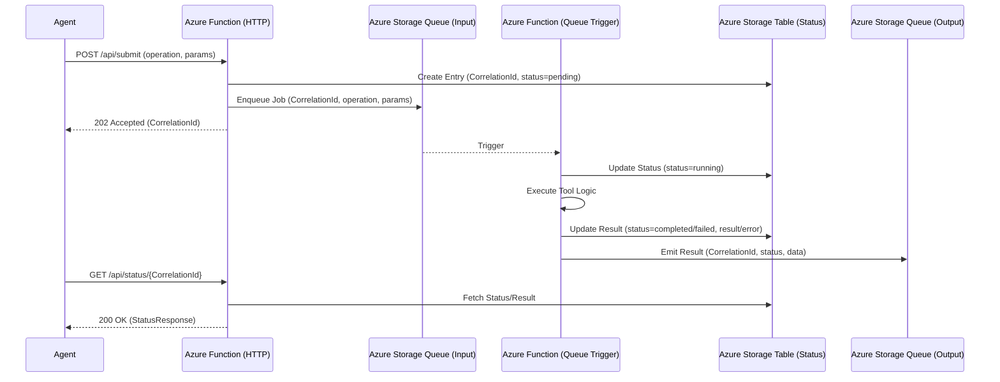

# Agent Tool Queue Function

Async queue-backed Azure Function reference for longer-running agent tool execution. This building block demonstrates how to decouple an agent's tool call from its execution using Azure Storage Queues, Table Storage for status persistence, and a correlation-based API contract.

## Purpose

When an agent needs to perform a task that exceeds the typical timeout of a synchronous HTTP call (e.g., complex analysis, multi-step validation), a queue-based pattern is preferred. This module provides a deterministic, customer-safe reference for such a flow with explicit `submit` and `status` endpoints.

## Service-Level Mermaid Diagram



## Contracts

### Submit Job (POST /api/submit)

**Request:**
```json
{
  "operation_type": "analyze_text",
  "parameters": {
    "text": "The quick brown fox..."
  }
}
```

**Response (202 Accepted):**
```json
{
  "correlation_id": "550e8400-e29b-41d4-a716-446655440000",
  "status": "pending"
}
```

### Get Status (GET /api/status/{id})

**Response (200 OK):**
```json
{
  "id": "550e8400-e29b-41d4-a716-446655440000",
  "status": "completed",
  "business_summary": "Job completed successfully.",
  "created_at": "2024-07-03T12:00:00Z",
  "started_at": "2024-07-03T12:00:01Z",
  "finished_at": "2024-07-03T12:00:05Z",
  "result_data": {
    "word_count": 4,
    "length": 20
  }
}
```

## Security Notes

- **Opaque Identifiers**: Correlation IDs are UUIDs; no internal Azure identifiers or database keys are exposed.
- **Redaction**: Raw exceptions and stack traces are never returned to the customer or logged.
- **Validation**: Strict Pydantic models with `extra="forbid"` enforce the API and queue contracts.
- **Least Privilege**: Requires `Storage Queue Data Contributor`, `Storage Queue Data Message Processor`, and `Storage Table Data Contributor` roles. No storage keys or connection strings are used.

## Local Commands

### Install dependencies
```bash
python -m pip install -r requirements.txt -r requirements-test.txt
```

### Run tests
```bash
pytest tests/
```

### Linting
```bash
ruff check .
ruff format --check .
```

## Microsoft Learn References

- [Azure Functions overview](https://learn.microsoft.com/en-us/azure/azure-functions/functions-overview)
- [Azure Queue Storage trigger and bindings](https://learn.microsoft.com/en-us/azure/azure-functions/functions-bindings-storage-queue)
- [Use Azure Functions with Foundry Agent Service](https://learn.microsoft.com/en-us/azure/foundry/agents/how-to/tools/azure-functions)
- [Azure Table Storage as a simple state store](https://learn.microsoft.com/en-us/azure/storage/tables/table-storage-overview)
