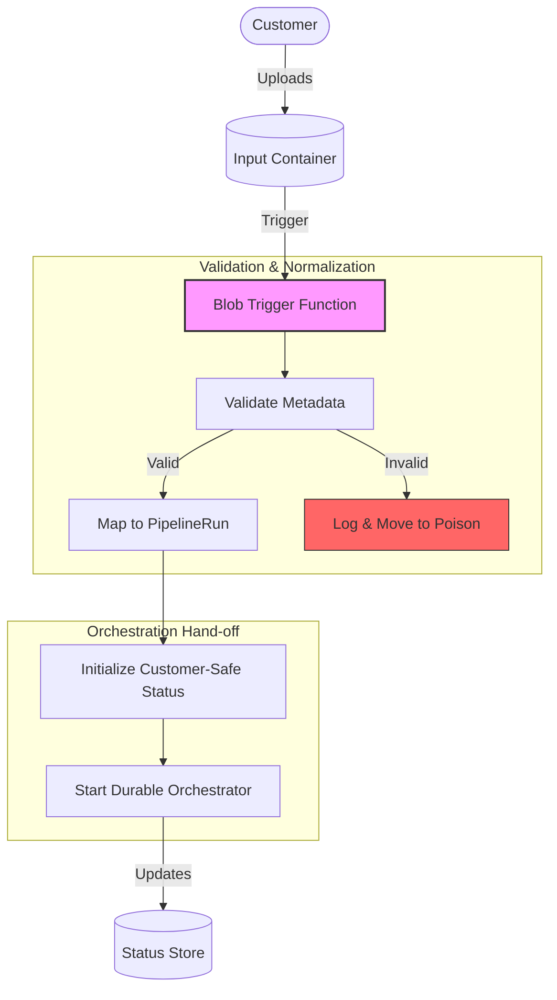

# Blob Trigger Start Pipeline

Reference trigger for starting a Document AI pipeline when a customer uploads a file to Azure Blob Storage.

## Purpose

Convert an unstructured Blob Storage upload into a normalized, validated pipeline start event. This module acts as the entrypoint for the Document AI portal, ensuring that technical storage details are decoupled from business orchestration.

## Trigger Model

- **Primary**: Event Grid-based Blob Trigger (recommended for low latency and Azure Functions Flex Consumption).
- **Fallback**: Polling-based Blob Trigger (for local development with Azurite).

## Input Metadata

The trigger expects metadata to be provided via the blob path or blob metadata:
- `customer_id`: Unique identifier for the customer (e.g., from the path `uploads/{customer_id}/...`).
- `document_type`: The type of document being uploaded (e.g., `invoice`, `receipt`).
- `correlation_id`: Optional ID for cross-system tracing.

## Process Flow

## Normalized Pipeline Start Event

The trigger normalizes the input into a `PipelineRun` object as defined in `shared/contracts/pipeline-run.schema.json`:

| Field | Source | Description |
|-------|--------|-------------|
| `id` | Generated (UUID) | Unique ID for this specific run. |
| `customer_id` | Blob Path/Metadata | Owner of the document. |
| `pipeline_type` | Blob Metadata | Determines the Durable orchestration to start. |
| `status` | Constant | Initialized to `pending`. |
| `correlation_id` | Metadata/Trigger | Used for end-to-end tracing. |

## Durable Functions Hand-off

The function uses the `DurableClient` binding to start the orchestration:
1. Validates that no active orchestration exists for the same `id` (if idempotency is required).
2. Calls `client.start_new(orchestrator_name, instance_id=run_id, client_input=pipeline_run_data)`.
3. Returns a success response once the orchestration is scheduled.

## Customer-Safe Status Boundary

This module enforces the following safety rules:
- **No SAS Tokens**: Raw blob URLs with SAS tokens are never stored in the customer-facing status.
- **No Connection Strings**: Internal storage account credentials stay within the Function environment.
- **Internal IDs**: Azure Resource IDs for the Storage Account or Function App are redacted from public metadata.

## Local Validation

1. **Azurite**: Run Azurite to emulate Azure Storage locally.
2. **Core Tools**: Run `func host start` from the module root.
3. **Trigger**: Use the `Azure Storage Explorer` or `az` CLI to upload a file to the local `input` container.
4. **Test**: Run `pytest building-blocks/functions/blob-trigger-start-pipeline/tests/`.

## Azure Deployment Assumptions

- **Managed Identity**: The Function App must have `Storage Blob Data Reader` on the input container.
- **Hosting**: Azure Functions Flex Consumption is the preferred plan.
- **Networking**: For high security, use Private Endpoints for the Storage Account and restricted ingress for the Function App.

## Known Limits

- **Retries**: Azure Functions retries the trigger 5 times by default.
- **Poison Queue**: Failed blobs after max retries are moved to the `webjobs-blobtrigger-poison` queue.
- **File Size**: Large files should be processed via streams to avoid memory exhaustion (Flex Consumption helps mitigate this).
