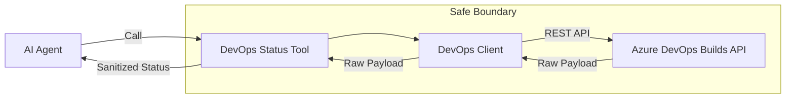

# DevOps Status Tool

## Purpose

This building block provides a **safe read-only tool boundary** for retrieving Azure DevOps build status. It is designed to be consumed by AI agents (e.g., Azure AI Foundry agents) to answer questions about CI/CD pipelines without exposing internal technical details, source code metadata, or credentials.

## Architecture



## Tool Contract

### Input parameters

- `organization_url` (string): The URL of the Azure DevOps organization (e.g., `https://dev.azure.com/myorg`).
- `project` (string): The project name or ID.
- `build_id` (integer): The unique identifier for the build.

### Output contract

Matches `shared/contracts/devops-status.schema.json`.

- `pipeline_name` (string): Friendly name of the pipeline.
- `run_id` (string): The build ID.
- `status` (string): Current state (`inProgress`, `completed`, `queued`, etc.).
- `result` (string): Outcome (`succeeded`, `failed`, `canceled`, etc.).
- `branch` (string): Always returns `"redacted"` for safety.
- `start_time` (datetime): ISO8601 start time.
- `end_time` (datetime, optional): ISO8601 finish time.
- `duration_seconds` (integer, optional): Total duration in seconds.
- `summary` (string): A business-level summary of the status.
- `portal_url` (string): A sanitized link to the build in the Azure DevOps portal.

## Security Boundary

- **Read-Only:** The tool only implements `GET` operations. It cannot queue, cancel, or modify builds.
- **Data Redaction:**
    - `branch` names and `sourceVersion` (commit SHAs) are explicitly redacted.
    - Repository URLs, commit messages, and author details are never exposed.
    - Logs and timeline details are not retrieved.
- **Safe Logging:** Telemetry and logs are stripped of PATs, internal URLs, and raw provider payloads.
- **Input Validation:** Strict regex and type validation for all input parameters before any network call.

## Configuration

Required environment variables for local testing:

- `AZURE_DEVOPS_PAT`: A Personal Access Token with `Build (Read)` scope.

## Local Run

```bash
# Install dependencies
pip install -r requirements.txt

# Run the CLI tool
export AZURE_DEVOPS_PAT="your-pat-here"
python3 -m src.main --org-url https://dev.azure.com/yourorg --project yourproj --build-id 12345
```

## Local Validation

```bash
# Run tests
PYTHONPATH=. python3 -m pytest tests/

# Linting
ruff check src/
ruff format --check src/
```

## Known Limits

- Only supports Azure DevOps Services (`dev.azure.com` and `{org}.visualstudio.com`).
- Limited to retrieving exactly one build by ID.
- Does not support arbitrary queries or listing builds.

## Microsoft Documentation Consulted

- [Builds - Get REST API (7.1)](https://learn.microsoft.com/en-us/rest/api/azure/devops/build/builds/get?view=azure-devops-rest-7.1)
- [Azure DevOps Authentication Guidance](https://learn.microsoft.com/en-us/azure/devops/integrate/get-started/authentication/authentication-guidance?view=azure-devops)
