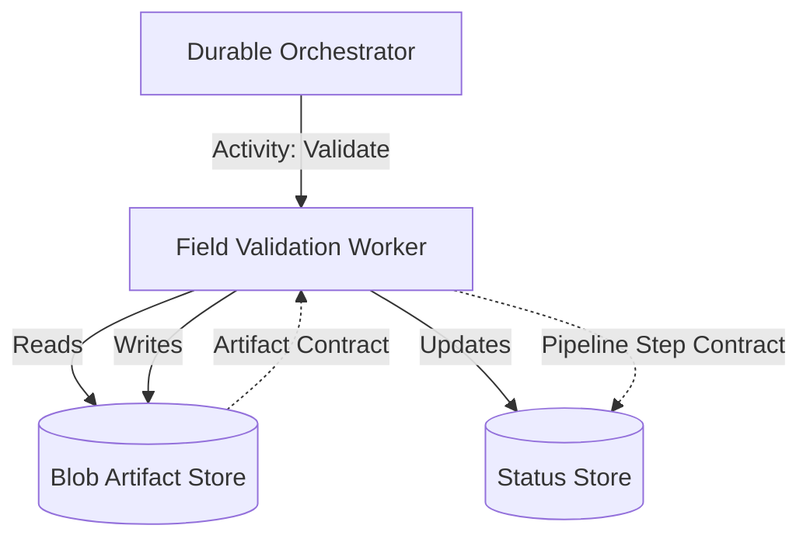

# Field Validation Worker

This building block provides a worker contract for validating fields extracted via OCR (e.g., Azure AI Document Intelligence) against business rules and confidence thresholds.

## Purpose

The Field Validation Worker is responsible for ensuring that the structured data extracted from a document meets the quality and business requirements of the application. It acts as a gatekeeper before the data is finalized or presented to the customer.

## Service-Level Diagram

## Trigger/Input Assumptions

- **Trigger**: Typically invoked as a Durable Functions activity after an OCR step has completed.
- **Inputs**:
  - `run_id`: The unique identifier for the current processing pipeline run.
  - `artifact_id`: The ID of the artifact containing the extracted fields (usually JSON output from OCR).
  - `ruleset_id`: (Optional) Specifies which set of business rules to apply to the validation.

## Validation Responsibility

- **Schema Validation**: Ensures the OCR output matches the expected JSON structure.
- **Confidence Thresholds**: Flags fields with extraction confidence scores below a defined threshold.
- **Business Rule Validation**: Checks for data consistency, required fields, and domain-specific rules (e.g., date formats, sum of line items matching total).
- **Customer-Safe Error Generation**: Translates technical validation failures into friendly, actionable messages for the customer.

## Outputs

- **Validation Status**: `valid`, `invalid`, or `warning`.
- **Missing Fields**: A list of required fields that were absent in the OCR output.
- **Invalid Fields**: A list of fields that failed one or more business rules, including the reason.
- **Generated Artifacts**: A validation report (JSON or PDF) stored in the artifact store.

## Failure Model

- **Transient Failures**: Handled by Durable Functions retry policies (e.g., storage access issues).
- **Permanent Failures**:
  - `Missing Artifact`: If the specified `artifact_id` does not exist.
  - `Unsupported Format`: If the artifact content cannot be parsed.
  - `Internal Engine Error`: If the validation logic itself encounters an unhandled exception.
- **Result Status**: Failures are reported back to the orchestrator and logged in the `pipeline-step` status with a `failed` status and a `friendly_error`.

## Customer-Safe Boundary

Strictly follows the repository-wide security and privacy guidelines.

### Allowed Customer-Facing Data
- Friendly validation status (e.g., "Data validation successful", "Action required: missing fields").
- Names of missing or invalid fields.
- High-level reasons for validation failure (e.g., "Total amount does not match subtotal").
- Validation reports marked as `is_customer_visible: true`.

### Forbidden Data (Internal-Only)
- Raw validation engine logs or trace IDs.
- Technical business rule definitions or logic paths.
- Internal storage URLs or SAS tokens.
- Raw stack traces or provider-specific error payloads.

## Deployment Assumptions

- Hosted as an Azure Function (Flex Consumption recommended).
- Requires Managed Identity with `Storage Blob Data Reader` and `Storage Blob Data Contributor` roles on the artifact storage account.
- Configured to use Application Insights for technical observability.

## Local / Demo Notes

1. Use Azure Functions Core Tools to run the worker locally.
2. Use Azurite for local blob storage emulation.
3. Mock the OCR result artifact in the local `artifacts` container.
4. Use a local `run_id` and `artifact_id` to test the validation logic via the Function's HTTP or Queue trigger.

## Known Limits

- Business rules are currently defined statically; dynamic ruleset management is not part of this contract.
- Validation is limited to structured JSON artifacts; raw text or unstructured data validation requires a different worker.
