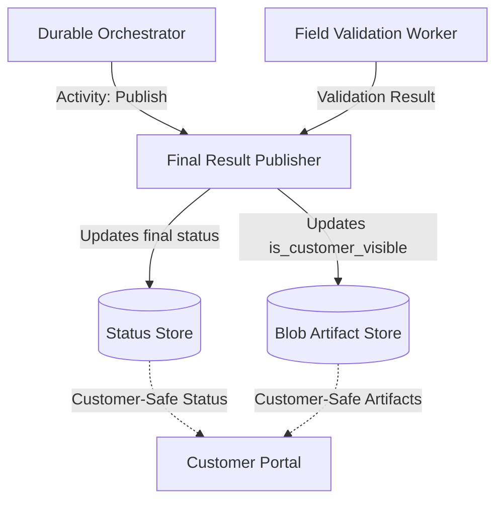

# Final Result Publisher

This building block provides a worker contract for finalizing a document processing pipeline and publishing the results to the customer-facing portal.

## Purpose

The Final Result Publisher is the last step in the Document AI pipeline. It takes the validated fields and artifacts, marks them as safe for customer consumption, and updates the final status of the pipeline run. It acts as the final enforcement point for the [Customer-Safe Status Boundary](../../security/customer-safe-status-boundary/).

## Service-Level Diagram

## Trigger/Input Assumptions

- **Trigger**: Invoked as a Durable Functions activity after the `Field Validation Worker` has completed.
- **Inputs**:
  - `run_id`: The unique identifier for the pipeline run.
  - `correlation_id`: (Optional) Opaque identifier provided by the customer or portal for end-to-end tracking.
  - `validation_status`: The outcome from the validation step (e.g., `valid`, `warning`).
  - `artifact_ids`: A list of artifact IDs (e.g., extracted JSON, validation report) that should be made visible to the customer.

## Publication Responsibility

- **Artifact Finalization**: Updates the `is_customer_visible` flag to `true` for all specified `artifact_ids` in the artifact store.
- **Status Finalization**: Updates the `pipeline-run` status to `completed` (or `failed` if validation was critical).
- **Correlation Preservation**: Ensures the `correlation_id` is preserved in the final status store record to facilitate customer-side tracking across the portal boundary.
- **Internal ID Redaction**: Explicitly strips technical orchestration IDs, activity IDs, and internal task references before finalizing the customer-safe record.
- **Business Summary**: Generates a final, customer-friendly `business_summary` of the entire processing run.
- **Idempotency**: Ensures that multiple calls with the same `run_id` do not create duplicate final states or redundant notifications.

## Outputs

- **Publication Status**: `published` or `failed`.
- **Friendly Summary**: A high-level message for the customer (e.g., "Processing complete. Your document data is now available.").

## Failure Model

- **Transient Failures**: Handled by Durable Functions retry policies (e.g., intermittent storage or database connectivity).
- **Permanent Failures**:
  - `Invalid Run ID`: If the pipeline run cannot be found.
  - `Access Denied`: If the managed identity lacks permissions to update status or artifacts.
- **Result Status**: Failures are reported back to the orchestrator and captured in the `pipeline-step` status for the publishing activity.

## Customer-Safe Boundary

Strictly enforces the boundary between internal processing and customer-facing results.

### Allowed Customer-Facing Data
- Final business status (`completed`, `failed`).
- Customer-friendly summaries (e.g., "All 10 fields validated successfully").
- Artifacts explicitly marked with `is_customer_visible: true`.
- ISO-8601 timestamps for completion.

### Forbidden Data (Internal-Only)
- **Raw OCR Payloads**: Never expose the raw JSON response from Document Intelligence.
- **Prompts**: No system instructions, few-shot examples, or model grounding text.
- **Internal Logs**: No internal orchestration logs, activity IDs, or technical trace data.
- **Internal Azure IDs**: No subscription IDs, resource group names, or raw resource URIs.
- **Storage Internals**: No SAS tokens, raw blob URLs, or storage account names.
- **Stack Traces**: No technical error details or code-level diagnostics.
- **Secrets**: No API keys or connection strings.

## Deployment Assumptions

- Hosted as an Azure Function (Flex Consumption).
- Requires Managed Identity with `Storage Blob Data Contributor` role (or equivalent for the status store).
- Integrated with Application Insights for technical telemetry (which remains internal).

## Local / Demo Notes

1. Use Azure Functions Core Tools to run the publisher locally.
2. Use Azurite for local blob storage emulation.
3. Mock a completed pipeline run and validation result to test the publishing logic.
4. Verify that the `is_customer_visible` flag is correctly toggled in the local artifact metadata.

## Known Limits

- This block defines the **contract** and **behavior**; the actual storage implementation (e.g., Cosmos DB, Table Storage, or SQL) is abstracted by the status store building block.
- Real Azure Function runtime code and storage writes are not included in this reference.
- No portal UI is provided here; it is expected that a portal consumes the published data.
