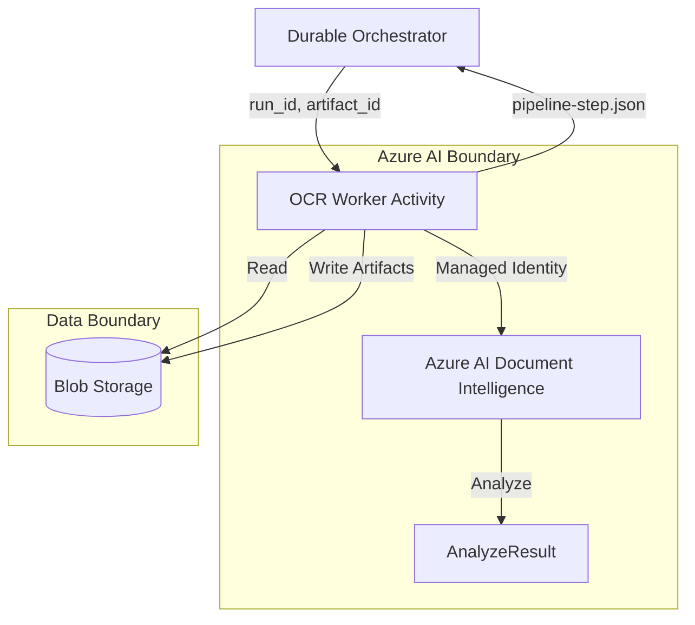

# OCR Document Intelligence

Reference OCR/extraction function using Azure AI Document Intelligence.

## Purpose

Extract text, fields, confidence values, and artifacts from documents as one step in a larger pipeline. This module serves as a Durable Functions Activity worker.

## Trigger / Input Assumptions

- **Trigger**: Invoked as a Durable Activity by an orchestrator.
- **Inputs**:
    - `run_id`: The unique pipeline execution ID.
    - `artifact_id`: The ID of the document to process (must be a valid `artifact.schema.json` entry).
    - `document_type`: Hint for the Document Intelligence model (e.g., `prebuilt-invoice`, `prebuilt-layout`, or a custom model ID).

## Document Intelligence Responsibility

- **Connect**: Authenticate using Managed Identity (no keys).
- **Analyze**: Send the document blob to Azure AI Document Intelligence.
- **Process**: Poll for completion and extract the relevant result object.
- **Store**: Save raw OCR results as a private artifact if configured.

## Outputs

This module returns a normalized object conforming to the `pipeline-step.schema.json` contract:
- **`extracted_text`**: Aggregated text content from all pages.
- **`fields`**: Map of extracted business fields (for prebuilt/custom models).
- **`confidence`**: Mean confidence of extracted fields/text.
- **`artifacts`**: IDs of generated artifacts (e.g., extracted JSON).
- **`status`**: `completed` or `failed`.

## Service-Level Diagram

## Failure Model

- **Transient Errors**: The Activity utilizes Durable Functions retry policies for 429s or 5xx from Azure.
- **Contract Failures**: If the document is unreadable or the model fails, the worker returns `status: failed` with a `friendly_error` suitable for the customer.
- **Internal Errors**: Raw SDK exceptions and stack traces are logged to Application Insights but *never* returned to the orchestrator in the `friendly_error` field.

## Customer-Safe Boundary

Strict adherence to the [Customer-Safe Status Boundary](../../security/customer-safe-status-boundary/) is required.

### Allowed
- Extracted business fields (names, values, confidence).
- Summary of processing status (e.g., "Analysis complete").
- Friendly error messages (e.g., "The document provided is not a valid invoice").

### Forbidden
- Raw Document Intelligence JSON responses.
- Azure Storage SAS URLs or connection strings.
- Subscription IDs, Resource Group names, or Provider Endpoint URLs.
- Internal Correlation IDs (use `run_id` instead).

## Deployment Assumptions

- **Identity**: The Azure Function must have a System-Assigned or User-Assigned Managed Identity.
- **RBAC**:
    - `Cognitive Services User` on the Document Intelligence resource.
    - `Storage Blob Data Reader` on the input container.
    - `Storage Blob Data Contributor` on the artifact container.
- **Version**: Uses Azure AI Document Intelligence v4.0 (GA).

## Local / Demo Flow

1. Run [Azurite](https://github.com/Azure/Azurite) for local blob storage.
2. Use `DefaultAzureCredential` to authenticate locally via Azure CLI.
3. Use the [Document Intelligence Studio](https://documentintelligence.ai.azure.com/studio) to verify model IDs before integration.

## Known Limits

- Large documents (>50MB) may require direct URL processing rather than stream uploads.
- Custom neural models require training and a specific model ID.
