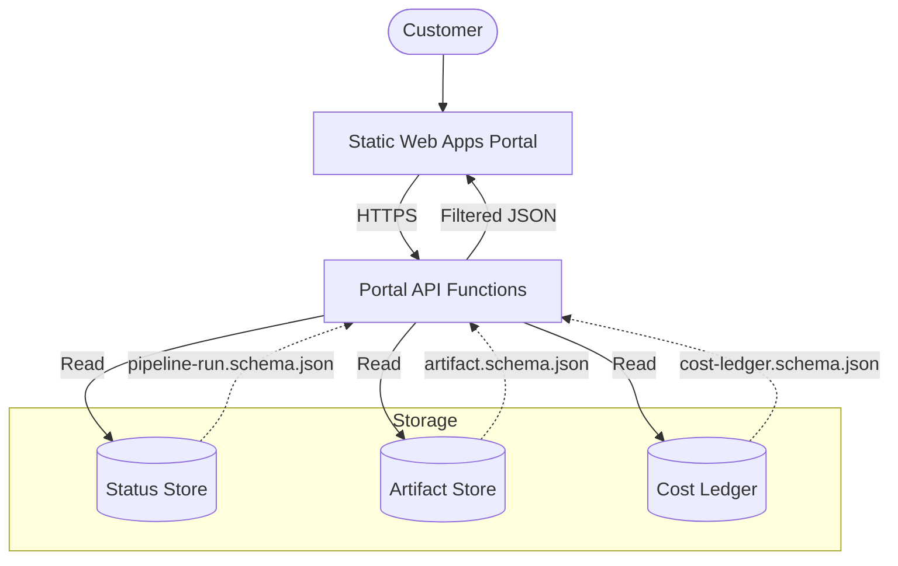

# Portal API Functions

Backend API layer providing customer-safe access to Document AI pipeline status, artifacts, and costs.

## Purpose

The Portal API acts as the **enforcement boundary** between internal technical execution and the customer-facing portal. It ensures that only curated, non-sensitive data is exposed to end-users while providing a stable contract for the frontend.

## Architecture Boundary



## API Contract

All endpoints return JSON and follow the schemas defined in `shared/contracts/`.

### Endpoints

| Method | Path | Description | Output Schema |
|--------|------|-------------|---------------|
| `GET` | `/runs` | List recent pipeline runs for the authenticated customer. | `Array<PipelineRun>` (Summary) |
| `GET` | `/runs/{runId}` | Get full details and step timeline for a specific run. | `PipelineRun` + `Array<PipelineStep>` |
| `GET` | `/runs/{runId}/artifacts` | Get metadata for customer-visible artifacts. | `Array<Artifact>` |
| `GET` | `/runs/{runId}/cost` | Get the aggregated estimated cost for a run. | Aggregate of `CostLedgerEntry` |
| `POST` | `/runs/start` | (Future) Initiate a new pipeline run. | `PipelineRun` (Initial status) |

### Error Model

Errors follow a standard structure to avoid leaking stack traces:

```json
{
  "error": {
    "code": "FriendlyErrorCode",
    "message": "A non-technical message explaining what went wrong.",
    "correlation_id": "opaque-reference-id"
  }
}
```

## Customer-Safe Boundary

This module strictly enforces the [Customer-Safe Status Boundary](../../security/customer-safe-status-boundary/).

### Allowed Customer-Facing Data
- **Business Status**: `pending`, `running`, `completed`, `failed` (from `PipelineRun`).
- **Friendly Step Names**: Human-readable progress (e.g., "Analyzing Document").
- **Safe Summaries**: High-level outcomes (e.g., "5 fields extracted").
- **Extracted Fields**: Business data explicitly mapped to the `PipelineStep` output.
- **Friendly Errors**: Curated messages for common failure scenarios.
- **Aggregated Cost**: Total estimated amount for the run.

### Forbidden Data (Internal-Only)
- **Raw Logs**: No Function logs or internal execution traces.
- **Prompts**: No system instructions or LLM grounding text.
- **Secrets**: No SAS tokens, connection strings, or API keys.
- **Technical IDs**: No Azure Subscription, Tenant, or Resource IDs.
- **Provider Payloads**: No raw Document Intelligence or OpenAI JSON responses.

## Authentication & Identity

- **Authentication**: Managed via Azure Static Web Apps (SWA) built-in authentication or EasyAuth.
- **Identity**: The API uses **Managed Identity** to access the underlying storage stores (Table/Blob).
- **Authorization**: Responses are filtered based on the `customer_id` context derived from the authenticated token.

## Local / Demo Flow

1. Run the Functions project locally using [Azure Functions Core Tools](https://learn.microsoft.com/en-us/azure/azure-functions/functions-run-local).
2. Use Azurite to emulate storage.
3. Access candidate endpoints via `http://localhost:7071/api/runs`.
4. Use the `shared/contracts/` schemas to mock responses.

## Deployment Assumptions

- Hosted on **Azure Functions (Flex Consumption)**.
- Integrated as a backend for **Azure Static Web Apps**.
- VNet Integration enabled for secure access to internal storage resources.
- Identity-based access to Storage/Table containers (RBAC: `Storage Table Data Reader`, `Storage Blob Data Reader`).

## Known Limits

- The current contract is focused on read-only status; write operations (except `/runs/start`) are out of scope.
- Aggregated cost is an estimate and may lag behind real-time execution.
- Large artifact lists may require pagination in future versions.
