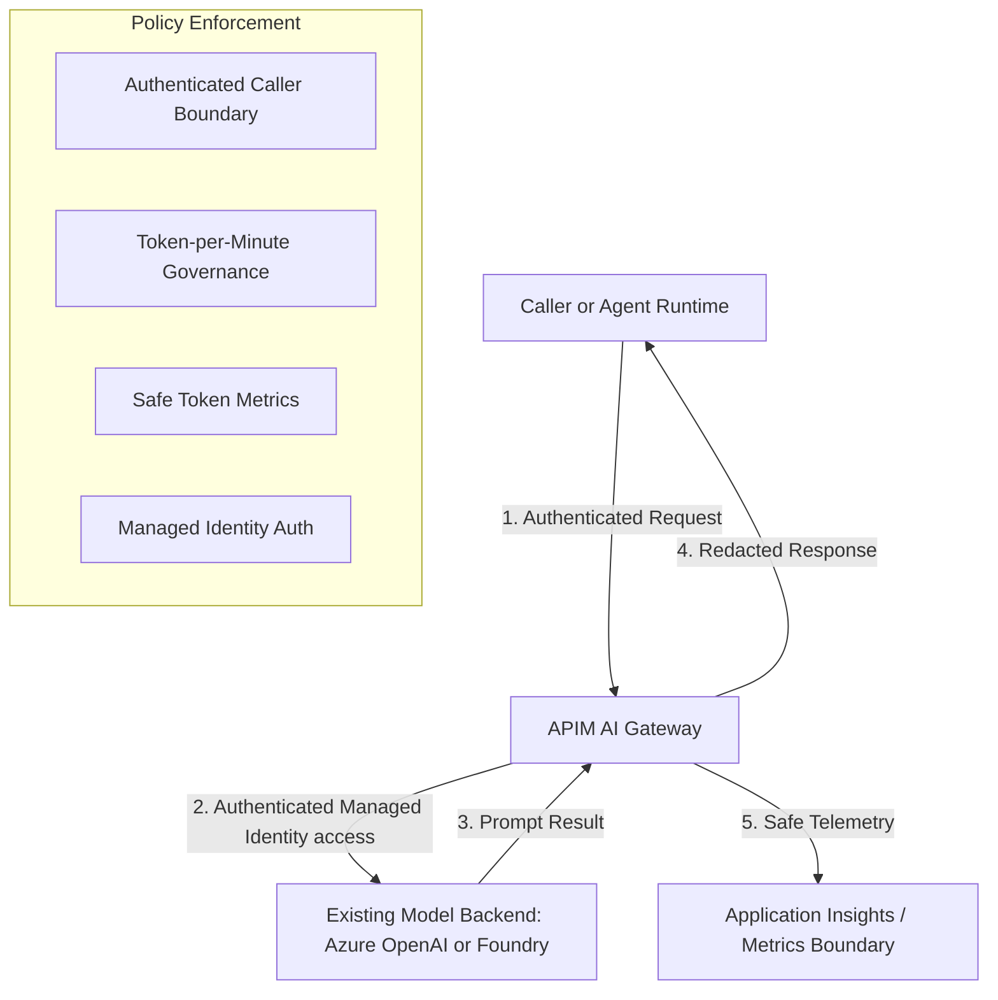

# APIM AI Gateway Model-Access Building Block

This module implements a minimal, reusable **AI Gateway** using **Azure API Management (APIM)** for controlled access to a single generative-AI model backend.

## Purpose

The AI Gateway provides a governance and security layer between your callers (e.g., agents, applications) and your AI model deployments (e.g., Azure OpenAI, Microsoft Foundry).

## When to Use

- **Recommended**: When you need to centralize token governance, audit usage, redact technical headers, and authenticate callers via Entra ID instead of static backend API keys.
- **Optional**: For simple development scenarios where direct model access is sufficient and governance is not a requirement.

## Supported Topology (v1)

- One Gateway instance governs **one** existing Azure OpenAI or Microsoft Foundry model backend.
- Managed Identity is used for backend authentication; static API keys are forbidden.

## Mermaid Diagram



## Prerequisites

- An existing Azure Resource Group.
- An existing Azure OpenAI or Microsoft Foundry model deployment.
- Azure CLI and Terraform for deployment.

## Deployment Inputs

| Input | Type | Description |
|---|---|---|
| `apim_name` | `string` | Name of the API Management instance. |
| `location` | `string` | Azure region for the deployment. |
| `model_endpoint` | `string` | The target model endpoint URL. |
| `model_resource_id` | `string` | The Azure Resource ID of the model for RBAC assignment. |
| `model_id` | `string` | Friendly identifier (e.g., 'gpt-4o') for metrics. |
| `token_limit_per_minute` | `number` | The TPM limit to enforce. |

## Local Validation

Since this is an infrastructure module, local validation focus is on static analysis of policy XML and Terraform HCL.

```bash
# Verify XML syntax
python -m pytest building-blocks/gateways/apim-ai-gateway/tests/
```

## Azure Deployment

Deploy the module using Terraform:

```bash
cd building-blocks/gateways/apim-ai-gateway/infra/terraform
terraform init
terraform plan -out=tfplan
terraform apply tfplan
```

## Cost Drivers

- **API Management (APIM)**: Costs depend on the selected SKU (e.g., Standard v2).
- **Application Insights**: Storage costs for emitted metrics and logs.

## Security Assumptions

- The Gateway is the only authorized way to access the backend model for the intended workload.
- Callers must provide a valid authentication mechanism recognized by the Gateway.
- Backend access is granted via **least-privilege RBAC** (Cognitive Services User role).

## Limitations

- First version governs exactly one model backend.
- No semantic caching, multi-backend routing, or circuit breakers in this version.
- Requires an APIM SKU that supports GenAI policies (Standard v2 or equivalent).

## Cleanup

```bash
terraform destroy
```
