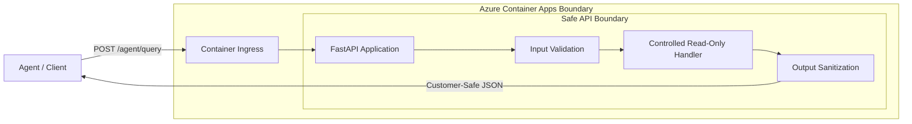

# Container-hosted Agent API

Reference building block defining when and how to package a bounded agent-facing API as a container instead of using serverless functions.

## Purpose

Provide a standard hosting reference for agentic workloads that require custom runtimes, long-running processes, or specific system dependencies that exceed the limits of serverless environments like Azure Functions.

## Architecture



## When to Use Containers

- **Custom Dependencies:** Your agent requires OS-level libraries (e.g., specialized PDF processing, OCR engines, or specific ML runtimes) not available in standard serverless environments.
- **Consistent Execution Environment:** You need bit-for-bit parity between local development, CI/CD, and production.
- **Resource Intensity:** The workload requires specific CPU/Memory ratios or GPU access not easily met by standard serverless plans.
- **Long-Running Requests:** Tasks that consistently exceed the timeout limits of Azure Functions (typically 10 minutes).

## When NOT to Use Containers

- **Simple Request/Response:** If the API only orchestrates calls to Azure AI services, Azure Functions is often more cost-effective.
- **Low Traffic:** Serverless functions scale to zero and cost nothing when idle. Containers (unless using scale-to-zero in Container Apps) often incur a base cost.

## Security and Safety

- **Non-Root User:** The container runs as a non-privileged `appuser` to minimize the blast radius of any potential vulnerability.
- **No Technical Leakage:** The API implements a global exception handler that redacts internal stack traces and technical details, returning only customer-safe error messages.
- **Strict Validation:** Input models use Pydantic v2 with regex patterns and length limits to prevent injection and oversized payloads.
- **Read-Only by Design:** This reference demonstrates a read-only query pattern, avoiding any mutation operations that could affect system state.

## Local Development

### Prerequisites

- Python 3.12+
- Docker (optional, for container validation)

### Local Run (Python)

```bash
# Navigate to the module directory
cd building-blocks/hosting/container-agent-api

# Install dependencies
pip install -r requirements.txt

# Start the API locally
python src/main.py

# Alternatively, using uvicorn directly:
# uvicorn src.main:app --host 0.0.0.0 --port 8080 --reload
```

### Local Build and Run (Docker)

```bash
# Build the image
docker build -t container-agent-api .

# Run the container
docker run -p 8080:8080 container-agent-api
```

### Example Request

```bash
curl -X POST http://localhost:8080/agent/query \
  -H "Content-Type: application/json" \
  -d '{"query_type": "status_summary", "resource_id": "vm-123"}'
```

## Azure Hosting Notes

### Azure Container Apps (Recommended)
- **Managed Identity:** Use System-Assigned or User-Assigned Managed Identity for secure access to Azure resources (like ACR for image pull).
- **Scale to Zero:** Configure KEDA scalers to scale the container app to zero when not in use to save costs.

## Validation Commands

```bash
# Linting and Formatting
ruff check src/
ruff format --check src/

# Focused Testing
# From module root:
PYTHONPATH=. pytest tests/
```

## Known Limits and Trade-offs

- **Operational Overhead:** Managing Dockerfiles and registries adds complexity compared to pure serverless.
- **Cold Starts:** Containers may have longer cold starts than Azure Functions if scaling from zero.
- **Statelessness:** Local disk changes are ephemeral and lost on container restart.

## Microsoft Documentation Consulted

- [Azure Container Apps overview](https://learn.microsoft.com/en-us/azure/container-apps/overview)
- [Containers in Azure App Service](https://learn.microsoft.com/en-us/azure/app-service/configure-custom-container)
- [FastAPI in containers](https://fastapi.tiangolo.com/deployment/docker/)
- [Terraform on Azure](https://learn.microsoft.com/en-us/azure/developer/terraform/overview)
- [Managed identity for Azure Container Apps](https://learn.microsoft.com/en-us/azure/container-apps/managed-identity)
