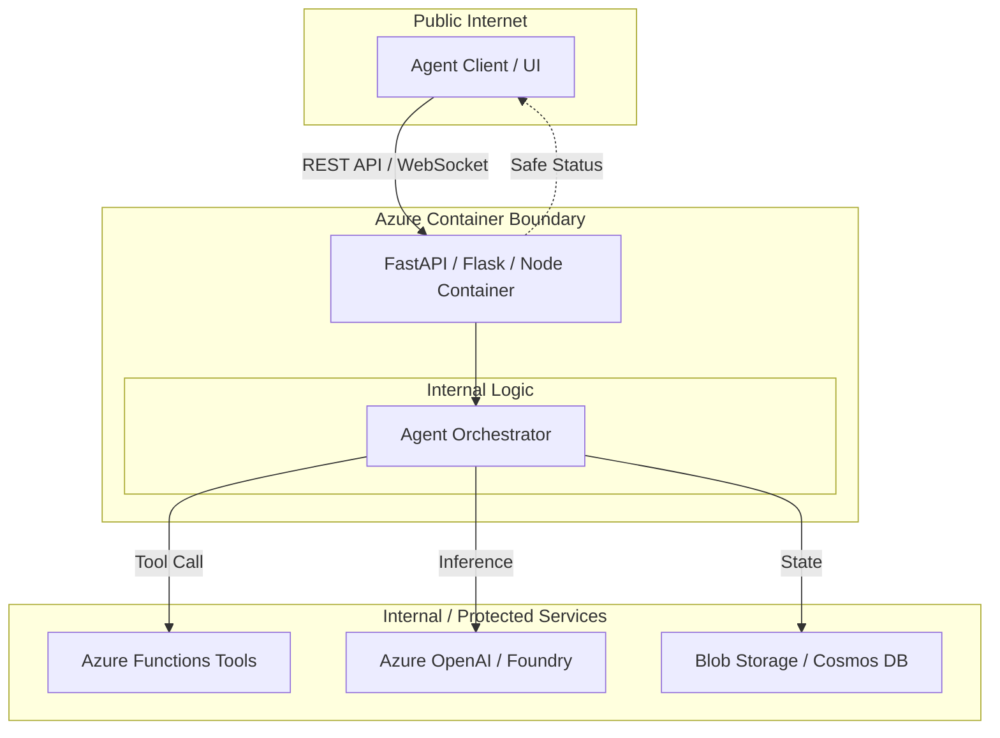

# Container-hosted Agent API

Reference building block defining when and how to package an agent-facing API as a container instead of using serverless functions or static web apps.

## Purpose

Provide a standard hosting contract for agentic workloads that require custom runtimes, long-running processes, or specific system dependencies that exceed the limits of serverless environments like Azure Functions.

## When to Use Containers

- **Custom Dependencies:** Your agent requires OS-level libraries (e.g., PDF processing, specialized OCR engines, or ML runtimes) not available in standard serverless environments.
- **Long-Running Requests:** The agent task exceeds the timeout limits of Azure Functions (typically 10 minutes).
- **Consistent Execution Environment:** You need bit-for-bit parity between local development, CI/CD, and production.
- **Streaming Responses:** You require long-lived HTTP connections for token-by-token streaming that may be throttled or interrupted in some serverless tiers.
- **Resource Intensity:** The workload requires specific CPU/Memory ratios or GPU access not easily met by standard serverless plans.

## When NOT to Use Containers

- **Simple Request/Response:** If the API just orchestrates a few calls to Azure AI services, Azure Functions is usually more cost-effective and easier to manage.
- **Low Traffic:** Serverless functions scale to zero and cost nothing when idle. Containers (unless using specialized serverless tiers like Container Apps with scale-to-zero) often incur a base cost.
- **Frontend Only:** Static content and simple React/Vue/Svelte frontends should use Azure Static Web Apps.

## Comparison with Other Hosting Options

| Feature | Azure Functions | Container Apps | App Service (Web App) |
|---------|-----------------|----------------|-----------------------|
| **Best For** | Event-driven, small tasks | Microservices, custom runtimes | Monolithic APIs, legacy apps |
| **Scaling** | Fast, scale-to-zero | Fast, scale-to-zero (KEDA) | Slower, plan-based |
| **Runtime** | Managed stacks | Any (Container) | Managed or Container |
| **Complexity** | Low | Medium | Low to Medium |
| **Cost Model** | Pay-per-execution / Flex | Pay-per-use (CPU/Mem) | Plan-based (Reserved) |

## API Boundary

The container-hosted API acts as a secure gateway between the agent client and the internal tools/services. It must enforce the `customer-safe-status-boundary`.



## Local / Demo Flow

To run the agent API locally using Docker:

1. **Build the image:**
   ```bash
   docker build -t agent-api .
   ```

2. **Run the container:**
   ```bash
   # Use DefaultAzureCredential (Managed Identity / Azure CLI login) for local auth
   docker run -p 8080:8080 \
     -e AZURE_OPENAI_ENDPOINT="https://..." \
     agent-api
   ```

3. **Test the endpoint:**
   ```bash
   curl http://localhost:8080/health
   ```

## Azure Hosting Notes

### Azure Container Apps (Recommended)
- **Scale to Zero:** Ideal for agent workloads that aren't constant.
- **Dapr Integration:** Useful for state management and service-to-service communication.
- **KEDA Scalers:** Can scale based on queue depth or custom metrics.

### Azure App Service for Containers
- **Stability:** Better suited for long-lived, high-throughput monolithic APIs.
- **WebSockets:** Excellent support for persistent connections.
- **Easy Transition:** Good for teams already familiar with App Service.

## Security Notes

- **Managed Identity:** Use User-Assigned Managed Identity to access Azure OpenAI, Storage, and Key Vault. Avoid API keys in environment variables.
- **Private Networking:** Deploy the container within a VNet and use Private Endpoints for downstream services.
- **Customer-Safe Boundary:** Ensure the API filters raw model outputs and technical logs. Never expose internal stack traces or prompts to the client.

## Cost & Ops Trade-offs

- **Operational Overhead:** Managing Dockerfiles and container registries adds complexity compared to pure serverless.
- **Cold Starts:** Containers may have longer "cold starts" than Functions if scaling from zero.
- **Cost Predictability:** App Service Plans provide fixed costs, while Container Apps can be more variable but efficient for bursty workloads.

## Known Limits

- **Port Limits:** Azure App Service generally expects only one exposed port (defaults to 80 or 8080).
- **Ephemeral Storage:** Local disk changes are lost when the container restarts. Use Azure Files or Blob Storage for persistence.
- **Registry Dependency:** Requires an Azure Container Registry (ACR) or similar for deployment.
