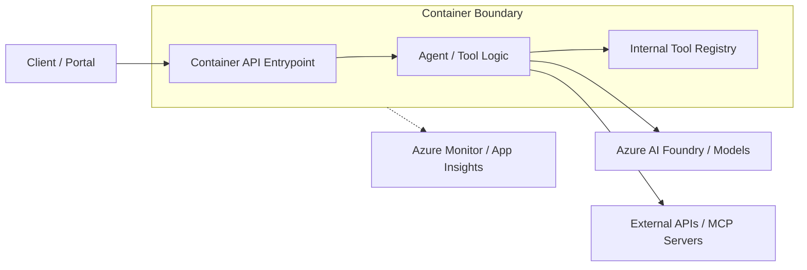

# Container-Hosted Agent API

## Purpose

This building block provides a reference pattern for packaging and hosting an AI agent or agent-facing API as a container. It documents when to choose container-based hosting over serverless functions and how to structure the container for Azure deployment.

## Justification: Why Container Hosting?

Choosing the right hosting platform depends on the architectural requirements:

| Feature | Azure Functions | Azure App Service | Azure Container Apps |
| :--- | :--- | :--- | :--- |
| **Primary Use** | Event-driven, short-lived tasks | Web apps, monolithic APIs | Microservices, serverless containers |
| **Execution Time** | Limited (default 5-10 mins) | Unbounded | Unbounded |
| **Scaling** | Scale to zero (Consumption) | Manual/Autoscale (App Service Plan) | Scale to zero, event-driven (KEDA) |
| **Dependencies** | Limited by runtime | Full control (via Docker) | Full control (via Docker) |
| **Dapr Support** | No | No | Yes (Native) |

**Use Container Hosting when:**
- Your agent requires custom OS-level dependencies or a specific Linux distribution.
- You need long-running execution beyond Function limits (e.g., complex multi-step reasoning).
- You want to utilize the [Dapr](https://dapr.io/) runtime for service discovery and state management.
- You have an existing containerized API that you are extending with agent capabilities.

## Architecture

The following diagram illustrates the flow from a client through the container boundary to the agent logic and observability.



## Minimal File Layout

A reference container-hosted agent API should follow this minimal structure:

```text
building-blocks/hosting/container-agent-api/
├── Dockerfile          # Multi-stage build for Python/FastAPI
├── main.py             # Entrypoint (e.g., FastAPI/Uvicorn)
├── requirements.txt    # Python dependencies
└── module.yaml         # Module contract
```

### Dockerfile Recommendation

```dockerfile
# Use a slim Python base image
FROM python:3.11-slim as builder

WORKDIR /app
COPY requirements.txt .
RUN pip install --no-cache-dir -r requirements.txt

# Final stage
FROM python:3.11-slim
WORKDIR /app
COPY --from=builder /usr/local/lib/python3.11/site-packages /usr/local/lib/python3.11/site-packages
COPY --from=builder /usr/local/bin /usr/local/bin
COPY . .

EXPOSE 8080
CMD ["uvicorn", "main:app", "--host", "0.0.0.0", "--port", "8080"]
```

## Local Run

To run the agent API locally using Docker:

1. Build the image:
   ```bash
   docker build -t container-agent-api .
   ```
2. Run the container:
   ```bash
   docker run -p 8080:8080 --env-file .env container-agent-api
   ```

Verify the service by visiting `http://localhost:8080/health`.

## Configuration

### Environment Variables
- `PORT`: Port the container listens on (default: 8080).
- `APPLICATIONINSIGHTS_CONNECTION_STRING`: For observability.
- `AZURE_CLIENT_ID`: Required for User-Assigned Managed Identity.

### Secrets Handling
- **Azure Container Apps:** Use [Secret references](https://learn.microsoft.com/en-us/azure/container-apps/manage-secrets) mapped to environment variables.
- **Azure App Service:** Use [Key Vault references](https://learn.microsoft.com/en-us/azure/app-service/app-service-key-vault-references) in Application Settings.

### Health Checks
Implement a `/health` or `/ready` endpoint to allow the hosting platform to monitor container status.
- **Container Apps:** Configure `liveness`, `readiness`, and `startup` probes.
- **App Service:** Enable "Health check" in the "Monitoring" section.

## Known Limits and Trade-offs

- **Cold Starts:** Serverless containers (ACA) may experience cold starts when scaling from zero.
- **State:** Containers are ephemeral. Use Azure Blob Storage, Cosmos DB, or Managed Redis for session persistence.
- **Networking:** Private networking (VNet integration) is recommended for production but increases complexity.

## Deployment Notes

### Azure Container Apps (Recommended)
Container Apps is the preferred serverless platform for modern containerized agents.
```bash
az containerapp up --name my-agent-api --source .
```

### Azure App Service
Use App Service if you require a more traditional Web App environment or specific Windows container support.
```bash
az webapp create --name my-agent-api --plan my-plan --deployment-container-image-name myregistry.azurecr.io/my-agent:latest
```

## References

- [Azure Container Apps overview](https://learn.microsoft.com/en-us/azure/container-apps/overview)
- [Azure App Service custom containers](https://learn.microsoft.com/en-us/azure/app-service/quickstart-custom-container)
- [Microsoft Foundry Agent Service](https://learn.microsoft.com/en-us/azure/foundry/agents/overview)
