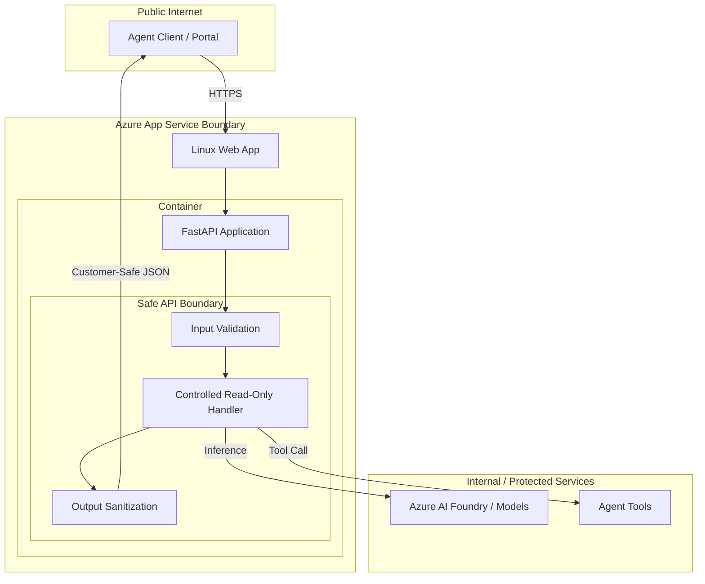

# Web App Hosted Agent API

Reference building block for hosting a minimal, bounded agent-facing FastAPI on Azure App Service (Web App for Containers).

## Purpose

This module provides a complete reference for a production-ready, customer-safe agent API hosted on Azure App Service. It demonstrates how to implement a bounded API with strict input/output models and host it using the smallest Linux App Service plan.

## When to Use Web Apps

- **Managed Platform:** You want the simplicity of a managed platform with the control of a custom container.
- **Persistent Connections:** You require support for WebSockets or long-lived streaming responses (common in AI agents).
- **Stability:** You prefer the mature hosting environment and features of App Service (e.g., Staging Slots, EasyAuth).
- **Long-Running Tasks:** The workload may exceed the default timeouts of serverless functions.

## When NOT to Use Web Apps

- **Sparse Traffic:** If the API is rarely used and can tolerate cold starts, [Azure Functions](../../functions/agent-tool-http-function/README.md) may be more cost-effective.
- **Complex Orchestration:** For a large collection of interdependent microservices, [Azure Container Apps](../container-agent-api/README.md) or Azure Kubernetes Service (AKS) might be better.

## Comparison with Other Hosting Options

| Feature | Azure Functions | Container Apps | App Service (Web App) |
|---------|-----------------|----------------|-----------------------|
| **Best For** | Event-driven, small tasks | Microservices, scale-to-zero | Monolithic APIs, stability |
| **Scaling** | Fast, scale-to-zero | Fast, scale-to-zero (KEDA) | Slower, plan-based |
| **Cold Starts** | Yes (on Consumption) | Yes (on scale-to-zero) | Minimal (with Always On) |
| **Cost Model** | Pay-per-execution | Pay-per-use (CPU/Mem) | Plan-based (Fixed) |

## API Boundary

The Web App hosted API acts as a secure gateway, enforcing a customer-safe boundary before returning data to the client.



## Local Development

### Prerequisites

- Python 3.12+
- Docker (optional, for container validation)

### Local Run (Python)

```bash
# Navigate to the module directory
cd building-blocks/hosting/web-app-agent-api

# Install dependencies
pip install -r requirements.txt

# Start the API locally
python src/main.py
```

### Local Build and Run (Docker)

```bash
# Build the image
docker build -t web-app-agent-api .

# Run the container
docker run -p 8080:8080 web-app-agent-api
```

### Example Request

```bash
curl -X POST http://localhost:8080/agent/query \
  -H "Content-Type: application/json" \
  -d '{"query_type": "status_summary", "resource_id": "res-123"}'
```

## Environment Variables

| Variable | Description | Default |
|----------|-------------|---------|
| `PORT` | The port the application listens on. | `8080` |
| `WEBSITES_PORT` | Mapped by App Service to the container port. | `8080` |

## Validation Commands

### Contract and Code Validation
```bash
# From the module root
pip install -r requirements-test.txt
ruff check src/
ruff format --check src/
pytest tests/
```

### Infrastructure Validation
```bash
cd infra/terraform
terraform init -backend=false
terraform validate
```

## Azure Hosting Notes

- **Managed Identity:** This module uses a **System-Assigned Managed Identity**.
- **Private Registry Pulls:** To pull from a private registry (like Azure Container Registry) using Managed Identity, set `container_registry_use_managed_identity = true` in the Web App configuration and grant the identity the `AcrPull` role.
- **HTTPS Only:** The Web App is configured to enforce HTTPS-only traffic.

## Security Notes

- **Technical Redaction:** The API implements a global exception handler to ensure no internal stack traces or technical details leak to the client.
- **Strict Validation:** Input models use Pydantic with strict regex patterns and length limits.
- **Least Privilege:** The container runs as a non-root user.

## Cost & Ops Trade-offs

- **Fixed Cost:** The App Service Plan has a fixed monthly cost (default B1), providing predictable billing but no scale-to-zero.
- **Operations:** Managed platform reduces overhead while providing advanced features like staging slots and easy authentication.

## Known Limits

- **Startup Latency:** Containers may have a delay during initial pull/start if "Always On" is not enabled.
- **Scaling Speed:** App Service scales out more slowly than Azure Functions or Container Apps.

## Deployment / IaC Decision

This building block **includes module-local Terraform** to demonstrate the recommended Infrastructure-as-Code (IaC) pattern for Azure App Service for Containers.

The decision to provide IaC is based on:
1. **Azure Native Best Practices:** Showing the correct configuration for Linux Web App for Containers, including system-assigned managed identity and `WEBSITES_PORT` setting.
2. **Security-First Setup:** Explicitly demonstrating HTTPS-only configuration and managed identity.
3. **Reproducibility:** Allowing developers to provision the hosting environment independently.

## Microsoft Documentation

- [Azure App Service overview](https://learn.microsoft.com/en-us/azure/app-service/overview)
- [Configure a custom container for Azure App Service](https://learn.microsoft.com/en-us/azure/app-service/configure-custom-container)
- [Managed identity for App Service](https://learn.microsoft.com/en-us/azure/app-service/overview-managed-identity)
- [FastAPI in containers](https://fastapi.tiangolo.com/deployment/docker/)
