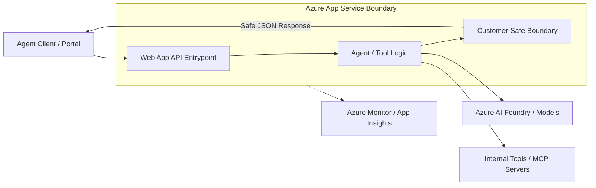

# Web App Hosted Agent API

Reference building block defining when and how to host an agent-facing API on Azure App Service (Web Apps) using the native Python runtime.

## Purpose

This building block provides a standard hosting contract for agentic workloads that benefit from a managed, native Python environment. It defines the boundary between the agent client and the internal tool logic, ensuring a secure and observable interface.

## When to Use Web Apps

- **Managed Runtime:** You want Azure to handle OS and Python runtime patching (Native Runtime) without managing Dockerfiles.
- **Web Frameworks:** Your agent API is built using standard Python web frameworks like FastAPI, Django, or Flask.
- **Long-Running Requests:** The agent task may exceed the default timeout limits of Azure Functions (typically 10 minutes).
- **Persistent Connections:** You need support for WebSockets or long-lived streaming responses.
- **Feature Rich Hosting:** You want to leverage App Service features like Staging Slots, easy integrated authentication (EasyAuth), and simple "Always On" capability to avoid cold starts.

## When NOT to Use Web Apps

- **Complex System Dependencies:** Your agent requires OS-level libraries or non-Python binaries not included in the standard App Service Python image. Use [Container-hosted Agent API](../container-agent-api/README.md) instead.
- **Event-Driven / Sparse Traffic:** If the API is rarely called and can tolerate cold starts, [Azure Functions](../../functions/agent-tool-http-function/README.md) may be more cost-effective due to scale-to-zero.
- **Microservices Orchestration:** If you are deploying a large collection of interdependent microservices, Azure Container Apps might be a better fit.

## Comparison with Other Hosting Options

| Feature | Azure Functions | Web App (Native) | Web App for Containers |
| :--- | :--- | :--- | :--- |
| **Primary Use** | Event-driven, small tasks | Monolithic APIs, Web Apps | Custom runtimes, legacy apps |
| **Scaling** | Scale to zero (Consumption) | Plan-based (Auto/Manual) | Plan-based (Auto/Manual) |
| **Runtime** | Managed by platform | Managed (Native Python) | Full control (Docker) |
| **Cold Starts** | Possible on Consumption | Minimal (with Always On) | Minimal (with Always On) |
| **Execution Time** | Limited (5-10 mins) | Unbounded | Unbounded |

## API Boundary

The Web App hosted API acts as a secure gateway, enforcing the `customer-safe-status-boundary` before returning data to the caller.



## Local / Demo Flow

To run a sample FastAPI agent API locally:

1. **Setup environment:**
   ```bash
   python -m venv .venv
   source .venv/bin/activate
   pip install fastapi uvicorn
   ```

2. **Run the app:**
   ```bash
   # In building-blocks/hosting/webapp-agent-api/src/ (if code existed)
   uvicorn main:app --host 0.0.0.0 --port 8000
   ```

3. **Verify:**
   ```bash
   curl http://localhost:8000/health
   ```

## Azure Hosting Notes

### Deployment Methods
- **Azure CLI:** Use `az webapp up` for quick creation and deployment.
- **Zip Deploy:** Recommended for CI/CD. Ensure `SCM_DO_BUILD_DURING_DEPLOYMENT=true` is set to enable server-side `pip install`.
- **GitHub Actions:** Use the official `azure/webapps-deploy` action.

### Configuration
- **Startup Command:** For FastAPI, set the startup command to:
  `gunicorn -w 4 -k uvicorn.workers.UvicornWorker -b 0.0.0.0:8000 main:app`
- **Always On:** Enable for Production/Basic+ tiers to eliminate cold starts.

## Security Notes

- **Managed Identity:** Always use System-Assigned or User-Assigned Managed Identity for accessing downstream Azure services (AI Foundry, Key Vault, Storage).
- **Redaction:** Implement strict response filtering to ensure no raw prompts, internal Azure resource IDs, or technical stack traces are exposed to the client.
- **Integrated Auth:** Use App Service Authentication (EasyAuth) to restrict access to the API without writing custom auth code.

## Cost & Ops Trade-offs

- **Predictable Cost:** App Service Plans (B, S, P tiers) have a fixed monthly cost regardless of traffic.
- **Ops Simplicity:** No need to manage container registries or Dockerfiles; just push code.
- **Scaling:** Vertical scaling (Up) and horizontal scaling (Out) are mature and well-integrated into the portal and CLI.

## Known Limits

- **Image Customization:** You cannot modify the underlying OS or install arbitrary system packages.
- **Ephemeral Disk:** Files written to the local disk (outside of `/home`) are lost on restart. Use Azure Blob Storage for persistence.
- **Port Mapping:** App Service expects the app to listen on the port provided by the `PORT` environment variable (usually 80 or 8080 is mapped by the platform).

## References

- [Azure App Service overview](https://learn.microsoft.com/en-us/azure/app-service/overview)
- [Configure a Linux Python app for Azure App Service](https://learn.microsoft.com/en-us/azure/app-service/configure-language-python)
- [Managed identities for App Service](https://learn.microsoft.com/en-us/azure/app-service/overview-managed-identity)
- [Microsoft Foundry Agent Service](https://learn.microsoft.com/en-us/azure/foundry/agents/overview)
