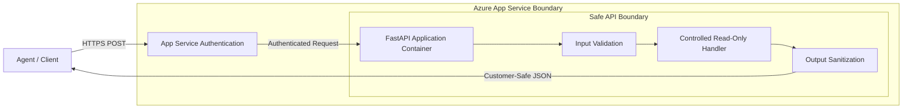

# Web App-hosted Agent API

Reference building block for hosting a bounded agent-facing API using Azure App Service (Web App for Containers).

## Purpose

Provide a standard hosting reference for agentic workloads using Azure App Service when a fully managed web hosting environment with built-in authentication (EasyAuth) is preferred over serverless or container orchestration platforms.

## Scenario

A team needs to host the `container-agent-api` workload in a dedicated environment. They choose Azure App Service because it offers a simplified authentication layer (EasyAuth) and a familiar management experience for web applications, while still supporting custom container images for specialized dependencies.

## Architecture



## Comparison: App Service vs. Alternatives

| Feature | Azure App Service | Azure Functions | Azure Container Apps |
|---------|-------------------|-----------------|----------------------|
| **Best For** | Persistent web APIs with simple auth | Event-driven, ephemeral tasks | Microservices, complex scaling |
| **Authentication** | Built-in EasyAuth (Entra ID, etc.) | Function Keys, App Service Auth | Built-in Auth, Dapr |
| **Pricing Model** | Predictable (Plan-based) | Pay-per-execution (Consumption) | Resource-based (vCPU/Memory) |
| **Cold Start** | Minimal (with Always On) | Potential on Consumption | Potential when scaling from zero |
| **Customization** | High (Custom Containers) | Medium (Custom Runtimes) | High (Full Container Control) |

**When to choose App Service:**
- You require a persistent endpoint with predictable performance.
- You want to leverage built-in App Service Authentication (EasyAuth) without writing auth code.
- You have existing App Service Plans that can be reused for cost efficiency.

## Security and Safety

- **Authentication (EasyAuth):** This reference configures the Web App to require Microsoft Entra ID authentication by default. Unauthenticated requests are rejected before reaching the container.
- **Managed Identity:** The Web App uses a System-Assigned Managed Identity to pull images from Azure Container Registry (ACR), avoiding the use of registry credentials.
- **No Technical Leakage:** Reuses the `container-agent-api` workload which redacts internal stack traces and technical details.
- **Secure Inbound:** Configured to enforce HTTPS and reject unauthenticated traffic.

## API Contract

This module reuses the API contract defined in `building-blocks/hosting/container-agent-api/`.

### Request: `POST /agent/query`
- See `building-blocks/hosting/container-agent-api/README.md` for schema details.

## Configuration

| Input | Type | Description |
|-------|------|-------------|
| `container_image` | string | The container image URI to deploy. |
| `container_registry_server` | string | The FQDN of the container registry. |
| `client_id` | string | The Client ID for Microsoft Entra ID authentication. |
| `tenant_id` | string | The Tenant ID for Microsoft Entra ID authentication. |

## Local Development

Local development should use the `container-agent-api` module directly as it contains the application source code.

```bash
cd building-blocks/hosting/container-agent-api
pip install -r requirements.txt
python src/main.py
```

## Azure Hosting Notes

### Deployment Assumptions and Cost Drivers
- **App Service Plan:** Requires an App Service Plan (Basic or higher recommended for production).
- **ACR Access:** Assumes the image is hosted in an Azure Container Registry accessible via Managed Identity.
- **Cost Drivers:** The primary cost is the App Service Plan, which is billed per hour regardless of traffic.

### Authentication Implementation
- The Terraform configuration enables `auth_settings_v2` and configures a `microsoft` provider.
- You must provide a valid `client_id` and `tenant_id` corresponding to an App Registration in your Entra ID tenant.

## Validation Commands

```bash
# Validate module contract
PYTHONPATH=. pytest tests/
```

## Microsoft Documentation Consulted

- [Azure App Service overview](https://learn.microsoft.com/en-us/azure/app-service/overview)
- [Configure a custom container for App Service](https://learn.microsoft.com/en-us/azure/app-service/configure-custom-container)
- [App Service authentication and authorization](https://learn.microsoft.com/en-us/azure/app-service/overview-authentication-authorization)
- [Managed identities for App Service](https://learn.microsoft.com/en-us/azure/app-service/overview-managed-identity)
