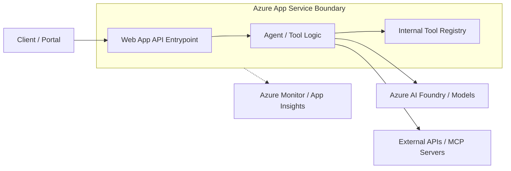

# Web App Hosted Agent API

## Purpose

This building block provides a reference pattern for hosting an AI agent or agent-facing API on Azure App Service (Web App) using the native Python runtime. It documents when to choose App Service over serverless functions or containers and how to structure the application for Azure.

## Justification: Why Web App?

| Feature | Azure Functions | Azure App Service (Web App) | Azure Container Apps |
| :--- | :--- | :--- | :--- |
| **Primary Use** | Event-driven, short-lived tasks | Web apps, monolithic APIs | Microservices, serverless containers |
| **Execution Time** | Limited (default 5-10 mins) | Unbounded | Unbounded |
| **Scaling** | Scale to zero (Consumption) | Manual/Autoscale (App Service Plan) | Scale to zero, event-driven (KEDA) |
| **Runtime Control** | Managed by platform | Managed (Native) or Custom (Docker) | Full control (via Docker) |
| **Cold Starts** | Possible on Consumption | Minimal (if Always On enabled) | Possible (if scaled to zero) |

**Use Azure App Service (Web App) when:**
- Your agent API is a standard web application (e.g., FastAPI, Django, Flask).
- You want the platform to manage the OS and Python runtime patching (Native Runtime).
- You need long-running execution or persistent connections (WebSockets) beyond Function limits.
- You prefer a familiar web hosting environment with features like Staging Slots and integrated authentication.

## Architecture

The following diagram illustrates the flow from a client through the Web App boundary to the agent logic and observability.



## Minimal File Layout

A reference App Service hosted agent API should follow this minimal structure:

```text
building-blocks/hosting/webapp-agent-api/
├── main.py             # Entrypoint (e.g., FastAPI/Uvicorn)
├── requirements.txt    # Python dependencies
└── module.yaml         # Module contract
```

## Local Run

To run the agent API locally:

1. Create and activate a virtual environment:
   ```bash
   python -m venv .venv
   source .venv/bin/activate
   ```
2. Install dependencies:
   ```bash
   pip install -r requirements.txt
   ```
3. Run the app using Uvicorn:
   ```bash
   uvicorn main:app --host 0.0.0.0 --port 8000 --reload
   ```

Verify the service by visiting `http://localhost:8000/health`.

## Configuration

### Environment Variables
- `PORT`: Port the app listens on (default: 8000).
- `APPLICATIONINSIGHTS_CONNECTION_STRING`: For observability.
- `AZURE_CLIENT_ID`: Required when using User-Assigned Managed Identity.

### Secrets Handling
- Use [Key Vault references](https://learn.microsoft.com/en-us/azure/app-service/app-service-key-vault-references) in Application Settings to securely inject secrets as environment variables.
- Example: `@Microsoft.KeyVault(SecretUri=https://myvault.vault.azure.net/secrets/mysecret/)`

### Identity
- Enable **Managed Identity** (System-assigned or User-assigned) to allow the Web App to authenticate to Azure AI Foundry and other Azure services without managing credentials.

## Deployment Notes

### Azure CLI (Quickstart)
The `az webapp up` command simplifies creation and deployment:
```bash
az webapp up --runtime PYTHON:3.12 --sku B1 --name <your-app-name>
```

### Zip Deployment
For CI/CD or manual zip-based deployment, ensure `SCM_DO_BUILD_DURING_DEPLOYMENT=true` is set in App Settings to enable build automation (pip install) on the server.

### Startup Command
For FastAPI, you may need to configure a custom startup command in the Azure Portal or via CLI:
```bash
gunicorn -w 4 -k uvicorn.workers.UvicornWorker -b 0.0.0.0:8000 main:app
```

## Known Limits and Trade-offs

- **Native Dependencies:** Limited to what is available in the App Service Python image. If you need complex system-level libraries, consider [Container Hosting](../container-agent-api/README.md).
- **File System:** The file system is ephemeral unless using persistent storage mounts. Use Azure Blob Storage for persistent artifacts.
- **Port 80/443:** App Service routes traffic from 80/443 to the port your app listens on (usually configured via `PORT` env var).

## References

- [Azure App Service overview](https://learn.microsoft.com/en-us/azure/app-service/overview)
- [Quickstart: Deploy a Python web app to Azure App Service](https://learn.microsoft.com/en-us/azure/app-service/quickstart-python)
- [Microsoft Foundry Agent Service](https://learn.microsoft.com/en-us/azure/foundry/agents/overview)
- [Configure a Linux Python app for Azure App Service](https://learn.microsoft.com/en-us/azure/app-service/configure-language-python)
