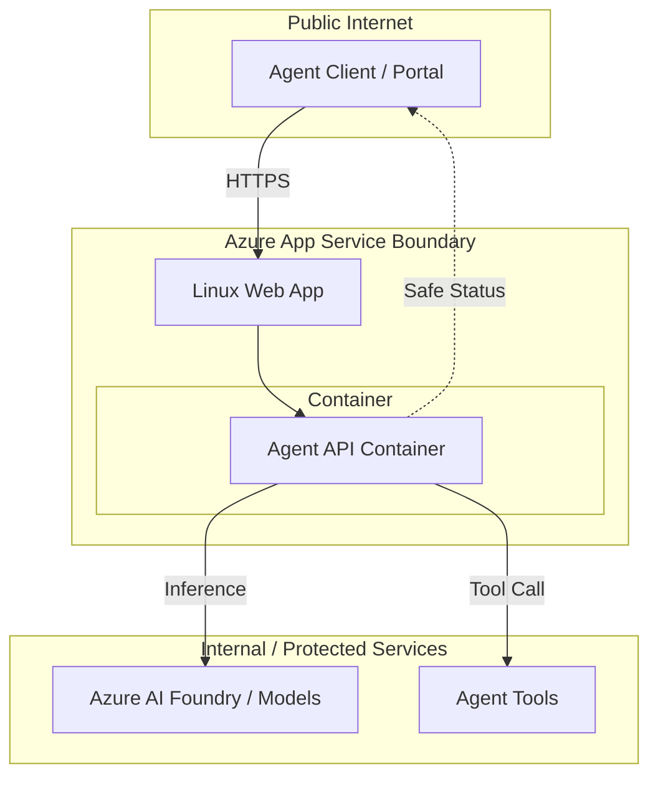

# Web App Hosted Agent API

Reference building block for hosting a containerized agent API on Azure App Service.

## Purpose

This module provides a hosting adapter for deploying the [Container-hosted Agent API](../container-agent-api/README.md) to Azure App Service (Web App for Containers). It demonstrates how to provision the smallest Linux App Service plan and configuration needed to host an existing container image without duplicating application logic.

## When to Use Web Apps

- **Managed Platform:** You want the simplicity of a managed platform with the control of a custom container.
- **Persistent Connections:** You require support for WebSockets or long-lived streaming responses (common in AI agents).
- **Stability:** You prefer the mature hosting environment and features of App Service (e.g., Staging Slots, EasyAuth).
- **Long-Running Tasks:** The workload may exceed the default timeouts of serverless functions.

## When NOT to Use Web Apps

- **Sparse Traffic:** If the API is rarely used and can tolerate cold starts, [Azure Functions](../../functions/agent-tool-http-function/README.md) may be more cost-effective.
- **Complex Orchestration:** For a large collection of interdependent microservices, [Azure Container Apps](../container-agent-api/README.md) or Azure Kubernetes Service (AKS) might be better.

## Comparison with Other Hosting Options

| Feature | Azure Functions | Container Apps | App Service (Web App) |
|---------|-----------------|----------------|-----------------------|
| **Best For** | Event-driven, small tasks | Microservices, scale-to-zero | Monolithic APIs, stability |
| **Scaling** | Fast, scale-to-zero | Fast, scale-to-zero (KEDA) | Slower, plan-based |
| **Cold Starts** | Yes (on Consumption) | Yes (on scale-to-zero) | Minimal (with Always On) |
| **Cost Model** | Pay-per-execution | Pay-per-use (CPU/Mem) | Plan-based (Fixed) |

## API Boundary

The Web App hosted API acts as a secure gateway, enforcing the `customer-safe-status-boundary` before returning data to the client.



## Local / Demo Flow

This module reuses the container image defined in `building-blocks/hosting/container-agent-api/`.

1. **Build the image locally:**
   ```bash
   cd building-blocks/hosting/container-agent-api/
   docker build -t agent-api .
   ```

2. **Run the container:**
   ```bash
   docker run -p 8080:8080 -e PORT=8080 agent-api
   ```

3. **Verify the endpoint:**
   ```bash
   curl http://localhost:8080/health
   ```

## Environment Variables

| Variable | Description | Default |
|----------|-------------|---------|
| `WEBSITES_PORT` | The port the container listens on (mapped by App Service). | `8080` |

## Validation Commands

### Contract Validation
Verify that the `module.yaml` contract is in sync with the Terraform interface and follows repository standards.

To run tests in a clean environment:
```bash
# From the module root
python3 -m venv venv
source venv/bin/activate
pip install -r requirements-test.txt
python3 -m pytest tests/test_contract.py
```

### Infrastructure Validation
```bash
cd infra/terraform
terraform init -backend=false
terraform validate
```

### File Inspection
Verify that no application code was duplicated:
```bash
ls -R building-blocks/hosting/webapp-agent-api/ | grep -E "src/|tests/|schemas/|Dockerfile"
```
*(Only `infra/` and `module.yaml` should be present outside this README)*

## Azure Hosting Notes

- **Managed Identity:** This module uses a **System-Assigned Managed Identity**.
- **Private Registry Pulls:** To pull from a private registry (like Azure Container Registry) using Managed Identity, set `use_managed_identity_for_registry = true` and grant the Web App's Managed Identity the `AcrPull` role on the registry. Registry credentials should not be hardcoded.
- **HTTPS Only:** The Web App is configured to enforce HTTPS-only traffic.

## Security Notes

- **Authentication:** External authentication (like Entra ID) and network restrictions are outside the scope of this hosting example but should be implemented for production.
- **Customer-Safe Boundary:** Ensure the underlying container implementation adheres to the redaction rules defined in `module.yaml`.

## Cost & Ops Trade-offs

- **Fixed Cost:** The App Service Plan (default B1) has a fixed monthly cost, which may be higher than Consumption-based serverless for low-traffic scenarios.
- **Operations:** Managed platform reduces the overhead of managing underlying infrastructure while providing advanced diagnostics and monitoring.

## Known Limits

- **Startup Latency:** Containers may have a delay during the initial pull and start if "Always On" is not enabled.
- **Ephemeral Storage:** Any data written to the container's local file system is lost on restart.

## Deployment / IaC Decision

This building block **includes module-local Terraform** to demonstrate the recommended Infrastructure-as-Code (IaC) pattern for Azure App Service for Containers.

The decision to provide IaC is based on:
1. **Azure Native Best Practices:** Showing the correct configuration for Linux Web App for Containers, including system-assigned managed identity and `WEBSITES_PORT` setting.
2. **Security-First Setup:** Explicitly demonstrating HTTPS-only configuration and managed identity.
3. **Reproducibility:** Allowing developers to provision the hosting environment independently of the container build process.

## Microsoft Documentation

- [Azure App Service overview](https://learn.microsoft.com/en-us/azure/app-service/overview)
- [Configure a custom container for Azure App Service](https://learn.microsoft.com/en-us/azure/app-service/configure-custom-container)
- [Deploy Flask/FastAPI container to App Service](https://learn.microsoft.com/en-us/azure/developer/python/tutorial-containerize-simple-web-app-for-app-service)
- [azurerm_linux_web_app (Terraform)](https://registry.terraform.io/providers/hashicorp/azurerm/latest/docs/resources/linux_web_app)
