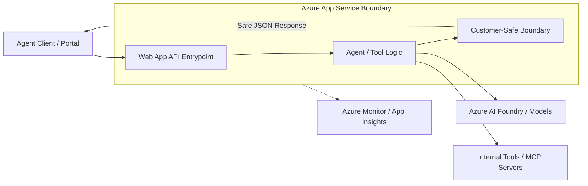

# Web App Hosted Agent API (Web App for Containers)

Reference building block defining when and how to host an agent-facing API on Azure App Service using custom containers.

## Purpose

This building block provides a standard hosting contract for agentic workloads that benefit from the stability and features of Azure App Service. It specifically demonstrates the **Web App for Containers** pattern, allowing for a secure and observable interface while reusing the API implementation from the [container-hosted reference](../container-agent-api/README.md) without duplicating code.

## When to Use Web Apps (Containers)

- **Managed Container Platform:** You want the simplicity of App Service but need the control of a custom container.
- **Reuse Existing Containers:** You already have a containerized agent API (like the one in `container-agent-api`) and want to host it on a mature PaaS.
- **Web Frameworks:** Your agent API is built using standard Python web frameworks like FastAPI, Django, or Flask and packaged as a container.
- **Long-Running Requests:** The agent task may exceed the default timeout limits of Azure Functions (typically 10 minutes).
- **Persistent Connections:** You need support for WebSockets or long-lived streaming responses.
- **Feature Rich Hosting:** You want to leverage App Service features like Staging Slots, easy integrated authentication (EasyAuth), and simple "Always On" capability to avoid cold starts.

## When NOT to Use Web Apps

- **Complex System Dependencies:** Your agent requires OS-level libraries or non-Python binaries not included in the standard App Service Python image. Use [Container-hosted Agent API](../container-agent-api/README.md) instead.
- **Event-Driven / Sparse Traffic:** If the API is rarely called and can tolerate cold starts, [Azure Functions](../../functions/agent-tool-http-function/README.md) may be more cost-effective due to scale-to-zero.
- **Microservices Orchestration:** If you are deploying a large collection of interdependent microservices, Azure Container Apps might be a better fit.

## Comparison with Other Hosting Options

| Feature | Azure Functions | Web App (Native) | Web App for Containers |
| :--- | :--- | :--- | :--- |
| **Primary Use** | Event-driven, small tasks | Monolithic APIs | This Reference / Custom runtimes |
| **Scaling** | Scale to zero (Consumption) | Plan-based (Auto/Manual) | Plan-based (Auto/Manual) |
| **Runtime** | Managed by platform | Managed (Native Python) | Full control (Docker) |
| **Cold Starts** | Possible on Consumption | Minimal (with Always On) | Minimal (with Always On) |
| **Execution Time** | Limited (5-10 mins) | Unbounded | Unbounded |

## API Boundary

The Web App hosted API acts as a secure gateway, enforcing the `customer-safe-status-boundary` before returning data to the caller. This reference reuses the API implementation from [Container-hosted Agent API](../container-agent-api/README.md).



## Local / Demo Flow

This building block reuses the FastAPI application from `container-agent-api`. To run it locally:

1. **Navigate to the container API source:**
   ```bash
   cd building-blocks/hosting/container-agent-api/
   ```

2. **Follow the local run instructions in its README:**
   ```bash
   docker build -t agent-api .
   docker run -p 8080:8080 agent-api
   ```

3. **Verify:**
   ```bash
   curl http://localhost:8080/health
   ```

## Environment Variables

| Variable | Description | Default |
|----------|-------------|---------|
| `PORT` | The port the API listens on (mapped by App Service). | `8080` |
| `DOCKER_REGISTRY_SERVER_URL` | URL for the container registry. | - |
| `DOCKER_REGISTRY_SERVER_USERNAME` | Username for the registry (if using keys). | - |
| `DOCKER_REGISTRY_SERVER_PASSWORD` | Password for the registry (if using keys). | - |

## Validation Commands

### Contract Validation
```bash
pytest building-blocks/hosting/webapp-agent-api/tests/test_contract.py
```

### Infrastructure Validation
```bash
cd building-blocks/hosting/webapp-agent-api/infra/terraform
terraform init -backend=false
terraform validate
```

### Linting
```bash
ruff check building-blocks/hosting/webapp-agent-api
```

## Azure Hosting Notes

### Deployment Methods
- **Azure CLI:** Use `az webapp config container set` to update the image and registry settings.
- **GitHub Actions:** Use the `azure/webapps-deploy` action with the `images` parameter.

### Configuration
- **Startup Command:** If the container doesn't have an `ENTRYPOINT` or `CMD`, provide the startup command in the App Service configuration.
- **Always On:** Enable for Production/Basic+ tiers to eliminate cold starts and keep the agent API responsive.

## Security Notes

- **Managed Identity:** Always use System-Assigned or User-Assigned Managed Identity for accessing downstream Azure services (AI Foundry, Key Vault, Storage).
- **Redaction:** Implement strict response filtering to ensure no raw prompts, internal Azure resource IDs, or technical stack traces are exposed to the client.
- **Integrated Auth:** Use App Service Authentication (EasyAuth) to restrict access to the API without writing custom auth code.

## Cost & Ops Trade-offs

- **Predictable Cost:** App Service Plans (B, S, P tiers) have a fixed monthly cost regardless of traffic.
- **Ops Overhead:** Requires managing a container registry (like Azure Container Registry) and ensuring the App Service has permission to pull images (Managed Identity is recommended).
- **Scaling:** Vertical scaling (Up) and horizontal scaling (Out) are mature and well-integrated into the portal and CLI.

## Known Limits

- **Startup Latency:** App Service may have slightly higher startup latency than Azure Functions if not using "Always On".
- **Ephemeral Disk:** Files written to the local disk (outside of `/home`) are lost on restart. Use Azure Blob Storage for persistence.
- **Port Mapping:** App Service expects the app to listen on the port provided by the `PORT` environment variable (usually 80 or 8080 is mapped by the platform).

## References

- [Azure App Service overview](https://learn.microsoft.com/en-us/azure/app-service/overview)
- [Configure a Linux Python app for Azure App Service](https://learn.microsoft.com/en-us/azure/app-service/configure-language-python)
- [Managed identities for App Service](https://learn.microsoft.com/en-us/azure/app-service/overview-managed-identity)
- [Microsoft Foundry Agent Service](https://learn.microsoft.com/en-us/azure/foundry/agents/overview)
