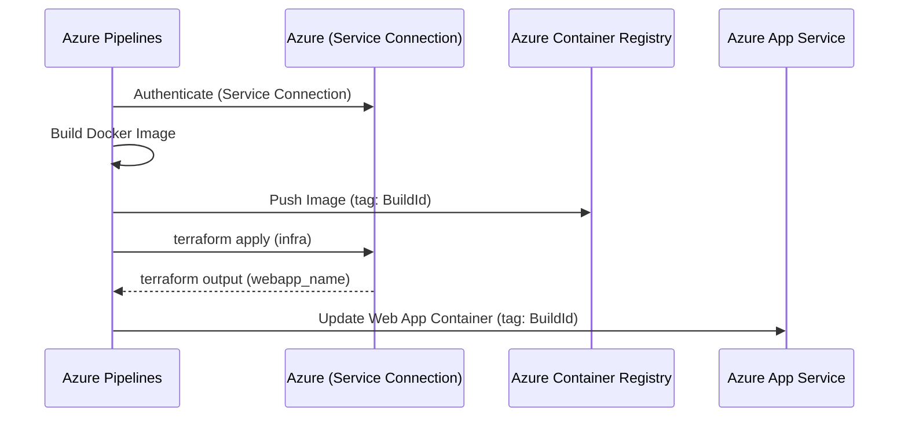

# Azure Pipelines Deployment Example: Web App for Containers

This example demonstrates how to automate the deployment of the Web App Hosted Agent API using Azure Pipelines.

## Overview

The deployment flow follows a bounded CI/CD process across three stages:
1. **Build:** Builds the Docker image and pushes it to Azure Container Registry (ACR).
2. **Infrastructure:** Uses Terraform to provision or update Azure resources.
3. **App Deployment:** Updates the Web App with the newly created container image tag.

## Prerequisites

### 1. Azure Service Connections
Two service connections are recommended in your Azure DevOps project:
- **Azure Resource Manager Connection:** For Terraform and App Service deployment.
- **Docker Registry Connection:** For building and pushing images to ACR.

Reference: [Create an Azure Resource Manager service connection](https://learn.microsoft.com/en-us/azure/devops/pipelines/library/connect-to-azure?view=azure-devops)

### 2. Variable Group
Create a Variable Group (e.g., `webapp-agent-api-vars`) to store environment-specific values and secrets:
- `containerRegistry`: The FQDN of your ACR (e.g., `myacr.azurecr.io`).
- `azureServiceConnection`: Name of your ARM service connection.
- `dockerRegistryServiceConnection`: Name of your Docker Registry service connection.

### 3. Terraform Backend
The pipeline assumes a remote backend is used for Terraform state. You must provide the following in the `terraform init` step or via a Variable Group:
- Resource Group Name
- Storage Account Name
- Container Name

## Deployment Flow

1. **Build & Push:**
   - Reuses the `Dockerfile` from `building-blocks/hosting/container-agent-api/`.
   - Tags the image with the `Build.BuildId`.
2. **Terraform Deployment:**
   - Initializes Terraform with a remote backend.
   - Captures the `webapp_name` output variable using `task.setvariable` with `isOutput=true`.
3. **App Service Deploy:**
   - Uses the `AzureWebAppContainer@1` task.
   - References the `webappName` variable from the previous stage using `stageDependencies`.

## Differences from GitHub Actions Example

- **Authentication:** Uses Azure Service Connections instead of OIDC-based Azure Login task (though OIDC is also supported in Azure Pipelines).
- **Variable Scoping:** Uses `stageDependencies` to pass information (like the web app name) between stages, whereas GitHub Actions uses job outputs.
- **Task Syntax:** Uses native Azure Pipelines tasks (`Docker@2`, `AzureCLI@2`, `AzureWebAppContainer@1`).

## Rollback and Cleanup

- **Rollback:** To roll back, redeploy a previous successful build from the Azure Pipelines UI.
- **Cleanup:** Run `terraform destroy` locally or create a destruction pipeline to remove the Azure resources.
