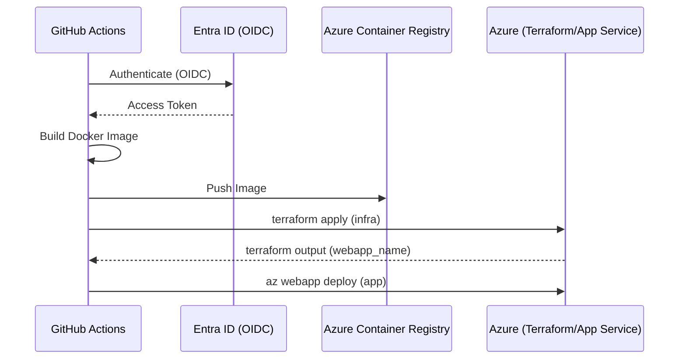

# GitHub Actions Deployment Example: Web App for Containers

This example demonstrates how to automate the deployment of the Web App Hosted Agent API using GitHub Actions.

## Overview

The deployment flow follows a bounded CI/CD process:
1. **Build & Push:** Builds the Docker image and pushes it to Azure Container Registry (ACR).
2. **Infrastructure:** Uses Terraform to provision or update the Azure resources (App Service Plan, Web App).
3. **Application:** Deploys the specific container image tag to the Web App.

## Prerequisites

### 1. Azure Identity (OIDC)
This workflow uses OpenID Connect (OIDC) to authenticate with Azure without needing long-lived secrets.
- Create an Azure Service Principal.
- Configure Federated Credentials for the GitHub repository.
- Reference: [Use GitHub Actions with Azure Login](https://learn.microsoft.com/en-us/azure/developer/github/connect-from-azure-openid-connect)

### 2. Azure Container Registry (ACR)
An ACR instance must exist to store the container images. The Service Principal must have `AcrPush` permissions.

### 3. GitHub Secrets
The following secrets must be configured in your GitHub repository or environment:

| Secret Name | Description |
|-------------|-------------|
| `AZURE_CLIENT_ID` | The Client ID of the Service Principal. |
| `AZURE_TENANT_ID` | The Tenant ID of your Azure subscription. |
| `AZURE_SUBSCRIPTION_ID` | The ID of your Azure subscription. |
| `ACR_NAME` | The name of your Azure Container Registry (without `.azurecr.io`). |
| `BACKEND_RG` | Resource group for the Terraform remote backend. |
| `BACKEND_STORAGE` | Storage account for the Terraform remote backend. |

> **Note:** The `WEBAPP_NAME` is automatically derived from Terraform outputs and does not need to be provided as a secret.

## Deployment Flow

1. **Checkout:** Clones the repository.
2. **Azure Login:** Authenticates using OIDC.
3. **Build & Push:**
   - Reuses the `Dockerfile` from `building-blocks/hosting/container-agent-api/`.
   - Tags the image with the GitHub SHA.
4. **Terraform Deployment:**
   - Initializes Terraform with a remote backend in Azure Storage.
   - Runs `terraform apply` to ensure the App Service is configured.
   - Captures the `webapp_name` from Terraform outputs.
5. **App Service Deploy:**
   - Updates the Web App to use the newly pushed image tag using the derived name.

## Rollback and Cleanup

- **Rollback:** To roll back, re-run a previous successful workflow run or manually update the Web App container settings to a known good image tag.
- **Cleanup:** Run `terraform destroy` locally or create a destruction workflow to remove the Azure resources.
