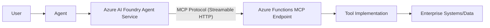

# MCP on Azure Functions Reference Pattern

## Purpose
This building block documents the supported architectural pattern for hosting Model Context Protocol (MCP) servers behind an Azure Functions boundary.

By hosting MCP tools on Azure Functions, agents can access enterprise systems and complex business logic with scale-to-zero pricing, managed identity security, and standardized tool discovery.

## Supported Patterns

Azure Functions supports two primary ways to create and host remote MCP servers:

### 1. MCP Binding Extension
The **MCP binding extension** allows you to create and host custom MCP servers similarly to any other function app by using specialized triggers and bindings. This is the recommended approach for deep integration with the Azure Functions programming model.

### 2. Self-hosted MCP Servers
You can host MCP servers created by using official MCP SDKs. This approach uses **Streamable HTTP transport** (such as SSE - Server-Sent Events) to communicate with AI clients. This pattern is currently in **preview**.

### Architecture

## Prerequisites
- **Azure AI Foundry Project**: To register and consume the MCP tool.
- **Azure Functions (Flex Consumption)**: Recommended for optimal serverless scaling and identity-based access.
- **Python 3.10+**: Standard runtime for FastMCP and Azure AI SDKs.
- **Managed Identity**: Enabled on the Function App for secure access to Azure resources without secrets.

## Implementation Details

### 1. Transport Choice
- **Streamable HTTP (SSE)**: Standard for real-time interactions with self-hosted MCP servers.
- **MCP Triggers/Bindings**: Used when leveraging the Azure Functions MCP binding extension.
- **Queue-based (Alternative)**: For long-running or asynchronous work, use the specialized `AzureFunctionsTool` with Storage Queues instead of a raw MCP endpoint.

### 2. Authentication and Security
- **Entra ID / Managed Identity**: The Function App should use Managed Identity to authenticate with other Azure services.
- **Foundry Connection**: Store any required third-party API keys in Azure AI Foundry Project Connections rather than in the Function App code.
- **Network Boundary**: Use Private Endpoints to restrict access to the MCP endpoint within a Virtual Network.

### 3. Local vs Azure
- **Local**: Development typically uses `stdio` transport with the MCP Inspector for rapid testing.
- **Azure**: Deployment requires switching to a network-based transport like **Streamable HTTP** (SSE) or the **MCP binding extension** to allow the Foundry Agent Service to reach the endpoint.

## Limitations and Trade-offs
- **Preview Status**: Remote MCP hosting patterns on Azure Functions are currently in preview and subject to change.
- **Documentation-Only**: This reference currently focuses on the architectural pattern. Implementation depends on the evolving `mcp` and `azure-functions` Python library support.
- **Cold Start**: While Flex Consumption minimizes cold starts, the first tool call after a period of inactivity may experience slight latency.

## When to use this pattern
- When you need a centralized, reusable tool catalog shared across multiple agents.
- When tool logic requires specific Python dependencies or environment configurations not available in-process.
- When you want to leverage Azure Functions' built-in triggers, bindings, and scaling.

## Microsoft Learn References
- [Agent tools overview for Foundry Agent Service](https://learn.microsoft.com/en-us/azure/foundry/agents/concepts/tool-catalog)
- [Use Azure Functions with Foundry Agent Service](https://learn.microsoft.com/en-us/azure/foundry/agents/how-to/tools/azure-functions)
- [Use AI tools and models in Azure Functions](https://learn.microsoft.com/en-us/azure/azure-functions/functions-create-ai-enabled-apps)
- [Host MCP servers in Azure Functions](https://learn.microsoft.com/en-us/azure/azure-functions/functions-create-ai-enabled-apps#remote-mcp-servers)
