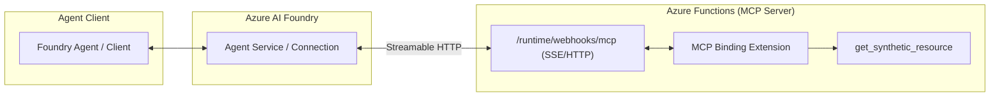

# Azure Functions MCP Endpoint Reference

## Purpose
This building block provides a reference implementation for hosting a [Model Context Protocol (MCP)](https://modelcontextprotocol.io/) server using the official **Azure Functions MCP binding extension**.

By hosting MCP tools on Azure Functions, agents can access enterprise systems and complex business logic with scale-to-zero pricing, managed identity security, and standardized tool discovery via the Streamable HTTP transport.

## When to Use
- When you need to host custom tools for Azure AI Foundry agents or other MCP-capable clients.
- When you want serverless, scale-to-zero hosting with enterprise-grade security (Managed Identity).
- When you require identity-first access to other Azure services (Key Vault, SQL, Blob) within your tools.
- When you need a standardized protocol (MCP) for tool discovery and invocation.

## When Not to Use
- Do not use if your tools are local-only or for dev-time only (use `fastmcp-basic-server` instead).
- Do not use if you require a transport other than Streamable HTTP or SSE (e.g., custom WebSockets).
- Do not use for extremely high-frequency, low-latency sub-millisecond tools where the cold start of serverless could be a factor (though Flex Consumption mitigates this).

## Architecture



## MCP on Azure Functions vs. Standard FastMCP

| Feature | FastMCP (Local/Container) | Azure Functions MCP Extension |
| :--- | :--- | :--- |
| **Transport** | stdio / SSE (manual) | Streamable HTTP (Native) |
| **Triggers** | CLI / Manual | `@app.mcp_tool_trigger` |
| **Auth** | Manual / Middleware | App Service Auth / System Keys |
| **Scaling** | Manual / K8s | Serverless (Flex Consumption) |
| **Identity** | Manual SDK setup | Managed Identity (Native) |

## Tool Contract

### Tool: `get_synthetic_resource`
Returns synthetic metadata for a requested resource type. This is a safe, read-only tool that returns static demo data only.

**Inputs:**
- `resource_type` (string, required): The type of resource to retrieve ('compute' or 'storage').

**Outputs:**
- `id` (string): Unique identifier for the synthetic resource.
- `type` (string): Resource type specification.
- `status` (string): Current operational status.
- `region` (string): Deployment region for the resource.

## Local Development & Validation

### Prerequisites
- [Azure Functions Core Tools](https://learn.microsoft.com/en-us/azure/azure-functions/functions-run-local) (v4.0.7030+)
- Python 3.10+
- `azure-functions>=1.24.0`

### Local Run
1. Install dependencies:
   ```bash
   pip install -r src/requirements.txt
   ```
2. Start the function app:
   ```bash
   func start
   ```
3. The MCP endpoint will be available at: `http://localhost:7071/runtime/webhooks/mcp`

### Local Validation
You can perform static validation of the function app structure:
```bash
PYTHONPATH=src pytest tests/test_endpoint.py
```

## Security and Customer Safety
- **Read-Only**: This reference contains only read-only tool triggers.
- **Data Redaction**: The implementation avoids logging raw tool arguments or internal stack traces.
- **System Keys**: When deployed to Azure, the endpoint is protected by the `mcp_extension` system key.
- **Identity-First**: The recommended pattern uses Managed Identity for all backend resource access.

## Deployment / IaC Reference
**Path**: `infra/terraform/`

This module includes a Terraform/OpenTofu reference for deploying the MCP server to Azure Functions Flex Consumption with identity-first security boundaries.

### Required Variables
- `prefix`: Prefix for naming resources.
- `location`: Azure region for deployment.

### Key Outputs
- `mcp_endpoint_url`: The full URL for the MCP Streamable HTTP endpoint.
- `function_app_name`: Name of the deployed Function App.

For detailed instructions, see [infra/terraform/README.md](infra/terraform/README.md).

## Known Limits
- **Extension Support**: The MCP extension is currently in preview; check official Microsoft docs for the latest GA status.
- **Language Support**: This reference focuses on Python; other languages (C#, Java, TypeScript) are supported by the extension but not implemented in this specific block.
- **Identity Passthrough**: Complex per-user OAuth passthrough requires additional configuration in App Service/Entra ID.

## Microsoft Learn References
- [Azure Functions MCP extension overview](https://learn.microsoft.com/en-us/azure/azure-functions/functions-bindings-mcp)
- [Create a tool endpoint in your remote MCP server](https://learn.microsoft.com/en-us/azure/azure-functions/functions-bindings-mcp-tool-trigger)
- [Use AI tools and models in Azure Functions](https://learn.microsoft.com/en-us/azure/azure-functions/functions-create-ai-enabled-apps)
