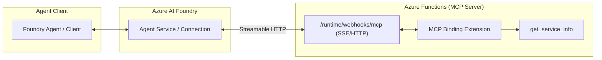

# Azure Functions MCP Endpoint Reference

## Purpose
This building block provides a reference implementation for hosting a [Model Context Protocol (MCP)](https://modelcontextprotocol.io/) server using the official **Azure Functions MCP binding extension**.

By hosting MCP tools on Azure Functions, agents can access enterprise systems and complex business logic with scale-to-zero pricing, managed identity security, and standardized tool discovery via the Streamable HTTP transport.

## Architecture



## MCP on Azure Functions vs. Standard FastMCP

| Feature | FastMCP (Local/Container) | Azure Functions MCP Extension |
| :--- | :--- | :--- |
| **Transport** | stdio / SSE (manual) | Streamable HTTP (Native) |
| **Triggers** | CLI / Manual | `@app.mcp_tool_trigger` |
| **Auth** | Manual / Middleware | App Service Auth / System Keys |
| **Scaling** | Manual / K8s | Serverless (Flex Consumption) |
| **Identity** | Manual SDK setup | Managed Identity (Native) |

## Tool Contract

### Tool: `get_service_info`
Returns a safe, read-only summary of the service hosting the MCP tools.

**Inputs:**
- None.

**Outputs:**
- `service_name` (string): Name of the service.
- `status` (string): Current operational status.
- `version` (string): Version of the MCP server.

## Local Development & Validation

### Prerequisites
- [Azure Functions Core Tools](https://learn.microsoft.com/en-us/azure/azure-functions/functions-run-local) (v4.0.7030+)
- Python 3.10+
- `azure-functions>=1.24.0`

### Local Run
1. Install dependencies:
   ```bash
   pip install -r src/requirements.txt
   ```
2. Start the function app:
   ```bash
   func start
   ```
3. The MCP endpoint will be available at: `http://localhost:7071/runtime/webhooks/mcp`

### Local Validation
You can perform static validation of the function app structure:
```bash
PYTHONPATH=src pytest tests/test_endpoint.py
```

## Security and Customer Safety
- **Read-Only**: This reference contains only read-only tool triggers.
- **Data Redaction**: The implementation avoids logging raw tool arguments or internal stack traces.
- **System Keys**: When deployed to Azure, the endpoint is protected by the `mcp_extension` system key.
- **Identity-First**: The recommended pattern uses Managed Identity for all backend resource access.

## Deployment / IaC Decision
**Status: Deferred-IaC (Reference Pattern)**

This module provides the code and configuration for the MCP server. Infrastructure deployment (Function App, Storage) follows the standard pattern in `infra/terraform/` but is deferred in this building block to maintain minimalism.

## Microsoft Learn References
- [Azure Functions MCP extension overview](https://learn.microsoft.com/en-us/azure/azure-functions/functions-bindings-mcp)
- [Create a tool endpoint in your remote MCP server](https://learn.microsoft.com/en-us/azure/azure-functions/functions-bindings-mcp-tool-trigger)
- [Use AI tools and models in Azure Functions](https://learn.microsoft.com/en-us/azure/azure-functions/functions-create-ai-enabled-apps)
