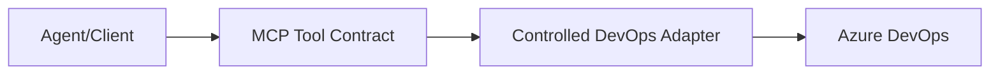

# DevOps MCP Tool Contract

## Purpose
This building block defines the safe, **read-only DevOps status** [Model Context Protocol (MCP)](https://modelcontextprotocol.io/) tool contracts for querying Azure DevOps. It establishes a strict security boundary that allows AI agents to answer questions about build and pipeline health without exposing sensitive technical internals, credentials, or allowing mutation operations.

## Architecture



## Security Boundary

To protect the integrity and confidentiality of the DevOps environment, the following **Read-Only DevOps Status Boundary** constraints are enforced by this contract:

### Allowed (Safe Fields)
- **Status**: Current state of a run (e.g., `inProgress`, `completed`).
- **Result**: Outcome of a completed run (e.g., `succeeded`, `failed`, `canceled`).
- **Metadata**: Pipeline name, run ID (surrogate or real depending on implementation), branch name, and commit short SHA.
- **Timing**: Start time, end time, and duration.
- **Summaries**: Friendly business-level summaries of successes or failures.
- **Artifacts**: Safe metadata about produced artifacts (name, type) without direct download links to sensitive content.

### Forbidden (Boundary Violations)
- **Mutations**: No tools for triggering builds, canceling runs, deleting artifacts, or changing configurations.
- **Secrets/Tokens**: No access to secrets, variables marked as secret, PATs, OAuth tokens, or credentials.
- **Technical Internals**: No raw build logs, full stack traces, internal IP addresses, or detailed model/tool payloads.
- **Broad Discovery**: No unbounded organization or project discovery; tools must be scoped to specific allowed projects.
- **Arbitrary Queries**: No passthrough of raw OData, SQL-like queries, or arbitrary REST API parameters to DevOps.
- **Customer PII**: No exposure of developer email addresses or internal IDs beyond what is necessary for business status.

## Tool Contracts

The following MCP tools are defined in this contract. Implementation should follow the provided JSON schemas and Pydantic models.

### 1. `get_pipeline_run_status`
Returns the status and summary of a specific Azure DevOps pipeline run.

**Inputs:**
- `pipeline_id` (string): The ID or name of the pipeline.
- `run_id` (string): The specific run ID to query.

**Output Example:**
```json
{
  "pipeline_name": "Main CI",
  "run_id": "20240101.5",
  "status": "completed",
  "result": "failed",
  "branch": "main",
  "commit_sha": "a1b2c3d",
  "start_time": "2024-01-01T10:00:00Z",
  "end_time": "2024-01-01T10:05:00Z",
  "summary": "Step 'Unit Tests' failed; see the Azure DevOps portal for authorized details."
}
```

## Known Limits
- **Read-Only**: This contract intentionally excludes any mutation or configuration capabilities.
- **Status Only**: It is designed for high-level status monitoring, not for deep technical debugging or log analysis.
- **No Global Search**: It requires specific pipeline identifiers and does not support searching across multiple organizations or projects.

## Authentication and Implementation
This module defines the **declarative contract only**. It is the responsibility of a **Controlled DevOps Adapter** (the implementation) to:
- Securely handle authentication (PATs, OAuth, Managed Identity).
- Enforce authorization and project scoping.
- Perform the actual Azure DevOps REST API calls.
- Handle raw provider payloads and sensitive technical data.
- Sanitize the response to match the fields defined in this contract *before* returning data to the agent.
No credentials, tokens, or live cloud integration should be included in this module.

## Deployment / IaC Decision
**No-IaC Decision**: This building block defines a contract and local validation logic. It does not introduce deployable Azure resources. Future implementations (e.g., an MCP server hosted on Azure Functions) will include their own infrastructure definitions.

## Local Validation
Validation includes JSON schema checks and Pydantic model verification.

```bash
python --version
ruff check .
ruff format --check .
pytest tests/
```

## References
- [Azure DevOps Pipelines REST API](https://learn.microsoft.com/en-us/rest/api/azure/devops/pipelines/runs/get?view=azure-devops-rest-7.1)
- [Azure DevOps Build REST API](https://learn.microsoft.com/en-us/rest/api/azure/devops/build/builds/get?view=azure-devops-rest-7.1)
- [Foundry Agent Tool Catalog](https://learn.microsoft.com/en-us/azure/foundry/agents/concepts/tool-catalog)
- [Model Context Protocol Specification](https://modelcontextprotocol.io/specification)
