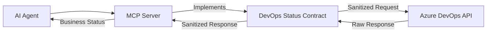

# DevOps MCP Tool Contract

## Purpose
This building block defines the safe, read-only [Model Context Protocol (MCP)](https://modelcontextprotocol.io/) tool contracts for querying Azure DevOps status. It establishes a security boundary that allows AI agents to answer questions about build and pipeline health without exposing sensitive internals or allowing mutations.

## Architecture



## Security Boundary

To protect the integrity and confidentiality of the DevOps environment, the following constraints are enforced by this contract:

### Allowed (Safe Fields)
- **Status**: Current state of a run (e.g., `inProgress`, `completed`).
- **Result**: Outcome of a completed run (e.g., `succeeded`, `failed`, `canceled`).
- **Metadata**: Pipeline name, run ID (surrogate or real depending on implementation), branch name, and commit short SHA.
- **Timing**: Start time, end time, and duration.
- **Summaries**: Friendly business-level summaries of successes or failures.
- **Placeholders**: URLs to the Azure DevOps portal (customer-facing links).

### Forbidden
- **Mutations**: No tools for triggering builds, canceling runs, or changing configurations.
- **Sensitive Data**: No access to secrets, variables marked as secret, tokens, or credentials.
- **Technical Internals**: No raw logs, full stack traces, or detailed model/tool payloads.
- **Broad Access**: No unbounded organization or project discovery; tools should be scoped to specific projects.
- **Arbitrary Queries**: No passthrough of raw OData or SQL-like queries to DevOps APIs.

## Tool Contracts

The following MCP tools are defined in this contract. Implementation should follow these schemas.

### 1. `get_pipeline_run_status`
Returns the status and summary of a specific Azure DevOps pipeline run.

**Inputs:**
- `pipeline_id` (string): The ID or name of the pipeline.
- `run_id` (string): The specific run ID to query.

**Output Example:**
```json
{
  "pipeline_name": "Main CI",
  "run_id": "20240101.5",
  "status": "completed",
  "result": "failed",
  "branch": "main",
  "commit_sha": "a1b2c3d",
  "start_time": "2024-01-01T10:00:00Z",
  "end_time": "2024-01-01T10:05:00Z",
  "summary": "Step 'Unit Tests' failed on agent 'Linux-01'.",
  "portal_url": "https://dev.azure.com/org/proj/_build/results?buildId=12345"
}
```

### 2. `get_latest_build_summary`
Returns the summary of the most recent build for a specified pipeline or branch.

**Inputs:**
- `pipeline_id` (string): The ID or name of the pipeline.
- `branch` (string, optional): Filter by branch name (defaults to default branch).

**Output Example:**
```json
{
  "pipeline_name": "Main CI",
  "build_number": "20240102.1",
  "status": "completed",
  "result": "succeeded",
  "branch": "main",
  "finish_time": "2024-01-02T12:00:00Z",
  "summary": "Build succeeded. All 150 tests passed.",
  "portal_url": "https://dev.azure.com/org/proj/_build/results?buildId=12346"
}
```

### 3. `list_recent_pipeline_runs`
Lists recent pipeline runs with their results and basic metadata.

**Inputs:**
- `pipeline_id` (string): The ID or name of the pipeline.
- `top` (integer, optional): Number of recent runs to return (default: 5, max: 10).

**Output Example:**
```json
[
  {
    "run_id": "20240102.1",
    "result": "succeeded",
    "branch": "main",
    "finish_time": "2024-01-02T12:00:00Z"
  },
  {
    "run_id": "20240101.9",
    "result": "failed",
    "branch": "feature/ui-update",
    "finish_time": "2024-01-01T15:30:00Z"
  }
]
```

## References
- [Azure DevOps Pipelines REST API](https://learn.microsoft.com/en-us/rest/api/azure/devops/pipelines/runs/get?view=azure-devops-rest-7.1)
- [Azure DevOps Build REST API](https://learn.microsoft.com/en-us/rest/api/azure/devops/build/builds/get?view=azure-devops-rest-7.1)
- [Foundry Agent Tool Catalog](https://learn.microsoft.com/en-us/azure/foundry/agents/concepts/tool-catalog)
