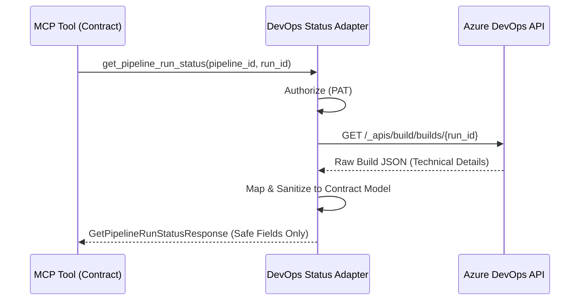

# DevOps Status Adapter

## Purpose
This building block implements a controlled, read-only adapter for Azure DevOps. It acts as the implementation layer behind the `devops-mcp-tool-contract`, handles authentication, performs REST API calls to Azure DevOps, and sanitizes raw provider responses into the bounded contract models.

## Architecture



## Security Boundary
The adapter enforces the following security constraints:
- **Read-Only**: Only `GET` requests to specific Build API endpoints are constructed.
- **Credential Safety**: Personal Access Tokens (PATs) are used for authentication but are never included in request/response models or logs.
- **Input Validation**: All identifiers are used safely in URL construction.
- **Output Sanitization**: Raw Azure DevOps payloads (which may include technical logs, internal paths, or user PII) are strictly mapped to the `devops-mcp-tool-contract` Pydantic models. Any fields not defined in the contract are discarded.
- **Failure Closed**: If the provider returns a malformed response or an error, the adapter returns a generic business-level error message without leaking technical internals.

## Usage

### Local Development
The adapter requires `pydantic` and `typing-extensions`.

```python
from building_blocks.mcp.devops_status_adapter.src.adapter import DevOpsStatusAdapter

adapter = DevOpsStatusAdapter(
    organization_url="https://dev.azure.com/your-org",
    project="your-project",
    token="your-pat"
)

status = adapter.get_pipeline_run_status(pipeline_id="123", run_id="456")
print(status.model_dump_json(indent=2))
```

### Local Validation
Run the following commands to validate the implementation:

```bash
python --version
ruff check .
ruff format --check .
pytest tests/
```

## Deployment / IaC Decision
**No-IaC Decision**: This building block is a local adapter and does not introduce or manage any Azure resources directly. It is intended to be used as a library or within a hosted service (like an Azure Function) which will own its own infrastructure.

## Known Limits
- Supports only Azure DevOps Build (Pipeline) status.
- Does not support log retrieval or artifact downloads.
- Restricted to the `get_pipeline_run_status` and `list_recent_pipeline_runs` operations.

## References
- [Azure DevOps Builds - Get](https://learn.microsoft.com/en-us/rest/api/azure/devops/build/builds/get?view=azure-devops-rest-7.1)
- [Azure DevOps Builds - List](https://learn.microsoft.com/en-us/rest/api/azure/devops/build/builds/list?view=azure-devops-rest-7.1)
- [Azure DevOps Authentication Guidance](https://learn.microsoft.com/en-us/azure/devops/integrate/get-started/authentication/authentication-guidance?view=azure-devops)
