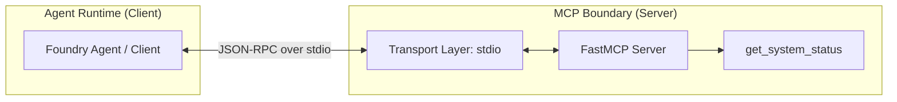

# FastMCP Basic Server Reference

## Purpose
This building block provides a minimal reference implementation of a [Model Context Protocol (MCP)](https://modelcontextprotocol.io/) server using the [FastMCP](https://github.com/jlowin/fastmcp) framework. It demonstrates how to expose local tools to AI agents through a standardized, secure boundary.

## Architecture



## MCP vs. Other Tooling Patterns

| Feature | Direct Function Calling | OpenAPI / REST | MCP |
| :--- | :--- | :--- | :--- |
| **Discovery** | Manual schema definition | OpenAPI Spec (JSON/YAML) | Protocol-level introspection |
| **Portability** | Low (code-dependent) | High (platform-agnostic) | High (AI-native standard) |
| **Complexity** | Low | Medium/High | Medium (managed by FastMCP) |
| **Statefulness** | Stateless | Typically Stateless | Supports stateful resources |
| **Best For** | Internal application logic | External web services | Composable agent ecosystems |

### Why choose MCP?
MCP is preferable when you want to build a **reusable tool catalog** that can be consumed by different agents or platforms (e.g., Azure AI Foundry, Claude Desktop) without writing custom integration code for every tool. It decouples the tool execution environment from the agent's reasoning environment.

### Why choose OpenAPI?
OpenAPI is better for legacy integrations or when you already have a robust HTTP/REST infrastructure with established OAuth2/Security patterns.

### Why choose Direct Function Calling?
Direct calling is best for high-performance, local-only operations that don't need to be exposed outside a single codebase.

## Local Execution

### Prerequisites
- Python 3.10+
- `fastmcp` library

### Run the server
The server uses `stdio` (standard input/output) as its transport mechanism.

```bash
python3 src/server.py
```

### Validation
You can verify the tool definitions by running the server with the help flag:

```bash
python3 src/server.py --help
```

## Security & Customer Safety
- **Read-Only**: This reference contains only read-only tools.
- **Bounded Inputs**: No external inputs are accepted in this minimal reference to maximize safety.
- **No Secrets**: No API keys or connection strings are stored or logged in this reference.

## Deployment / IaC Decision
**Status: No-IaC (Local Reference Only)**

This module is a local-first pattern. Deployment to Azure (e.g., via Azure Functions) requires different transport negotiation (SSE). Reference patterns for Azure-hosted MCP can be found in `building-blocks/mcp/azure-functions-mcp-endpoint/`.
