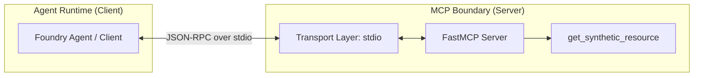

# FastMCP Basic Server Reference

## Purpose
This building block provides a minimal reference implementation of a [Model Context Protocol (MCP)](https://modelcontextprotocol.io/) server using the [FastMCP](https://github.com/jlowin/fastmcp) framework. It demonstrates how to expose local tools to AI agents through a standardized, secure, and read-only protocol boundary.

## When to Use
- When you need a minimal, local-first reference for MCP protocol behavior.
- When you want to demonstrate how to expose a Python function as an MCP tool.
- When testing MCP client integrations (e.g., Claude Desktop, Azure AI Foundry) with a predictable, safe server.

## When Not to Use
- Do not use for production tool hosting.
- Do not use when you need an Azure-hosted endpoint (use `building-blocks/mcp/azure-functions-mcp-endpoint/` instead).
- Do not use for complex, stateful tool logic.

## Comparison with Other Hosting Options

| Feature | Local FastMCP (This) | Azure Functions MCP | Container-hosted MCP |
| :--- | :--- | :--- | :--- |
| **Transport** | stdio | SSE / HTTP | SSE / HTTP |
| **Hosting** | Local process | Serverless (Azure Functions) | Azure Container Apps / AKS |
| **Scalability** | Manual | Automatic | Managed |
| **Best For** | Development & Debugging | Enterprise Tooling | High-performance / Custom Runtimes |

## API Boundary



## Local / Demo Flow

1. **Install dependencies**:
   ```bash
   pip install -r requirements.txt
   ```

2. **Run the server**:
   The server defaults to `stdio` transport, suitable for integration with MCP clients.
   ```bash
   python src/server.py
   ```

3. **Inspect the server**:
   FastMCP provides built-in inspection capabilities (requires `mcp` CLI):
   ```bash
   mcp dev src/server.py
   ```

## Tool Contract

### `get_synthetic_resource`
Returns synthetic metadata for a requested resource type.

**Arguments:**
- `resource_type` (string, required): The type of resource to retrieve. Must be one of: `compute`, `storage`.

**Returns:**
- A JSON object containing synthetic resource metadata (id, type, status, region) or an error message if the type is unsupported.

## Environment Variables
This module does not require any environment variables for its default configuration.

## Validation Commands
Run style and logic checks:

```bash
# Style check
ruff check src/ tests/

# Format check
ruff format --check src/ tests/

# Run tests
PYTHONPATH=src pytest tests/
```

## Azure Hosting Notes
This specific module is a **local-only reference**. It uses the `stdio` transport which is not directly compatible with Azure's HTTP-based serverless hosting without a transport bridge.

For Azure-native MCP hosting patterns (using SSE), refer to `building-blocks/mcp/azure-functions-mcp-endpoint/`.

## Security Notes
- **Read-Only**: All tools are strictly read-only and return synthetic data.
- **Fail-Closed**: Rejects unsupported inputs with a generic error message.
- **No Mutations**: No tools are provided for system modification.
- **No Secrets**: This reference does not handle or store secrets, tokens, or PII.
- **Data Redaction**: Does not leak internal exceptions, stack traces, or filesystem paths.
- **Process Isolation**: The server runs as a local process; ensure the parent agent runtime is trusted.

## Cost & Ops Trade-offs
- **Cost**: Zero (local execution).
- **Ops**: Low complexity, but manual lifecycle management. It does not benefit from Azure's managed observability or scaling.

## Known Limits
- **Transport**: Supports `stdio` only.
- **Concurrency**: Limited by the local Python runtime environment.
- **Stateless**: Does not persist state between requests or restarts.
