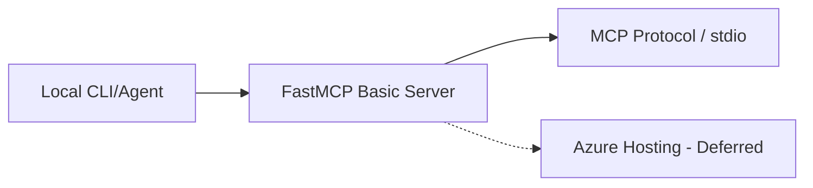

# Infrastructure: FastMCP Basic Server

This directory contains the Terraform/OpenTofu deployment structure for the FastMCP Basic Server building block.

## Deployment / IaC Decision

**Status: Local-only reference**

This module is intentionally designed as a local-first reference implementation using the `stdio` transport. It does not currently provision any Azure resources.

- **Why no resources?** To maintain minimalism and provide a clear baseline for MCP protocol behavior without cloud infrastructure overhead.
- **Azure Hosting:** Deployment patterns for hosting MCP servers on Azure (e.g., using Azure Functions or Container Apps) are deferred to dedicated building blocks such as `building-blocks/mcp/azure-functions-mcp-endpoint/`.

## Architecture

## Files
- `versions.tf`: Provider and version constraints.
- `main.tf`: Provider initialization and no-resource documentation.
- `variables.tf`: Placeholder variables.
- `outputs.tf`: Deployment status output.

## Validation

Manual HCL validation by inspection was performed. Terraform CLI is not available in the current environment for `terraform validate`.
