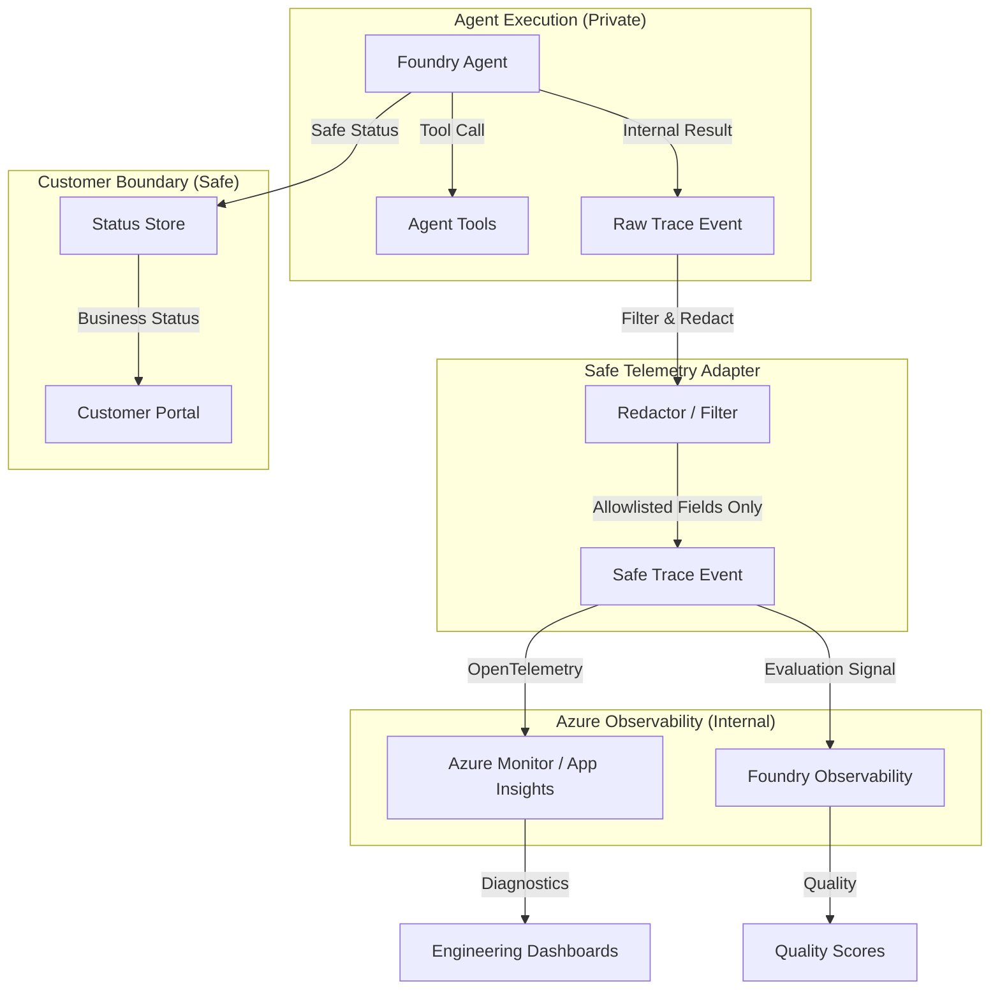

# Agent Evaluation and Observability

Reference for tracing, evaluation, and monitoring expectations for customer-safe Azure AI Foundry agent flows.

## Purpose

This building block defines the standards for capturing technical diagnostics and quality metrics while strictly enforcing a **customer-safe boundary**. It ensures that observability data remains actionable for engineers without leaking sensitive information or internal system details.

## Trace Boundary

Technical telemetry should be strictly separated from business status. Tracing focuses on the "how" (diagnostics), while the Portal API and Status Store focus on the "what" (outcomes).



## Trace and Evaluation Checklist

Technical telemetry should include these fields for debugging and performance tuning:

| Field | Description |
|-------|-------------|
| **Request ID** | Request correlation ID for the user request used to correlate spans across services. |
| **Agent ID/Name** | Identifier for the specific agent version being called. |
| **Agent Step Names** | Names of internal reasoning steps or state transitions. |
| **Tool Call Names** | The specific name of the tool called (e.g., `get_pipeline_status`). |
| **Tool Name** | Redundant field for tool identification in various log formats. |
| **Tool Outcome** | Technical success or failure of the tool call. |
| **Latency** | Duration of agent turns and individual tool executions. |
| **Status/Result** | Technical status or result of the individual span or operation. |
| **Safety Outcome** | High-level safety result from content filters. |
| **Sanitized Summary** | High-level evaluation outcome summary or diagnostic summary. |

## Customer-Safe Logging Rules

### What MAY be traced
- **Request ID**: Request correlation ID linking the agent flow.
- **Business Status**: High-level states (e.g., `completed`, `failed`).
- **Safe Artifact Metadata**: Non-sensitive info like file extensions or redacted names.
- **Timing/Latency**: Duration of agent turns and tool execution.
- **Cost Estimate**: Aggregated cost figures (no raw usage details).
- **Friendly Error Category**: Categorized failures that don't reveal internals.

### What MUST NOT be traced/logged
These fields must **never** enter technical telemetry or logs to protect the security and privacy boundary:
- **Secrets & Tokens**: API keys, SAS tokens, Bearer tokens, or credentials.
- **Connection Strings**: Full URIs containing authentication parameters.
- **Prompts with Secrets**: System instructions, user inputs, or model grounding text (raw prompts) containing sensitive data or credentials.
- **Raw Customer Documents**: Full text or binary content from processed files.
- **Raw Tool/Provider Payloads**: Full unfiltered JSON request/response bodies sent to tools or AI providers.
- **Stack Traces**: Technical error details revealing code paths, file names, or environment state.
- **Raw Azure DevOps Logs**: Direct output from build/release pipelines.
- **Raw Azure/DevOps Payloads**: Technical details from platform APIs (Tenant IDs, Subscription IDs, Customer/Org/Tenant identifiers) or internal secret variables.
- **Unrestricted User Content**: Large blocks of raw user input without PII/PHI scrubbing.

## Minimal Evaluation Checklist

Every agent iteration must be evaluated against these pillars:

| Pillar | Check | Description |
|--------|-------|-------------|
| **Quality** | Task Completion & Coherence | Did the agent complete the goal accurately and coherently? |
| **Tool-Boundary** | Tool-Call Correctness | Did the agent call the right tool with valid arguments and stay within its boundary? |
| **Groundedness/Relevance** | Groundedness & Relevance | Is the answer based on the provided context and relevant to the user? |
| **Safety** | Safety & Refusal Rate | Does the agent refuse harmful, out-of-scope, or prompt-injection attempts? |
| **Answer Format** | Customer-Safe Status Wording | Is the status language friendly and free of technical jargon (format check)? |
| **Failure Quality** | Latency/Error Budget Notes | Is the failure explanation friendly and non-technical, within performance limits? |
| **Redaction** | Redaction Compliance | Does the trace output strictly adhere to the redaction rules and contain no forbidden fields? |

## Local Validation

To validate the observability contract and redaction logic locally:

1. **Contract Validation**: Ensures the README and `module.yaml` are synchronized and meet P0 requirements.
   ```bash
   pytest tests/test_contract.py
   ```

2. **Redaction Validation**: Proves that forbidden fields are correctly identified and removed from telemetry payloads.
   ```bash
   pytest tests/test_redaction.py
   ```

3. **Schema Validation**: Ensures that the example trace and evaluation fixtures comply with the defined JSON schemas.
   ```bash
   pytest tests/test_schema_validation.py
   ```

## Known Limits

- **Shared Responsibility**: This reference defines the *what* and *how* of safe tracing, but the final implementation in the agent runtime or adapter is responsible for correctly applying these rules.
- **Pattern-Based Redaction**: Simple regex-based redaction may not catch all sophisticated prompt injection attempts or obfuscated secrets.
- **Local Simulation**: Local tests use static payloads and do not account for dynamic behavior or platform-level tracing injected by the Azure AI Foundry SDK.

## Security and Privacy Notes

- **Redaction**: Implement automated redaction for common secret patterns (e.g., `AccountKey=...`, `Bearer ...`) before emitting traces.
- **Least-Privilege Access**: Access to Application Insights and Foundry evaluation results should be restricted to engineering/security roles only.
- **Retention**: Telemetry and evaluation datasets should follow organizational data retention policies (typically 30-90 days).
- **Monitoring Trade-offs**: While high-detail tracing aids debugging, it increases storage costs and privacy risks. Use sampled tracing in production.

## Deployment / IaC Decision

**No-IaC: Guidance-only module.**

This building block defines standards and checklists rather than deployable infrastructure. Application-specific observability (Application Insights) is typically deployed as part of the hosting building block (e.g., `webapp-agent-api` or `functions`). No concrete Azure resources are introduced in this reference.

## References

- [Azure AI Foundry Agent Service Overview](https://learn.microsoft.com/en-us/azure/foundry/agents/overview)
- [Observability in Generative AI](https://learn.microsoft.com/en-us/azure/foundry/concepts/observability)
- [Application Insights OpenTelemetry Overview](https://learn.microsoft.com/en-us/azure/azure-monitor/app/app-insights-overview)
- [Foundry Trace Application Guidance](https://learn.microsoft.com/en-us/azure/foundry-classic/how-to/develop/trace-application)
- [Customer-Safe Status Boundary](../../security/customer-safe-status-boundary/README.md)
