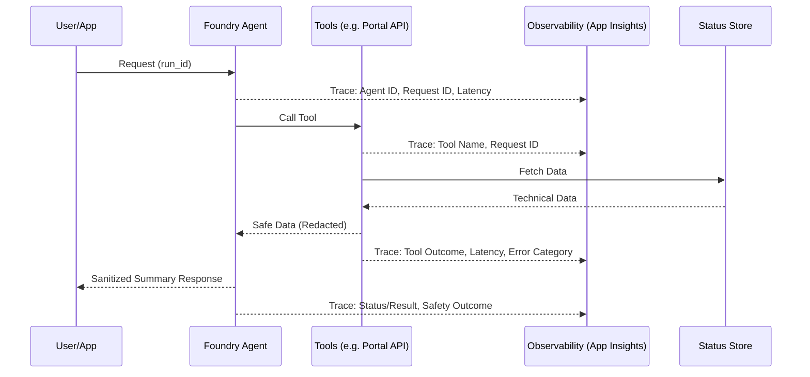

# Agent Evaluation and Observability

Reference for tracing, evaluation, and monitoring expectations for customer-safe Azure AI Foundry agent flows.

## Purpose

This building block defines the standards for capturing technical diagnostics and quality metrics while strictly enforcing a **customer-safe boundary**. It ensures that observability data remains actionable for engineers without leaking sensitive information or internal system details.

## Trace Boundary

Technical telemetry should be strictly separated from business status. Tracing focuses on the "how" (diagnostics), while the Portal API and Status Store focus on the "what" (outcomes).

## Trace and Evaluation Checklist

Technical telemetry should include these fields for debugging and performance tuning:

| Field | Description |
|-------|-------------|
| **Request ID** | Correlation ID for the unique user request. |
| **Agent ID/Name** | Identifier for the specific agent version being called. |
| **Tool Name** | The name of the tool called (e.g., `get_pipeline_status`). |
| **Tool Outcome** | Success, Failure, or Partial Success of the tool execution. |
| **Latency** | Duration of agent turns and individual tool executions. |
| **Status/Result** | Final high-level outcome of the agent interaction. |
| **Safety Outcome** | Result of built-in or custom safety filters (e.g., `Pass`, `Flagged`). |
| **Sanitized Summary** | A non-sensitive technical summary of the execution path. |

## Customer-Safe Logging Rules

### What MAY be traced
- **Run ID Alias**: A non-internal correlation ID for the pipeline run.
- **Business Status**: High-level status (e.g., `completed`, `failed`).
- **Safe Artifact Metadata**: Non-sensitive info like file extensions or redacted names.
- **Timing/Latency**: Duration of agent turns and tool execution.
- **Cost Estimate**: Aggregated cost figures (no raw usage details).
- **Friendly Error Category**: Categorized failures (e.g., `ValidationFailed`, `ServiceUnavailable`).

### What MUST NOT be traced/logged
These fields must **never** enter technical telemetry or logs:
- **Prompts with Secrets**: Raw system, user, or tool-caller prompts containing credentials or PII.
- **Raw Tool/Provider Payloads**: Unfiltered JSON from OpenAI, Document Intelligence, or internal APIs.
- **Raw Azure DevOps Logs**: Direct output from build/release pipelines that may contain secrets.
- **Tokens/Secrets**: API keys, SAS tokens, Bearer tokens, or connection strings.
- **Secret Variables**: Environment variables or pipeline variables marked as secret.
- **Internal Identifiers**: Tenant IDs, Subscription IDs, or unrestricted Customer/Org identifiers.
- **Stack Traces**: Technical error details that reveal code paths or internal state.
- **Unrestricted User Content**: Large blocks of raw user input without PII/PHI scrubbing.

## Minimal Evaluation Checklist

Every agent iteration must be evaluated against these pillars:

| Pillar | Check | Evaluator |
|--------|-------|-----------|
| **Quality** | Are answers accurate, coherent, and fluent? | `Groundedness`, `Coherence`, `Fluency` |
| **Safety** | Does the agent correctly refuse to answer out-of-scope or sensitive queries? | `Safety` (Built-in) + Refusal Rate |
| **Tool-Boundary** | Does the agent call the correct tool and stay within its data boundary? | Custom Tool Accuracy |
| **Answer Format** | Is the answer in the required customer-safe format? | Regex / Keyword Scanner |
| **Failure Quality** | Is the failure explanation friendly and non-technical? | Manual Review / Custom LLM Evaluator |

## Security and Privacy Notes

- **Redaction**: Implement automated redaction for common secret patterns (e.g., `AccountKey=...`, `Bearer ...`) before emitting traces.
- **Least-Privilege Access**: Access to Application Insights and Foundry evaluation results should be restricted to engineering/security roles only.
- **Retention**: Telemetry and evaluation datasets should follow organizational data retention policies (typically 30-90 days).
- **Customer-Safe Boundaries**: Ensure that no raw data from the `Status Store` or `Technical Traces` is ever returned directly to the user without passing through the Agent's sanitization layer.

## Deployment / IaC Decision

**No-IaC: Guidance-only module.**

This building block defines standards and checklists rather than deployable infrastructure. Application-specific observability (Application Insights) is typically deployed as part of the hosting building block (e.g., `webapp-agent-api` or `functions`).

## References

- [Azure AI Foundry Agent Service Tracing](https://learn.microsoft.com/azure/foundry/observability/how-to/trace-agent-setup)
- [Azure Monitor Application Insights Overview](https://learn.microsoft.com/azure/azure-monitor/app/app-insights-overview)
- [Evaluate Generative AI Applications](https://learn.microsoft.com/azure/ai-foundry/how-to/evaluate-generative-ai-app)
- [OpenTelemetry Semantic Conventions for AI](https://opentelemetry.io/docs/specs/semconv/gen-ai/)
