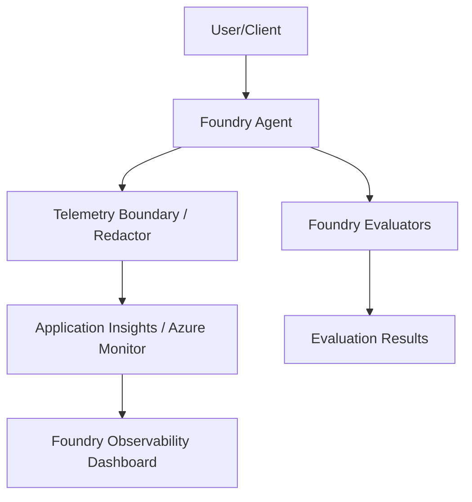

# Agent Evaluation and Observability

Reference for tracing, evaluation, and monitoring expectations for Azure AI Foundry agent flows.

## Purpose

Capture technical diagnostics and quality/safety metrics while protecting sensitive data. This building block defines the boundary between technical telemetry and business status.

## Architecture

## Tracing Expectations

When instrumenting agent flows with OpenTelemetry (using the `AZURE_EXPERIMENTAL_ENABLE_GENAI_TRACING` flag), the following fields should be captured:

| Field | Description | Source Attribute (OpenTelemetry) |
| --- | --- | --- |
| **Request ID** | Unique identifier for the interaction. | `operation_Id` |
| **Tool Call Name** | The name of the tool invoked by the agent. | `gen_ai.tool.name` |
| **Duration** | Latency of the agent turn or tool call. | Span duration |
| **Status** | Success or failure of the operation. | `otel.status_code` |
| **Safe Summary** | A redacted, business-level summary of the outcome. | Custom attribute |
| **Error Category** | Categorized reason for failure (e.g., ToolTimeout, ModelThrottled). | `error.type` |

## Data Privacy: What NOT to Log

To ensure security and compliance, the following fields **must not** be logged to technical telemetry:

* **Prompts**: Raw system or user prompts.
* **Secrets/Tokens**: API keys, bearer tokens, or connection strings.
* **Raw Provider Payloads**: Unfiltered JSON requests/responses to LLM providers.
* **Raw Tool Responses**: Technical tool outputs that might contain sensitive data.
* **Sensitive Customer Data**: PII, PHI, or internal business secrets.

## Minimal Evaluation Checklist

Before moving an agent to production, verify its performance using the following checklist:

1. [ ] **Identify Evaluators**: Select relevant built-in evaluators (e.g., Groundedness, Relevance, Safety).
2. [ ] **Prepare Test Dataset**: Create a CSV/JSONL file containing representative user queries and ground truth.
3. [ ] **Run Batch Evaluation**: Use the Foundry SDK or Portal to run evaluations against the dataset.
4. [ ] **Trace Evaluation**: Evaluate historical traces captured in Application Insights to monitor production quality.
5. [ ] **Analyze Metrics**: Review safety and quality scores to identify regressions or failure clusters.

## References

* [Azure AI Foundry Observability Overview](https://learn.microsoft.com/azure/foundry/concepts/observability)
* [Trace generative AI applications](https://learn.microsoft.com/azure/ai-foundry/how-to/develop/trace-local-sdk)
* [Evaluate generative AI applications](https://learn.microsoft.com/azure/ai-foundry/how-to/evaluate-generative-ai-app)
* [Built-in evaluators reference](https://learn.microsoft.com/azure/foundry/concepts/built-in-evaluators)
