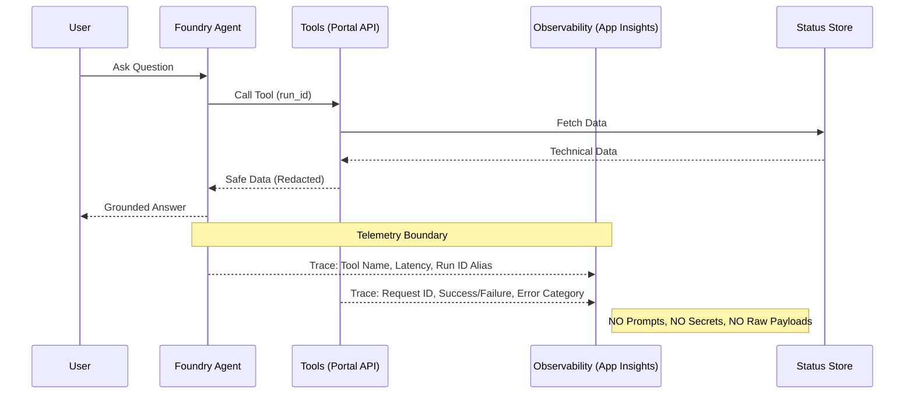

# Agent Evaluation and Observability

Reference for tracing, evaluation, and monitoring expectations for customer-safe Azure AI Foundry agent flows.

## Purpose

This building block defines the standards for capturing technical diagnostics and quality metrics while strictly enforcing a **customer-safe boundary**. It ensures that observability data remains actionable for engineers without leaking sensitive information or internal system details.

## Trace Boundary

Technical telemetry should be strictly separated from business status. Tracing focuses on the "how" (diagnostics), while the Portal API and Status Store focus on the "what" (outcomes).

## Customer-Safe Logging Rules

### What MAY be traced
These fields are safe for technical telemetry and help with debugging and performance tuning:
- **Run ID Alias**: A non-internal correlation ID for the pipeline run.
- **Tool Name**: The name of the tool called (e.g., `get_pipeline_status`).
- **Business Status**: High-level status (e.g., `completed`, `failed`).
- **Safe Artifact Metadata**: Non-sensitive info like file extensions or redacted names.
- **Timing/Latency**: Duration of agent turns and tool execution.
- **Cost Estimate**: Aggregated cost figures (no raw usage details).
- **Friendly Error Category**: Categorized failures (e.g., `ValidationFailed`, `ServiceUnavailable`).

### What MUST NOT be traced/logged
These fields must never enter technical telemetry or logs:
- **Prompts**: Raw system, user, or tool-caller prompts.
- **Raw Logs/Stack Traces**: Technical error details that reveal code paths or internal state.
- **Secrets/Tokens**: API keys, SAS tokens, Bearer tokens, or connection strings.
- **Raw Provider Payloads**: Unfiltered JSON from OpenAI, Document Intelligence, etc.
- **Internal IDs**: Subscription IDs, Tenant IDs, or unrestricted Azure Resource IDs.
- **Storage Paths**: Absolute paths to internal storage accounts or containers.

## Minimal Evaluation Checklist

Every agent iteration must be evaluated against these four pillars:

| Pillar | Check | Metric/Evaluator |
|--------|-------|------------------|
| **Groundedness** | Are answers supported by the provided tool output? | `Groundedness` (Built-in) |
| **Tool-Use** | Does the agent call the correct tool for the query? | Custom Tool Accuracy |
| **Safety/Refusal** | Does the agent correctly refuse to answer out-of-scope or sensitive queries? | `Safety` (Built-in) + Refusal Rate |
| **No-Leak** | Does the agent response contain any forbidden technical identifiers? | Regex / Keyword Scanner |

## Monitoring Signals

| Signal | Description | Target |
|--------|-------------|--------|
| **Turn Latency** | Time taken for the agent to generate a response. | < 5s (P95) |
| **Tool Failure Rate** | Percentage of tool calls that return an error. | < 1% |
| **Refusal Rate** | Percentage of queries the agent refuses to answer. | Monitor for drift |
| **Token Usage** | Aggregate token consumption per agent session. | Cost Control |

## Known Limits

- **Tracing Lag**: Telemetry in Application Insights can have a 2-5 minute ingestion delay.
- **Evaluation Latency**: Batch evaluations over large datasets can take significant time and model quota.
- **Redaction Complexity**: Automated redaction may occasionally over-redact or miss edge-case identifiers.

## References

- [Azure AI Foundry Agent Service Tracing](https://learn.microsoft.com/azure/foundry/observability/how-to/trace-agent-setup)
- [Azure Monitor Application Insights Overview](https://learn.microsoft.com/azure/azure-monitor/app/app-insights-overview)
- [Evaluate Generative AI Applications](https://learn.microsoft.com/azure/ai-foundry/how-to/evaluate-generative-ai-app)
- [OpenTelemetry Semantic Conventions for AI](https://opentelemetry.io/docs/specs/semconv/gen-ai/)
