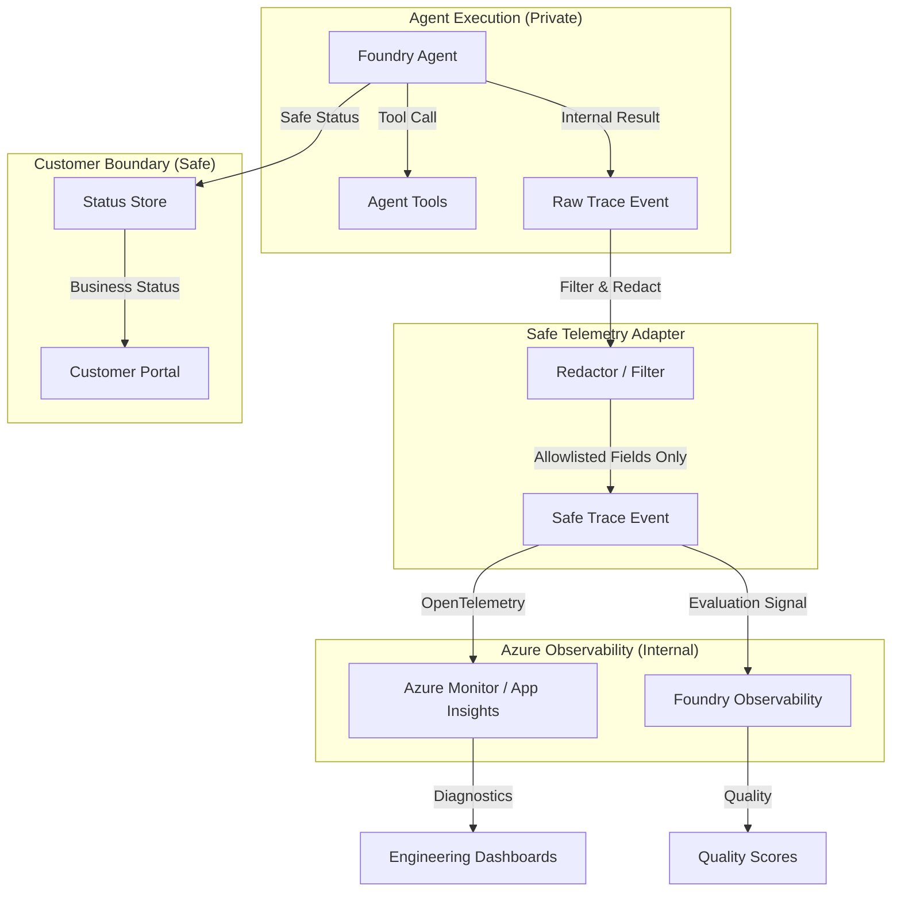

# Agent Evaluation and Observability

Reference for tracing, evaluation, and monitoring expectations for customer-safe Azure AI Foundry agent flows.

## Purpose

This building block defines the standards for capturing technical diagnostics and quality metrics while strictly enforcing a **customer-safe boundary**. It ensures that observability data remains actionable for engineers without leaking sensitive information or internal system details.

## Trace Boundary

Technical telemetry should be strictly separated from business status. Tracing focuses on the "how" (diagnostics), while the Portal API and Status Store focus on the "what" (outcomes).

This building block uses `solutions/foundry-agent-with-tools` as its concrete reference for agent execution.



## Trace and Evaluation Checklist

Technical telemetry should include these fields for debugging and performance tuning:

| Field | Description |
|-------|-------------|
| **Request ID** | Request correlation ID for the user request used to correlate spans across services. |
| **Agent ID/Name** | Identifier for the specific agent version being called. |
| **Operation Type** | The category of the operation (e.g., `agent_turn`, `tool_call`). |
| **Tool Name** | The specific name of the tool called (from a controlled allowlist). |
| **Tool Outcome** | Technical success or failure of the tool call. |
| **Status/Result** | Technical status or result of the individual span or operation. |
| **Latency** | Duration of agent turns and individual tool executions. |
| **Latency Bucket** | Coarse-grained performance category (e.g., `under_1s`, `1s_to_5s`). |
| **Evaluation Score** | Optional quality score associated with the trace event. |
| **Safety Outcome** | High-level safety result from content filters. |
| **Sanitized Summary** | High-level evaluation outcome summary or diagnostic summary. |
| **Error Category** | Friendly error category for failure analysis (e.g., `rate_limit`). |
| **Correlation ID** | Optional secondary correlation identifier. |

## Customer-Safe Logging Rules

### What MAY be traced
- **Request ID**: Request correlation ID linking the agent flow.
- **Business Status**: High-level states (e.g., `completed`, `failed`).
- **Safe Artifact Metadata**: Non-sensitive info like file extensions or redacted names.
- **Timing/Latency**: Duration of agent turns and tool execution.
- **Cost Estimate**: Aggregated cost figures (no raw usage details).
- **Friendly Error Category**: Categorized failures that don't reveal internals.
- **Latency Bucket**: Aggregated performance metrics.
- **Evaluation Score**: Quality signals for model performance tracking.

### What MUST NOT be traced/logged
These fields must **never** enter technical telemetry or logs to protect the security and privacy boundary:
- **Secrets & Tokens**: API keys, SAS tokens, Bearer tokens, or credentials.
- **Connection Strings**: Full URIs containing authentication parameters.
- **Prompts with Secrets**: System instructions, user inputs, or model grounding text (raw prompts) containing sensitive data or credentials.
- **Completions**: Raw model outputs, generated text, or final answers.
- **Raw Customer Documents**: Full text or binary content from processed files.
- **Raw Tool/Provider Payloads**: Full unfiltered JSON request/response bodies.
- **Stack Traces**: Technical error details revealing code paths or environment state.
- **Azure Resource IDs**: Raw resource identifiers (must be redacted).
- **Raw Azure DevOps Logs**: Direct output from build/release pipelines.
- **Raw Azure/DevOps Payloads**: Technical details from platform APIs (Tenant IDs, Subscription IDs, Customer/Org/Tenant identifiers) or internal secret variables.
- **Unrestricted User Content**: Large blocks of raw user input without scrubbing.

## Minimal Evaluation Checklist

Every agent iteration must be evaluated against these pillars:

| Pillar | Check | Description |
|--------|-------|-------------|
| **Quality** | Task Completion & Coherence | Did the agent complete the goal accurately and coherently? |
| **Tool-Boundary** | Tool-Call Correctness | Did the agent call the right tool with valid arguments? |
| **Groundedness** | Groundedness & Relevance | Is the answer based on the provided context? |
| **Safety** | Safety & Refusal Rate | Does the agent refuse harmful or out-of-scope attempts? |
| **Answer Format** | Customer-Safe Status Wording | Is the status language friendly and free of jargon? |
| **Failure Quality** | Error Message Safety | Is the failure explanation friendly and non-technical? |
| **Redaction** | Redaction Compliance | Does the trace output contain no forbidden fields? |

## Local Validation

To validate the observability contract and redaction logic locally:

1. **Contract Validation**: Ensures the README and `module.yaml` are synchronized.
   ```bash
   PYTHONPATH=. pytest tests/test_contract.py
   ```

2. **Redaction Validation**: Proves that forbidden fields are correctly identified and removed.
   ```bash
   PYTHONPATH=. pytest tests/test_redaction.py
   ```

3. **Schema Validation**: Ensures that fixtures comply with defined JSON schemas.
   ```bash
   PYTHONPATH=. pytest tests/test_schema_validation.py
   ```

## Cost and Cardinality Risks

- **Storage Costs**: High-detail tracing (e.g., 100% of turns) can lead to significant Application Insights ingestion costs. Use sampling (e.g., 1-10%) in production.
- **Cardinality Explosion**: Avoid using high-cardinality values (e.g., raw prompts or unique user IDs) as custom dimensions. Use controlled enums (like `LatencyBucket` or `ErrorCategory`) to keep metrics aggregatable.
- **Payload Size**: Large telemetry payloads can impact performance and hit platform limits. The provided `TelemetryRedactor` enforces a 20-field limit per event.

## Known Limits

- **Shared Responsibility**: The implementation must correctly apply these rules in the runtime adapter.
- **Regex-based Redaction**: Pattern matching is not 100% exhaustive; it is a defensive layer.
- **Model Non-Determinism**: Evaluation results can vary between runs; use multiple samples for statistical significance.
- **Server-side Tracing**: Azure AI Foundry provides automatic server-side tracing which may capture prompts by default; this module focuses on **client-side/adapter-level** safe tracing.

## Security and Privacy Notes

- **Redaction**: Implement automated redaction for common secret patterns before emitting traces.
- **Least-Privilege Access**: Access to technical telemetry should be restricted to engineering/security roles.
- **Retention**: Telemetry and evaluation datasets should follow organizational data retention policies (typically 30-90 days).
- **Observability Boundary**: Technical telemetry is for engineering. Business status (via Portal) is for customers. Never cross-link raw technical identifiers directly in the customer portal.

## Deployment / IaC Decision

**No-IaC: Guidance-only module.**

This building block defines standards rather than deployable infrastructure. Application-specific observability resources are typically deployed as part of the hosting building block (e.g., `webapp-agent-api`).

## References

- [Azure AI Foundry Agent Service Overview](https://learn.microsoft.com/en-us/azure/foundry/agents/overview)
- [Observability in Generative AI](https://learn.microsoft.com/en-us/azure/foundry/concepts/observability)
- [Application Insights OpenTelemetry Overview](https://learn.microsoft.com/en-us/azure/azure-monitor/app/app-insights-overview)
- [Foundry Trace Application Guidance](https://learn.microsoft.com/en-us/azure/foundry-classic/how-to/develop/trace-application)
- [Customer-Safe Status Boundary](../../security/customer-safe-status-boundary/README.md)
