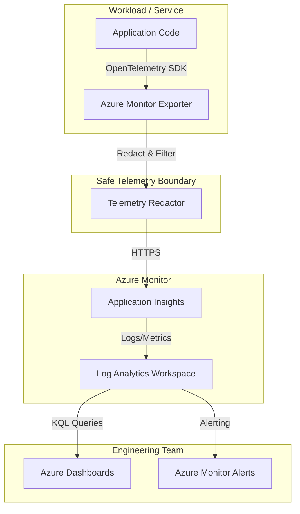

# Application Insights Observability

Reference observability pattern for technical diagnostics using Azure Monitor and Application Insights.

## Purpose

Capture technical telemetry—logs, traces, exceptions, and dependency data—to support engineering diagnostics while maintaining a strict security boundary. This module focuses on the "how" (technical execution) and remains separate from customer-facing business status.

## Architecture



## Telemetry Contract

This module enforces a strict telemetry contract to prevent data leakage. Only allowlisted, non-sensitive fields are permitted to reach Application Insights.

### Supported Safe Telemetry

| Field | Description |
|-------|-------------|
| `operation_name` | Name of the technical operation (e.g., `process_blob`). |
| `operation_status` | Outcome: `SUCCESS`, `FAILURE`, or `ERROR`. |
| `duration_ms` | Latency of the operation in milliseconds (max 1 hour). |
| `request_id` | Technical correlation ID for tracing. |
| `component_name` | Identifier for the emitting component. |
| `target_resource` | Identifier for a dependency or target resource. |
| `custom_dimensions` | Controlled key-value pairs for additional safe metadata. |

### Forbidden Fields (Redacted or Dropped)

The following data must **never** be included in technical telemetry:

- **Secrets & Tokens**: API keys, SAS tokens, Bearer tokens, or passwords.
- **Customer Content**: Prompts, raw document text, user inputs, or model outputs.
- **Platform Internals**: Subscription IDs, Tenant IDs, or raw provider payloads.
- **Sensitive URIs**: Connection strings or URLs containing signatures/tokens.
- **Technical Dumps**: Stack traces or raw request/response bodies.

## Local Validation

The telemetry contract and redaction logic are validated using Python and `pytest`.

```bash
# Run tests
pytest building-blocks/observability/appinsights-observability/tests
```

## Azure Deployment

Infrastructure is managed via Terraform and provisions a workspace-based Application Insights resource.

```bash
cd infra/terraform
terraform init
terraform apply
```

### Cost Drivers
- **Data Ingestion**: Log Analytics charges per GB ingested.
- **Data Retention**: Standard retention is 30 days; longer periods incur costs.

## Limitations
- **Redaction Depth**: Redaction is pattern-based and may not catch all obfuscated secrets.
- **Technical Scope**: This module does not provide customer-facing status; use `customer-safe-status-boundary` for business outcomes.
