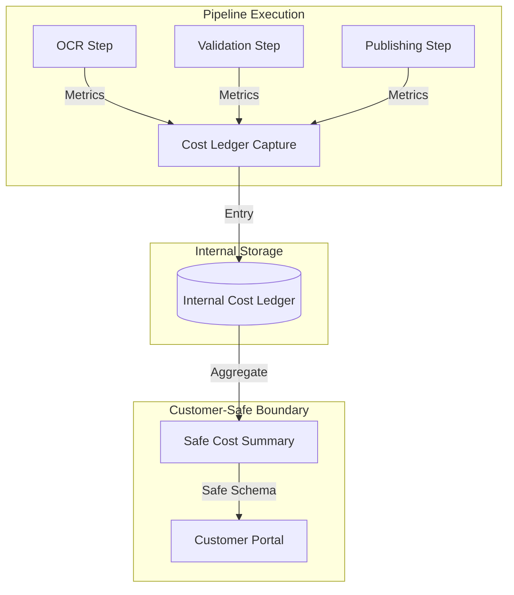

# Cost Ledger Capture

Reference building block for capturing estimated internal cost entries for pipeline steps.

## Purpose

Capture and store estimated costs associated with different steps of a Document AI pipeline. This allows for internal tracking and reporting of resource consumption without exposing sensitive Azure billing internals to customers.

## Contract vs Authoritative Billing

- **Estimate Only**: This module captures **estimated** costs based on usage metrics (e.g., tokens, pages, execution time) and pre-defined rates.
- **Not Authoritative**: This is NOT a replacement for official Azure billing, invoices, or Cost Management reconciliation.
- **Internal Focus**: The primary goal is internal observability and optional high-level customer-facing cost summaries.

## Input Fields

This module expects data aligned with the `shared/contracts/cost-ledger.schema.json` contract:

- **`run_id`** (Required): Unique identifier for the pipeline run.
- **`category`** (Required): Category of the cost (e.g., `ai_tokens`, `document_ai`, `storage`, `function_execution`, `integration`, `other`).
- **`estimated_amount`** (Required): The calculated estimate for the step.
- **`step_name`**: Name of the pipeline step that incurred the cost.
- **`provider`**: Service provider (e.g., `Azure`, `OpenAI`).
- **`model_or_service`**: Specific model or service used (e.g., `gpt-4o`, `prebuilt-invoice`).
- **`input_units`**: Number of input units (e.g., tokens, pages).
- **`output_units`**: Number of output units (e.g., tokens).
- **`unit_name`**: Name of the unit (e.g., `token`, `page`, `second`).
- **`currency`**: Currency code (default: `USD`).
- **`created_at`**: Timestamp of the cost event (ISO-8601).

## Service-Level Diagram

The following diagram shows how pipeline steps interact with the cost ledger capture boundary.

## Customer-Safe Boundary

Strict adherence to the [Customer-Safe Status Boundary](../../security/customer-safe-status-boundary/) is required to prevent leaking technical or sensitive billing data.

### Allowed
- **Estimated Total Cost**: Aggregated cost for a run or a customer.
- **Cost Categories**: High-level grouping (e.g., "AI Processing", "Storage").
- **Currency**: The currency used for the estimates.
- **Timestamps**: When the estimate was recorded.

### Forbidden
- **Raw Billing Records**: Actual Azure billing line items or invoices.
- **Subscription & Tenant IDs**: Azure environment identifiers.
- **Resource Group Names**: Internal infrastructure organization.
- **Provider Payloads**: Raw JSON responses from Azure Cost Management or Billing APIs.
- **Technical Logs**: Internal trace IDs or execution logs associated with cost calculation.
- **Secrets & Tokens**: Any credentials used to access pricing or billing APIs.
- **SKU Details**: Specific Azure SKU IDs or internal pricing tier names.

## Deployment Assumptions

- **Identity**: The calling service (Function) must use Managed Identity to write to the ledger store.
- **Storage**: Ledger entries are typically stored in a secure table (e.g., Azure Table Storage or Cosmos DB) that is NOT directly accessible by the customer portal.

## Local / Demo Flow

1. Use a local Function or script to generate a cost entry.
2. Validate the entry against `shared/contracts/cost-ledger.schema.json`.
3. Store the entry in a local emulator (e.g., Azurite Table Storage).

## Known Limits

- Does not include real-time pricing lookups from the Azure Retail Prices API in this reference.
- Does not handle currency conversion or complex tax calculations.
- Aggregation logic for the customer-safe summary is implemented in the Portal API, not in the capture block.
