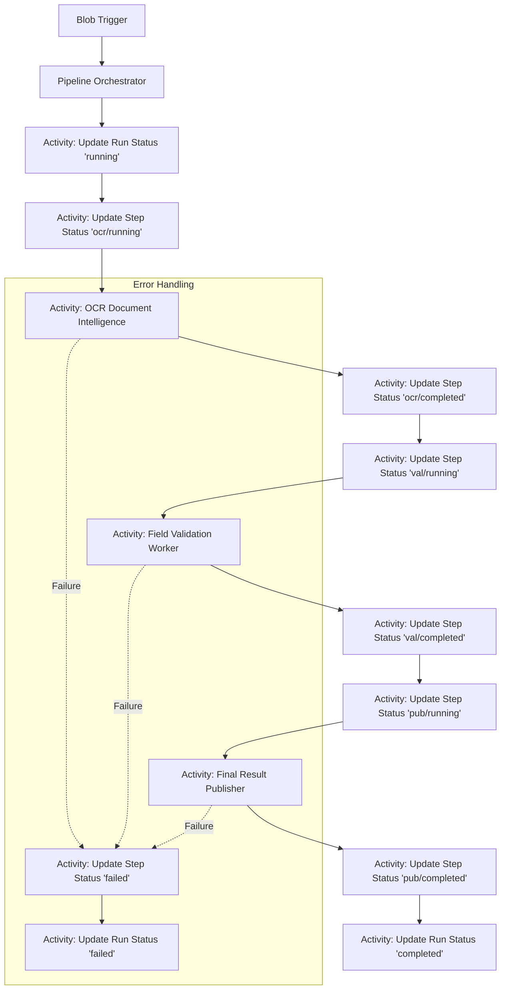

# Durable Basic Pipeline

## Purpose

This building block demonstrates a minimal Durable Functions orchestration pattern for tracking customer-visible pipeline status. It provides a structured way to manage long-running AI workflows, expose business-level progress, and keep technical internals out of customer-facing state.

## Pattern logic



## Scenario

A customer uploads a document to an Azure Storage blob. This triggers a multi-step pipeline:
1. **OCR**: Extracts text and metadata from the document.
2. **Validation**: Verifies extracted fields against business rules.
3. **Publication**: Publishes the validated results to a downstream system or notification service.

Throughout the process, the customer can monitor the overall run status and individual step progress through a secure status boundary.

## Contracts

This module adheres to the following shared contracts:

- `shared/contracts/pipeline-run.schema.json`: Overall run status.
- `shared/contracts/pipeline-step.schema.json`: Individual step status.
- `building-blocks/pipelines/durable-basic-pipeline/schemas/pipeline_input.schema.json`: Input contract.
- `building-blocks/pipelines/durable-basic-pipeline/schemas/pipeline_success.schema.json`: Success outcome contract.
- `building-blocks/pipelines/durable-basic-pipeline/schemas/friendly_failure.schema.json`: Failure outcome contract.

## Customer-safe status boundary

To maintain security and clarity, the following rules apply to status updates:

- **Allowed**: Business status (e.g., "Processing document"), friendly step names, safe summaries, artifact metadata, estimated costs, and correlation IDs.
- **Forbidden**: Raw logs, prompts, model/tool payloads, stack traces, secrets, internal tenant details, and raw identifiers (e.g., `run_id`, `instance_id`) in runtime logs.

## Failure and Retry Behavior

This pipeline implements a tiered failure handling strategy:

- **Transient Failures (Retryable)**: Steps that interact with external services (OCR, Publication) use a `RetryOptions` policy.
  - **Initial Interval**: 5 seconds.
  - **Maximum Attempts**: 3.
  - **Backoff**: Exponential backoff is applied by default in Durable Functions.
  - **Scope**: Handles network blips or temporary service unavailability (e.g., HTTP 429 or 5xx).

- **Deterministic Failures (Non-Retryable)**: Business logic steps like `Field Validation` are treated as non-retryable. If validation fails due to missing fields or incorrect format, the pipeline fails immediately to save cost and provide fast feedback.

- **Fail-Closed Contract Validation**: The orchestrator validates all inputs and status updates against JSON schemas. If a contract is violated, the orchestration fails immediately with a `FriendlyFailure` response, ensuring no unvalidated data is processed or exposed.

- **Redaction and Friendly Errors**: All unhandled exceptions or retry exhaustion events are caught. The technical error is logged internally (without sensitive IDs or secrets), and the customer-facing status is updated with a generic, safe error message.

## Local run

1. Install [Azure Functions Core Tools](https://learn.microsoft.com/en-us/azure/azure-functions/functions-run-local).
2. Install dependencies:
   ```bash
   pip install -r requirements.txt
   ```
3. Start the functions:
   ```bash
   func start
   ```

## Deploy

- **Hosting**: Azure Functions (Linux, Flex Consumption recommended).
- **Storage**: Azure Storage Account (required for Durable Functions state).
- **Observability**: Application Insights.

### IaC Decision

This building block is primarily a **runtime reference implementation**. While a minimal Terraform example is provided for completeness, the focus is on the orchestration logic and status contracts. Per repository standards, this module does not mandate a specific IaC provider for adoption, but the provided reference follows the [docs/terraform-deployment-requirement.md](../../docs/terraform-deployment-requirement.md) for validation.

### Terraform Deployment

A minimal Terraform deployment reference is provided in the [infra/terraform/](infra/terraform/) directory. It provisions the necessary Resource Group, Storage Account, Application Insights, and the Flex Consumption Function App.

**Required Configuration (Identity-First):**

This module enforces an **identity-first security boundary**. Shared access keys are disabled on the storage account (`shared_access_key_enabled = false`), and all communication is authorized via Microsoft Entra ID (Managed Identity).

- `AzureWebJobsStorage__accountName`: The name of the storage account.
- `AzureWebJobsStorage__credential`: Set to `managedidentity`.
- `APPLICATIONINSIGHTS_CONNECTION_STRING`: The connection string for Application Insights.

## Microsoft Learn References

- [Durable Functions Overview](https://learn.microsoft.com/en-us/azure/azure-functions/durable/durable-functions-overview)
- [Durable Functions Python Programming Model](https://learn.microsoft.com/en-us/azure/azure-functions/durable/durable-functions-overview?tabs=python-v2)
- [Orchestrator Code Constraints](https://learn.microsoft.com/en-us/azure/azure-functions/durable/durable-functions-code-constraints)
- [Error Handling in Durable Functions](https://learn.microsoft.com/en-us/azure/azure-functions/durable/durable-functions-error-handling)
- [Azure Functions Python Developer Guide](https://learn.microsoft.com/en-us/azure/azure-functions/functions-reference-python)

## Known limits

- Orchestrator functions must be deterministic.
- Status updates are eventually consistent if stored in an external database.
- Maximum activity payload size applies (typically 16-64MB depending on storage provider).
