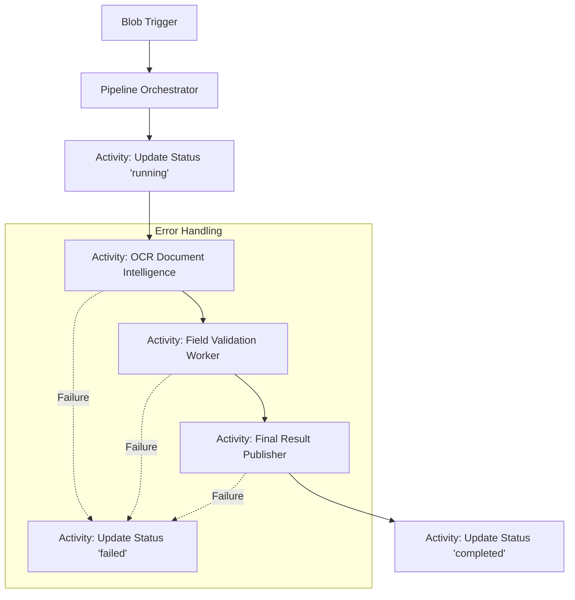

# Durable Basic Pipeline

## Purpose

This building block demonstrates a minimal Durable Functions orchestration pattern for tracking customer-visible pipeline status. It provides a structured way to manage long-running AI workflows, expose business-level progress, and keep technical internals out of customer-facing state.

## Pattern logic



## Contracts

This module adheres to the following shared contracts:

- `shared/contracts/pipeline-run.schema.json`: Overall run status.
- `shared/contracts/pipeline-step.schema.json`: Individual step status.

## Customer-safe status boundary

To maintain security and clarity, the following rules apply to status updates:

- **Allowed**: Business status (e.g., "Processing document"), friendly step names, safe summaries, artifact metadata, estimated costs, and correlation IDs.
- **Forbidden**: Raw logs, prompts, model/tool payloads, stack traces, secrets, internal tenant details, and raw identifiers (e.g., `run_id`, `instance_id`) in runtime logs.

## Local run

1. Install [Azure Functions Core Tools](https://learn.microsoft.com/en-us/azure/azure-functions/functions-run-local).
2. Install dependencies:
   ```bash
   pip install -r requirements.txt
   ```
3. Start the functions:
   ```bash
   func start
   ```

## Deploy

- **Hosting**: Azure Functions (Linux, Flex Consumption recommended).
- **Storage**: Azure Storage Account (required for Durable Functions state).
- **Observability**: Application Insights.

### Terraform Deployment

A minimal Terraform deployment reference is provided in the [infra/terraform/](infra/terraform/) directory. It provisions the necessary Resource Group, Storage Account, Application Insights, and the Flex Consumption Function App.

**Required Configuration (Identity-First):**

This module enforces an **identity-first security boundary**. Shared access keys are disabled on the storage account (`shared_access_key_enabled = false`), and all communication is authorized via Microsoft Entra ID (Managed Identity).

- `AzureWebJobsStorage__accountName`: The name of the storage account.
- `AzureWebJobsStorage__credential`: Set to `managedidentity`.
- `APPLICATIONINSIGHTS_CONNECTION_STRING`: The connection string for Application Insights.

## Failure behavior

- **Failures**: If a step fails, the orchestrator updates the `PipelineRun` status to `failed` with a customer-safe `friendly_error`.
- **Retry follow-up**: Add explicit Durable Functions retry options when the reference needs to demonstrate retry policy behavior instead of only orchestration shape.

## Known limits

- Orchestrator functions must be deterministic.
- Status updates are eventually consistent if stored in an external database.
