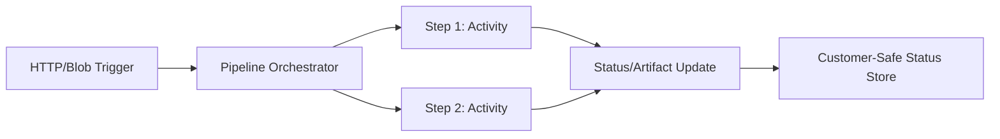

# Durable Basic Pipeline

## Purpose

This building block demonstrates a minimal Durable Functions orchestration pattern for tracking customer-visible pipeline status. It provides a structured way to manage long-running AI workflows, ensure reliability through checkpoints and retries, and expose business-level progress without leaking technical internals.

## Pattern logic



## Contracts

This module adheres to the following shared contracts:

- `shared/contracts/pipeline-run.schema.json`: Overall run status.
- `shared/contracts/pipeline-step.schema.json`: Individual step status.

## Customer-safe status boundary

To maintain security and clarity, the following rules apply to status updates:

- **Allowed**: Business status (e.g., "Processing document"), friendly step names, safe summaries, artifact metadata, estimated costs, and correlation IDs.
- **Forbidden**: Raw logs, prompts, model/tool payloads, stack traces, secrets, and internal tenant details.

## Local run

1. Install [Azure Functions Core Tools](https://learn.microsoft.com/en-us/azure/azure-functions/functions-run-local).
2. Install dependencies:
   ```bash
   pip install -r requirements.txt
   ```
3. Start the functions:
   ```bash
   func start
   ```

## Deploy

- **Hosting**: Azure Functions (Linux, Flex Consumption or Premium recommended).
- **Storage**: Azure Storage Account (required for Durable Functions state).
- **Observability**: Application Insights.

## Retry and failure behavior

- **Retries**: Orchestrators use `call_activity_with_retry` for transient failures.
- **Failures**: If a step fails after retries, the orchestrator updates the `PipelineRun` status to `failed` with a `friendly_error`.

## Known limits

- Orchestrator functions must be deterministic.
- Status updates are eventually consistent if stored in an external database.
